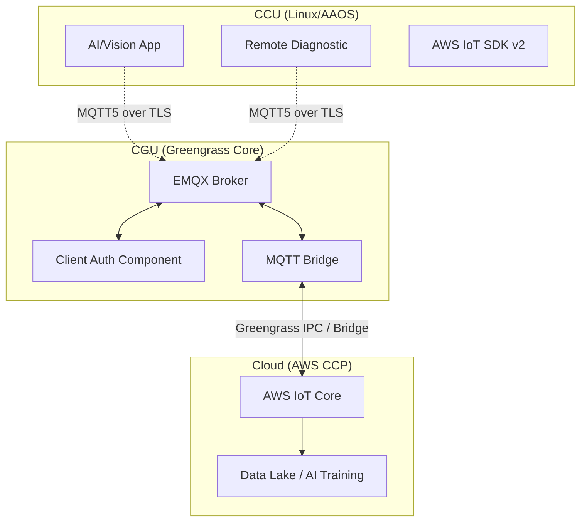
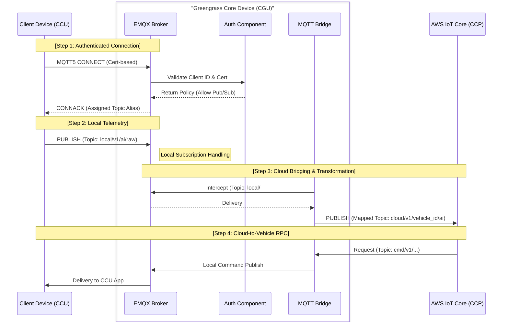

## 1. 개요

본 시스템은 SDM(Software Defined Machine) 환경에서 발생하는 특수 목적 트래픽(AI 학습 데이터, 고해상도 로그, 원격 진단 데이터 등)을 효율적으로 처리하기 위한 **차량 내 메시징 및 클라우드 브릿징 인프라**를 정의한다. 표준 VSS 데이터 외의 확장 데이터를 CGU의 수정 없이 CCU 레벨에서 즉각적으로 클라우드와 교환할 수 있는 구조를 지향한다.

## 2. 목적

- **데이터 유연성 확보:** VSS 표준에 얽매이지 않고 새로운 센서 및 앱 데이터를 신속하게 클라우드(CCP)로 전달.
- **통신 효율 최적화:** MQTT5의 `User Property`, `Topic Alias` 등을 활용하여 통신 오버헤드 절감.
- **보안 및 망분리 준수:** 제어망과 외부망 사이의 게이트웨이(CGU)를 통해서만 데이터가 흐르도록 강제하여 차량 내부 보안 강화.

## 3. 시스템 아키텍쳐

## 4. 역할 정의 (R&R)

- 1세부:
    - 시스템 아키텍쳐 설계 (문서화)
    - CGU 환경 구성
    - 네트워크 구성
    - 연결관리를 위한 MQTT5 속성 정의
    - Greengrass IPC 및 MQTT Bridge 의 기능을 고려하여 CCU 어플리케이션이 복잡한 MQTT5 연결관리나 세션관리를 하지 않도록 샘플코드 및 표준 SDK 제공 (AWS IoT Device SDK v2 포함)
- 2세부:
    - OS 별 MQTT5 Client 탑재 구현
    - 1세부에서 구성한 망분리 정책 적용
    - AWS 인증서 발급 정책 및 사물 관리 정책 수립
    - CCU 토픽 패턴 및 페이로드 스키마 정의 (CCP 주도)
    - (필요 시) AWS IoT Device SDK v2 탑재
    - (필요 시) SDK 제공, 1세부 표준 SDK 를 언어에 따라 변환
- 3세부:
    - 활용방안 제안
    - 응용 어플리케이션 개발 및 성능 평가

## 5. 기능 정의

### 5.1. CCU (Linux/AAOS)

- **인증:** X.509 인증서 기반 TLS 1.2/1.3 보안 연결을 수행한다.
- **데이터 발행:** 합의된 전용 토픽(예: `ai/raw/...`)으로 데이터를 발행한다.
- **데이터 구독:** 합의된 전용 토픽으로 데이터를 구독한다.
- **세션 관리:** MQTT5 `Clean Start` 및 `Session Expiry Interval`을 활용하여 연결 세션을 관리 한다. 관리 정책은 CGU 에서 정의한다.
- **데이터 최적화:** 고용량 데이터 전송 시 바이너리 포맷(Protobuf) 사용 및 필요시 압축 처리를 수행한다.

### 5.2. CGU

- **Client Device Auth (Gatekeeper)**
    - **권한 제어:** 클라이언트별로 허용된 토픽 이외의 접근을 차단한다.
    - **정책 관리:** 신규 장치 추가 시 보안 정책(Policy)을 동적으로 적용한다.
- **EMQX Broker**
    - **중개:** 클라이언트와 Bridge 사이의 모든 메시지 트래픽을 중개한다.
    - **규격 지원:** MQTT 5.0 기반의 고성능 통신 및 대용량 세션을 관리한다.
- **MQTT Bridge (Cloud Relay)**
    - **토픽 맵핑:** 로컬 EMQX 토픽을 클라우드 IoT Core 토픽으로 일대일 또는 패턴 매칭하여 전달한다.
    - **상태 관리:** 클라우드 연결이 끊겼을 때 로컬 큐잉을 통해 데이터 유실을 방지한다.

---

## 6. 협의 필요 사항

1. **Topic 명명 규칙 확정:** 구조의 계층화 표준 수립 필요.
    - 예시: `{direction}/{service}/{thing_name}/{brand}/{VIN}/…`
    - CCP 가 상위 웹/앱으로 토픽을 포워딩하거나 저장하기 위해 토픽 패턴이 사전 합의되어야 함
    - CGU 가 허용되지 않은 토픽의 발행과 구독을 필터링하기 위해 토픽 패턴이 사전 합의 되어야 함.
2. **Topic 매핑:** 세부의 응용 어플리케이션과 2세부 CCP 간 협의하여 결정하며, 결정된 매핑을 1세부에 공유하여 정책으로 정의한다.
3. **데이터 스키마 정의:** SSOT 를 달성하기 위한 JSON 포맷의 표준 필드(Timestamp, Priority, Version) 정의 및 Protobuf 관리 주체 결정. 
4. **QoS(Quality of Service) 레벨:** 실시간성이 중요한지(QoS 0), 유실이 없어야 하는지(QoS 1) 데이터 성격별 설정. 그 외 TTL 설정 등 연결 세션 정책 수립.
5. **인증서 갱신 정책:** 장비 수명 주기(약 10년)를 고려한 인증서 자동 갱신(Rotation) 메커니즘 확정.
6. **클라우드 비용 한도:** App별 월간 전송량 할당 및 초과 시 Throttling 정책 수립.

---

## 7. 기대 효과

- **유연한 대응:** 새로운 요구사항이 생겨도 게이트웨이 (CGU) 펌웨어를 업데이트할 필요 없이 클라우드와 클라이언트 앱만 수정하면 됨.
- **보안 강화:** `Client Device Auth`를 통해 검증되지 않은 외부 장치의 데이터 유입을 원천 차단.