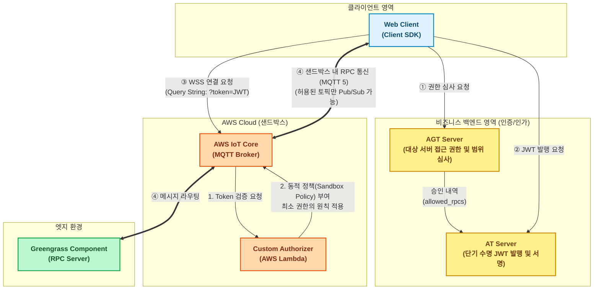
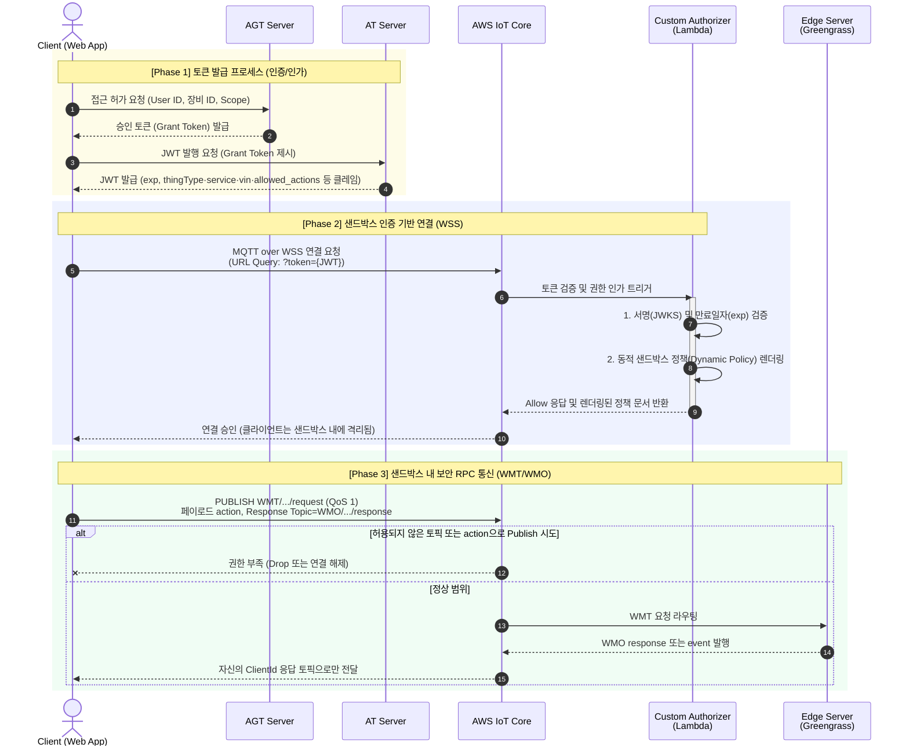

## 1. 개요 및 아키텍처 철학

본 사양서는 외부 클라이언트(Web App)가 AWS IoT Core(MQTT Broker)를 통해 엣지 서버(Greengrass Component)와 RPC 통신을 수행할 때, **VISSv3 보안 모델**을 기반으로 인증(Authentication) 및 인가(Authorization)를 처리하는 파이프라인을 정의합니다.

클라이언트는 AWS 브로커에 직접 영구적인 자격 증명을 요구하거나 하드코딩된 인증서를 사용하지 않습니다. 대신 외부 인증 서버(AGT/AT)를 통해 비즈니스 로직의 심사를 거쳐 발급받은 **일회성 JWT(JSON Web Token)**를 사용하며, 인프라 관리자는 이 토큰을 기반으로 클라이언트를 철저하게 격리된 **샌드박스(Sandbox)** 내에 가두어 허용된 RPC 명령만 수행하도록 통제합니다.

### 1.1. 핵심 컴포넌트 역할 정의

1. **AGT (Access Grant Token) 서버: 대상 장비 접근 허가 및 권한 획정역.**
클라이언트가 **대상 서버(특정 엣지 장비) 자체에 접근하여 서비스를 이용할 자격이 있는지** 비즈니스 데이터베이스(소유권, 대여 기간, 권한 등급 등)를 조회하여 일차적으로 검증합니다. 대상 서버 사용이 승인되면, 해당 클라이언트가 장비 내에서 호출할 수 있는 구체적인 서비스 범위(허용된 RPC 목록)를 확정하여 접근 승인(Grant)을 내립니다.
2. **AT (Access Token) 서버: 실제 통신용 토큰(JWT) 발행역.**
AGT 서버가 판단한 대상 장비 접근 허가 및 권한 범위 내역을 전달받아, AWS IoT Core(브로커)가 기계적으로 검증할 수 있는 짧은 수명의 JWT(JSON Web Token)로 규격화하고 전자 서명하여 클라이언트에게 발급합니다.
3. **Custom Authorizer (AWS Lambda): 브로커의 문지기.**
클라이언트가 WSS 연결 시 제시한 JWT의 서명과 유효기간을 검증하고, 토큰에 명시된 권한 범위를 해석하여 해당 세션에만 유효한 **동적 권한 정책(Dynamic IoT Policy)**을 생성해 브로커에 부여합니다.

---

## 2. 토큰 발급 프로세스 (AGT & AT 서버 연동)

클라이언트는 MQTT 연결을 시도하기 전, 비즈니스 백엔드 시스템을 통해 다음의 인증 파이프라인을 거쳐야 합니다.

### 2.1. 권한 심사 및 AGT (Access Grant Token) 획득

- **요청:** 클라이언트는 자신의 신원(User ID)과 제어하고자 하는 장비 ID, 그리고 요청하는 서비스 범위(Scope)를 AGT 서버에 제출합니다.
- **처리:** AGT 서버는 현재 로그인한 사용자가 해당 장비를 제어할 정당한 권한이 있는지 판단하고, 허가된 범위가 담긴 승인 토큰(Grant Token)을 반환합니다.

### 2.2. JWT (Access Token) 발행

- **요청:** 클라이언트는 획득한 AGT를 AT 서버에 제출하여 실제 MQTT 통신에 사용할 JWT를 요청합니다.
- **JWT Payload (Claims) 요구 규격:**JSON
    
    발행되는 토큰 내에는 Custom Authorizer 람다가 샌드박스를 구축하는 데 필요한 메타데이터가 명확히 포함되어야 합니다. (아래는 예시이므로, 상황에 따라 설계되어야 함)
    
    ```json
    {
      "sub": "user-uuid-1234",
      "clientId": "web-client-xyz",
      "thingType": "CGU",
      "service": "viss",
      "vin": "VIN-123456",
      "allowed_actions": ["get", "set", "session_start"],
      "exp": 1711234567
    }
    ```
    
    토픽 규격은 [TOPIC_AND_ACL_SPEC.md](TOPIC_AND_ACL_SPEC.md)를 따른다.  
    *(JWT 수명 `exp`는 탈취 대비로 1시간 이내 권장.)*
    

---

## 3. Custom Authorizer 및 동적 정책 발급 (람다 설계)

클라이언트가 WSS(WebSocket Secure)로 AWS IoT Core 엔드포인트에 접속할 때 JWT를 전달하면, 브로커는 사전 등록된 **Custom Authorizer 람다 함수**를 호출하여 연결 허용 여부를 묻습니다.

### 3.1. Authorizer 람다 동작 로직

1. **무결성 검증:** AT 서버의 공개키(JWKS)를 이용하여 JWT의 서명(Signature), 만료 일자(`exp`), 발급자(`iss`)가 유효한지 검증합니다.
2. **동적 정책(Dynamic Policy) 렌더링:** 토큰의 페이로드에서 `clientId`, `thingType`, `service`, `vin`, `allowed_actions` 등을 추출하여, WMT 발행·WMO 구독 ARN을 [TOPIC_AND_ACL_SPEC.md](TOPIC_AND_ACL_SPEC.md)에 맞게 제한하는 맞춤형 IAM 정책 문서(JSON)를 즉석에서 생성합니다.
3. **접근 승인:** 렌더링된 정책 문서와 함께 '연결 허용(Allow)' 응답을 AWS IoT Core로 반환합니다.

### 3.2. 샌드박스 정책 (Sandbox Policy) 명세

람다가 동적으로 생성하는 정책은 **최소 권한의 원칙(Principle of Least Privilege)**을 엄격하게 적용하여 구성됩니다.

**[람다가 반환하는 동적 정책 JSON 예시]**

```json
{
  "Version": "2012-10-17",
  "Statement": [
    {
      "Effect": "Allow",
      "Action": "iot:Connect",
      "Resource": "arn:aws:iot:region:account:client/${Token.clientId}"
    },
    {
      "Effect": "Allow",
      "Action": "iot:Subscribe",
      "Resource": [
        "arn:aws:iot:region:account:topicfilter/WMO/+/+/+/${Token.clientId}/response",
        "arn:aws:iot:region:account:topicfilter/WMO/+/+/+/${Token.clientId}/event",
        "arn:aws:iot:region:account:topicfilter/telemetry/heartbeat/${Token.vin}"
      ]
    },
    {
      "Effect": "Allow",
      "Action": "iot:Receive",
      "Resource": [
        "arn:aws:iot:region:account:topic/WMO/+/+/+/${Token.clientId}/response",
        "arn:aws:iot:region:account:topic/WMO/+/+/+/${Token.clientId}/event",
        "arn:aws:iot:region:account:topic/telemetry/heartbeat/${Token.vin}"
      ]
    },
    {
      "Effect": "Allow",
      "Action": "iot:Publish",
      "Resource": [
        "arn:aws:iot:region:account:topic/WMT/${Token.thingType}/${Token.service}/${Token.vin}/${Token.clientId}/request"
      ]
    }
  ]
}
```

- **연결 제한 (`iot:Connect`):** 토큰에 명시된 고유한 `clientId`로만 연결을 허용하여, 다른 클라이언트로 위장(Spoofing)하는 것을 방지합니다.
- **수신 제한 (`iot:Subscribe` & `iot:Receive`):** 자신의 `ClientId`가 포함된 WMO 응답·이벤트 토픽과, 허용된 보조 텔레메트리 토픽만 수신할 수 있도록 가둡니다.
- **발행 제한 (`iot:Publish`):** `WMT/{ThingType}/{Service}/{VIN}/{ClientId}/request` 한 경로로만 요청을 보낼 수 있게 하고, 세부 명령은 페이로드 `action`으로 구분합니다. `allowed_actions`는 Authorizer 또는 엣지에서 추가 검증하는 용도로 사용할 수 있습니다.

---

## 4. WSS 통신 및 클라이언트 연동 요구 사항

### 4.1. 안전한 연결 설정

- 웹 브라우저 환경의 표준 WebSocket API는 연결 시 HTTP 커스텀 헤더 주입이 불가능한 경우가 많습니다.
- 따라서 JWT는 브로커 연결 시 **Query String Parameter**를 통해 안전하게 전달해야 합니다.
    
    *(예: `wss://xxxxx-ats.iot.ap-northeast-2.amazonaws.com/mqtt?x-amz-customauthorizer-name=MyAuth&token=eyJhbG...`)*
    
- 인프라 관리자는 AWS IoT Core 콘솔에서 해당 쿼리 파라미터(`token`)를 Custom Authorizer 람다의 트리거 데이터로 매핑하도록 사전에 구성해야 합니다.

### 4.2. 토큰 만료 및 갱신 (Token Rotation)

- Custom Authorizer가 발급한 샌드박스 정책은 물리적인 세션이 유지되는 동안 지속되지만, 보안을 위해 토큰 자체의 수명은 짧게 유지됩니다.
- 클라이언트 SDK는 네트워크 플리커링이나 유휴 타임아웃으로 WebSocket 연결이 끊어졌을 때 재연결을 시도합니다. 이때 내부적으로 JWT의 만료 기간(`exp`)을 확인하고, 만료가 임박했거나 지났다면 AT 서버로부터 새로운 JWT를 갱신 발급받은 뒤 AWS 브로커에 접근(Clean Start = True)하는 자동화 로직을 갖추어야 합니다.

클라이언트는 브로커에 직접 영구적인 자격 증명을 요구하지 않으며, 외부 인증 서버(AGT/AT)를 통해 발급받은 일회성 JWT를 사용하여 철저하게 격리된 **샌드박스(Sandbox)** 내에서만 허용된 RPC 명령을 수행합니다.