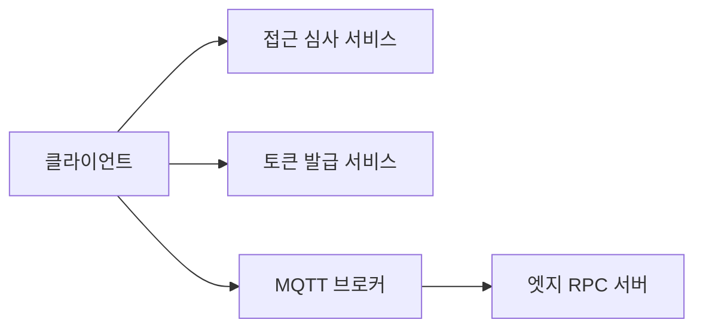

# RPC 보안 정책 (MQTT 브로커 중립)

외부 클라이언트가 **MQTT 5.0 브로커**를 통해 엣지 RPC 서비스와 통신할 때, 인증(Authentication)·인가(Authorization)를 **브로커 구현에 종속되지 않게** 설계할 수 있도록 한 개요이다. 토픽·ACL 규격은 [TOPIC_AND_ACL_SPEC.md](TOPIC_AND_ACL_SPEC.md)를 따른다.

## 1. 원칙

1. **영구 자격 증명을 클라이언트에 직접 심지 않는다.**  
   사용자·장비 단위 권한은 비즈니스 백엔드에서 판단하고, 통신에는 **단기 토큰**(예: JWT)만 사용하는 방식을 권장한다.
2. **최소 권한.**  
   세션당 허용 토픽은 `WMT` 발행·`WMO` 구독 등 [TOPIC_AND_ACL_SPEC.md](TOPIC_AND_ACL_SPEC.md)에 맞게 최소한으로 제한한다.
3. **브로커 앞단 게이트.**  
   연결 시 토큰을 검증하고 ACL을 적용하는 주체는 **브로커 기능**(네이티브 플러그인, 별도 프록시, 커스텀 인증 등)으로 둘 수 있다. 본 문서는 구체 제품명을 규정하지 않는다.

## 2. 참고 아키텍처 (개념)



- **접근 심사:** 사용자가 특정 장비·서비스를 호출할 수 있는지 비즈니스 규칙으로 판단.
- **토큰 발급:** 심사 결과를 바탕으로 짧은 수명 JWT(또는 동등물) 발급. 클레임에 `clientId`, 허용 `thingType` / `service` / `vin` / `allowed_actions` 등을 넣을 수 있다.
- **브로커:** 연결 시 토큰을 검증하고, 해당 세션에 허용된 토픽만 Pub/Sub 하도록 제한.

## 3. JWT 클레임 예시 (비규범)

토큰 내용은 배포 환경과 브로커 게이트웨이와의 계약에 따른다. 예시:

```json
{
  "sub": "user-uuid-1234",
  "clientId": "web-client-xyz",
  "thingType": "CGU",
  "service": "viss",
  "vin": "VIN-123456",
  "allowed_actions": ["get", "set", "session_start"],
  "exp": 1711234567
}
```

## 4. 클라이언트 SDK와의 관계

- **라우팅 정렬:** 기본 사용 패턴은 생성자에 허용 범위와 맞춘 `thing_type`, `service`, `vin`을 넣고, RPC는 `call(action[, params])`처럼 짧게 호출하는 것이다. JWT 클레임의 스코프와 토픽 축이 어긋나지 않게 한다.
- **토큰:** `connect()` 시점마다 `token_provider`가 호출되며, 반환 문자열을 브로커 설정에 맞게 MQTT username 등으로 전달한다. 앱이 JWT를 직접 보관하지 않아도 되도록, AT(토큰 발급) HTTP 연동용 `HttpTokenSource` 등을 쓸 수 있다(응답 스키마는 배포 계약에 따름).
- **브로커별 세부:** 연결 URL·쿼리 파라미터·TLS·WSS 경로 등은 **선택한 브로커 문서**에 따른다.

## 5. 토큰 갱신

WebSocket 등에서 연결이 끊기면 `exp`를 확인하고, 필요 시 AT 서버에서 토큰을 갱신한 뒤 **Clean Start**로 재연결하는 흐름을 권장한다.

## 6. 엣지 서버

`maas-server-sdk`는 브로커에 붙어 WMT 요청을 처리한다.  
독점 세션·단절 감지 등은 [RPC_DESIGN.md](RPC_DESIGN.md) 및 서버 SDK README를 따른다.  
브로커가 연결 수명 이벤트 토픽을 제공하면 `MaasServer(..., lifecycle_topics=[...])`로 구독 패턴을 넘길 수 있다.
