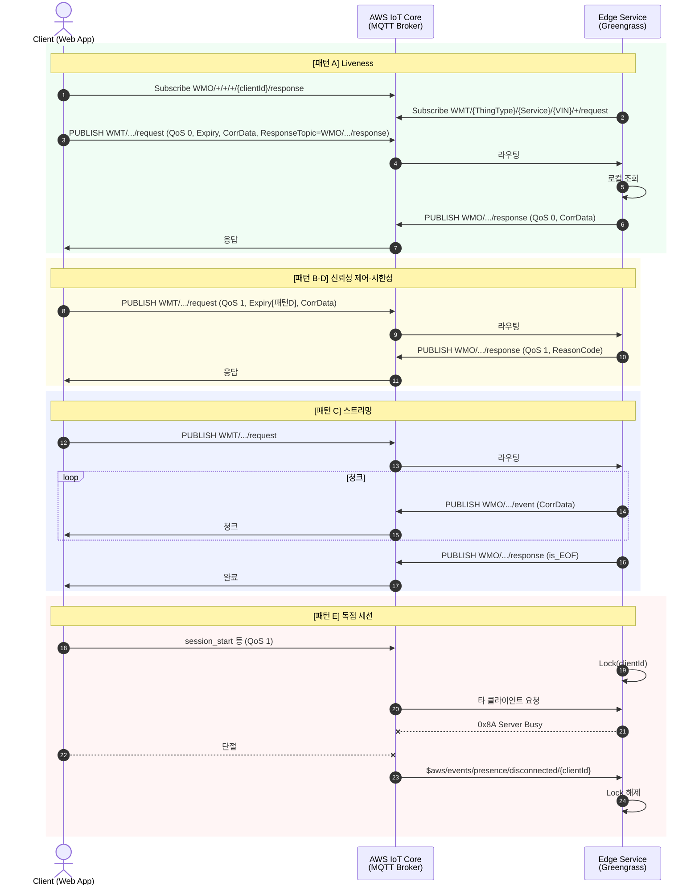

## 1. 개요 및 공통 규약

AWS Greengrass 기반 엣지가 제공하는 서비스를 웹 클라이언트가 **MQTT 5.0**으로 호출할 때의 패턴을 정의한다. 토픽·메타데이터 규격의 단일 출처는 [TOPIC_AND_ACL_SPEC.md](TOPIC_AND_ACL_SPEC.md) 및 [RPC_DESIGN.md](RPC_DESIGN.md)이다.

### 1.1. 통신 기반

- **엣지:** Greengrass Component 등 — `maas-server-sdk`로 `WMT/{ThingType}/{Service}/{VIN}/+/request` 구독.
- **클라이언트:** MQTT over WSS — `maas-client-sdk`로 요청 발행 및 `WMO/+/+/+/{clientId}/response|event` 구독.

### 1.2. MQTT 5 속성

1. **User Property:** `content-type` 등 (JSON 권장).
2. **Response Topic:** `WMO/{ThingType}/{Service}/{VIN}/{ClientId}/response` — 클라이언트의 MQTT ClientId가 경로에 포함되며, [TOPIC_AND_ACL_SPEC.md](TOPIC_AND_ACL_SPEC.md)의 ACL과 일치해야 한다.
3. **Correlation Data:** 요청-응답·스트림 청크 매칭.
4. **Reason Code / User Property `reason_code`:** [TOPIC_AND_ACL_SPEC.md](TOPIC_AND_ACL_SPEC.md) Reason Code 표 준수.

### 1.3. 컴포넌트 가용성

Greengrass IPC 환경에서 LWT가 제한될 수 있으므로, Shadow 또는 Heartbeat로 가용성을 보조한다 (기존과 동일).

### 1.4. Reason Code

[TOPIC_AND_ACL_SPEC.md](TOPIC_AND_ACL_SPEC.md) §7 및 [RPC_DESIGN.md](RPC_DESIGN.md) 참고.

---

## 2. RPC 패턴별 설계 명세

### 패턴 A: 상태 및 정보 조회 (Liveness/Health Check)

- 서버: 응답을 **QoS 0**, `Correlation Data` 유지.
- 클라이언트: **QoS 0**, Message Expiry·앱 타임아웃 약 3초 권장.

### 패턴 B: 신뢰성 보장 단일 제어 (Reliable Control)

- 서버: **QoS 1** 응답, 실패 시 Reason Code·`error_detail`.
- 클라이언트: **QoS 1**, 타임아웃 10~15초 등 여유 있게.

### 패턴 C: 대용량 데이터 스트리밍 (Chunked Streaming)

- 서버: 청크는 `WMO/.../event`, 완료는 `WMO/.../response` + `is_EOF`, 필요 시 Topic Alias.
- 클라이언트: 동일 `Correlation Data`로 청크 수신, `is_EOF`로 종료.
- 스트리밍 중 클라이언트 단절 시 `$aws/events/presence/disconnected/+` 등으로 전송 중단.

### 패턴 D: 시한성 안전 제어 (Time-bound)

- 클라이언트: **Message Expiry Interval** 엄격 설정, **Clean Start**로 stale 응답 방지.

### 패턴 E: 독점 세션 (Exclusive Session / Remote UDS)

- 서버: 세션 Lock, 타 `clientId`에 **0x8A**, 단절 시 Lock 해제.
- 클라이언트: 세션 획득·해제 RPC 순서 준수, **QoS 1** 권장.

---

## 3. 세션 및 연결 관리 표준

### 3.1. 웹 클라이언트 Keep-Alive

WSS 환경에서 로드밸런서 Idle Timeout을 고려하여 MQTT **Keep-Alive 30~45초** 권장.
