# RPC 시퀀스 다이어그램

> 클라이언트 SDK가 사용하는 RPC 패턴별 전체 흐름.  
> 각 다이어그램은 흐름 구조를 간결하게 표현하고, 상세 메시지 사양은 다이어그램 아래에 별도로 기술한다.

---

## 참여자 (Participants)

| 기호 | 역할 |
|------|------|
| **App** | SDK를 호출하는 애플리케이션 코드 |
| **SDK** | `RpcClient` / `RpcClientAsync` (maas-rpc-client-sdk) |
| **GW** | WSS-MQTT API Gateway (WebSocket ↔ MQTT 변환 + ACL) |
| **Broker** | MQTT 브로커 |
| **Edge** | 엣지 서버 — Machine (RPC 서비스 제공) |

---

## 토픽 패턴 요약

```
요청  WMT/{service}/{thing_name}/{oem}/{asset}/request
응답  WMO/{service}/{thing_name}/{oem}/{asset}/{client_id}/response
```

예시 값: `service=RemoteUDS`, `thing_name=device_001`, `oem=acme`, `asset=VIN123`, `client_id=client_A`

---

## 0 — 엣지 서버 사전 구독 (서버 시작 시 1회)

> 엣지 서버가 기동될 때 요청 토픽을 미리 구독해 두어야 클라이언트 요청을 수신할 수 있다.  
> 이 구독은 서버 SDK 시작 시 **1회** 수행하며, 이후 모든 클라이언트 요청에 공유된다.

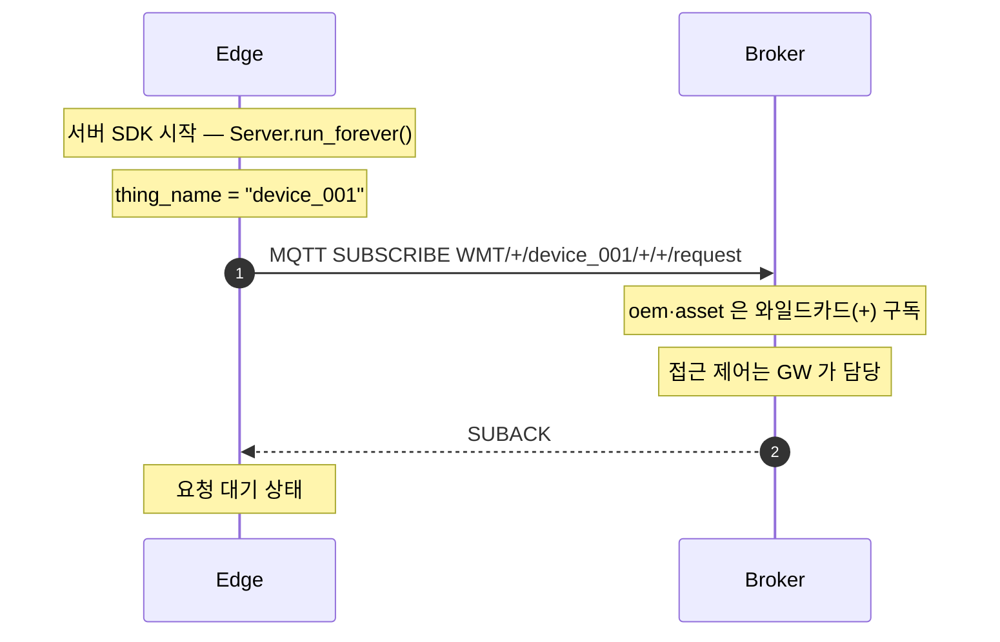

**구독 패턴 상세**

```
단일 서비스:  WMT/RemoteUDS/device_001/+/+/request
복수 서비스:  WMT/+/device_001/+/+/request
```

- `oem`, `asset` 을 `+` 와일드카드로 구독 — 접근 제어는 GW 가 담당
- 수신 토픽에서 `oem`, `asset` 값을 파싱하여 `RequestContext` 에 주입

---

## 패턴 1 — `call()` : 단일 요청-응답

### 1-1 정상 흐름

> 전제: **0** 의 엣지 서버 사전 구독이 완료된 상태

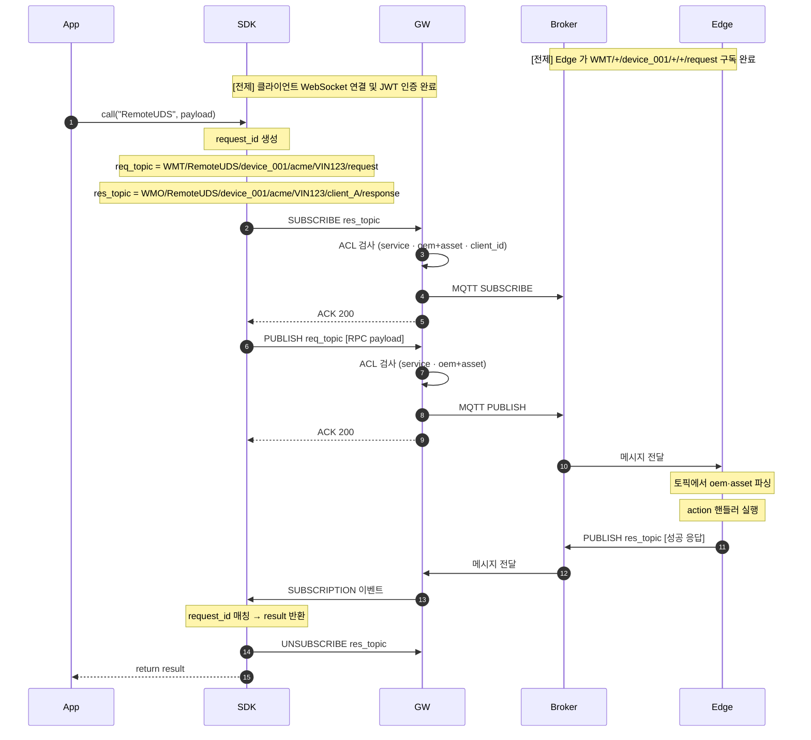

**① 요청 Payload** (SDK → GW → Broker → Edge)

```json
{
  "request_id": "a3f9e2b1c4d5...",
  "response_topic": "WMO/RemoteUDS/device_001/acme/VIN123/client_A/response",
  "request": {
    "action": "readDTC",
    "params": { "source": 1 }
  }
}
```

**② 성공 응답 Payload** (Edge → Broker → GW → SDK)

```json
{
  "request_id": "a3f9e2b1c4d5...",
  "result": { "dtcList": [] },
  "error": null
}
```

---

### 1-2 예외 — 엣지 서버 에러 응답 (RpcError)

> 전제: Edge 가 WMT/+/device_001/+/+/request 구독 완료

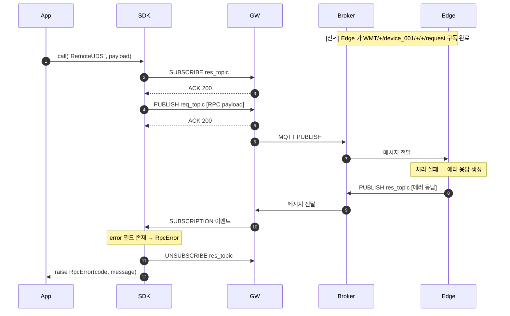

**에러 응답 Payload**

```json
{
  "request_id": "a3f9e2b1c4d5...",
  "result": null,
  "error": {
    "code": "DEVICE_BUSY",
    "message": "현재 처리 불가 상태입니다"
  }
}
```

---

### 1-3 예외 — 응답 타임아웃 (RpcTimeoutError)

> 전제: Edge 가 WMT/+/device_001/+/+/request 구독 완료

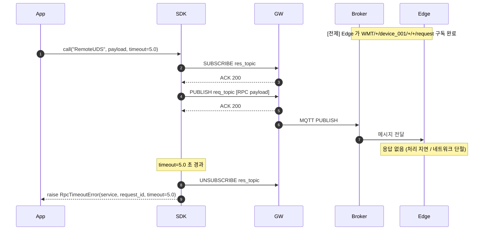

---

### 1-4 예외 — 게이트웨이 ACL 거부

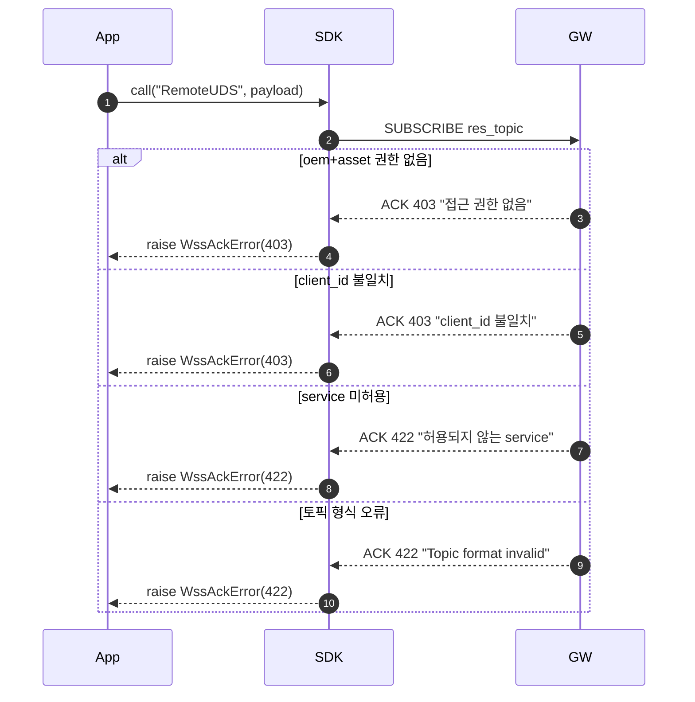

> 발행(PUBLISH) 단계에서도 동일한 ACL 검사가 적용된다.  
> 발행 거부 시 SDK는 응답 토픽 구독을 자동 해제한 후 예외를 전달한다.

---

### 1-5 예외 — payload 검증 오류 (네트워크 미사용)

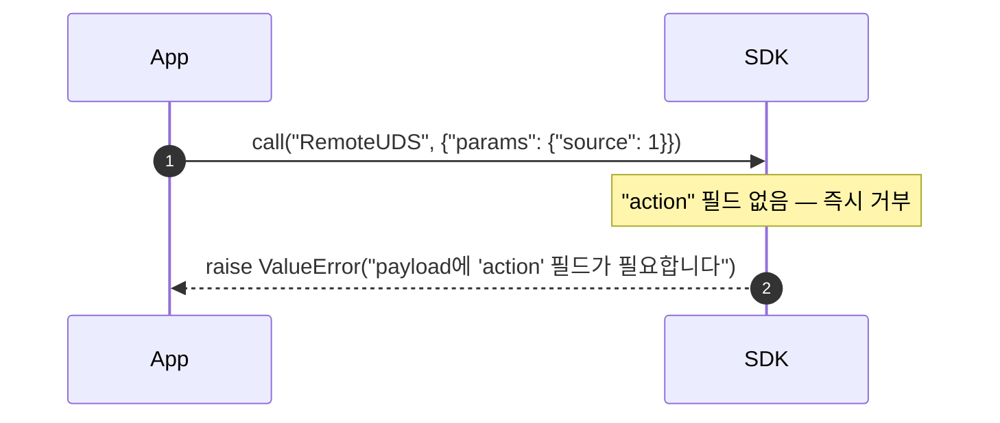

---

## 패턴 2 — `call_stream()` : 단일 요청, 멀티 응답

> 1회 요청 후 서버가 청크를 순차 발행.  
> `done: true` 수신 시 스트림 종료.

### 2-1 정상 흐름

> 전제: **0** 의 엣지 서버 사전 구독이 완료된 상태

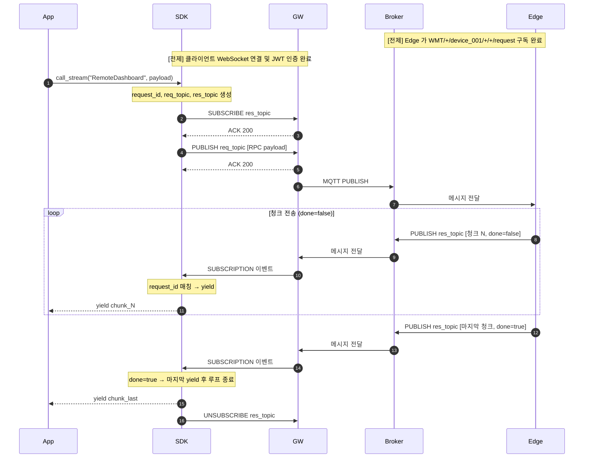

**중간 청크 Payload**

```json
{
  "request_id": "c7d8e9f0...",
  "result": { "chunk": [1, 2], "seq": 1 },
  "done": false
}
```

**마지막 청크 Payload**

```json
{
  "request_id": "c7d8e9f0...",
  "result": { "chunk": [10, 11], "seq": 5 },
  "done": true
}
```

---

### 2-2 예외 — 스트림 중 에러 응답

> 전제: Edge 가 WMT/+/device_001/+/+/request 구독 완료

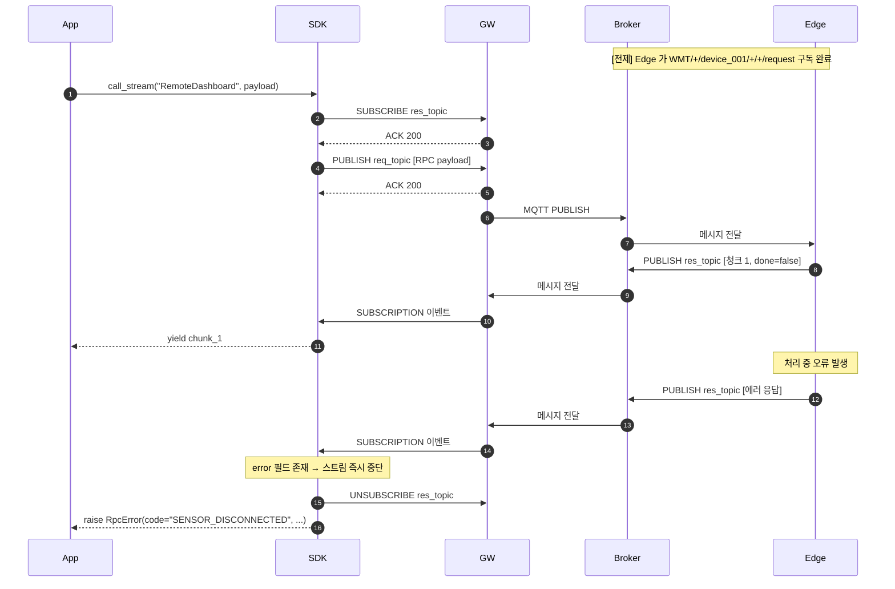

---

### 2-3 예외 — 첫 청크 수신 타임아웃

> 전제: Edge 가 WMT/+/device_001/+/+/request 구독 완료

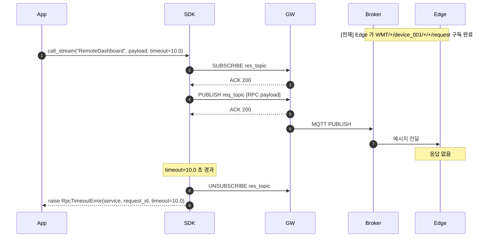

---

## 패턴 3 — 연결 수립 및 종료

### 3-1 WebSocket 연결 + JWT 인증

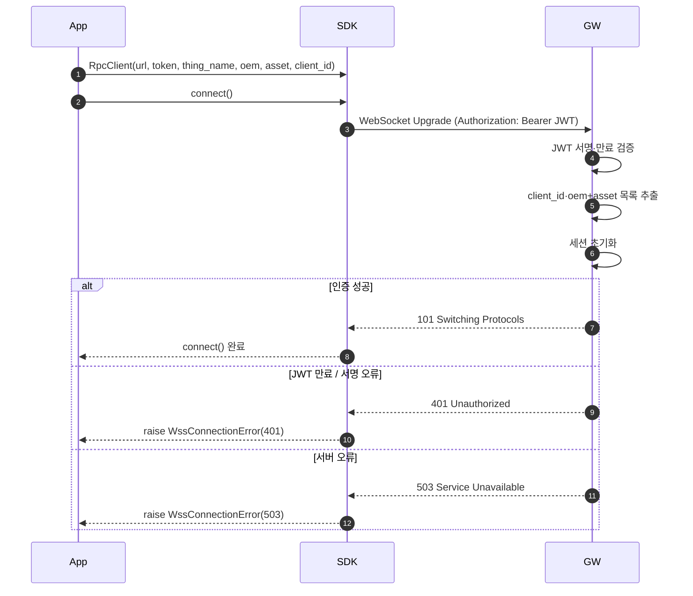

---

### 3-2 연결 종료

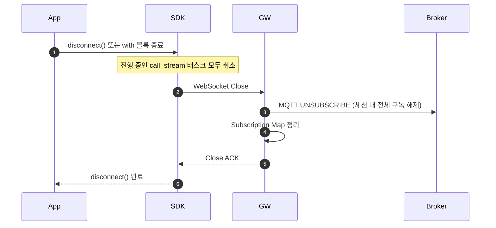

---

## 패턴 4 — 복수 클라이언트 동시 접근

> 동일 엣지 서버에 A, B 두 클라이언트가 동시에 요청.  
> `client_id` 가 다르면 응답 토픽이 완전히 격리된다.

> 전제: Edge 가 WMT/+/device_001/+/+/request 구독 완료

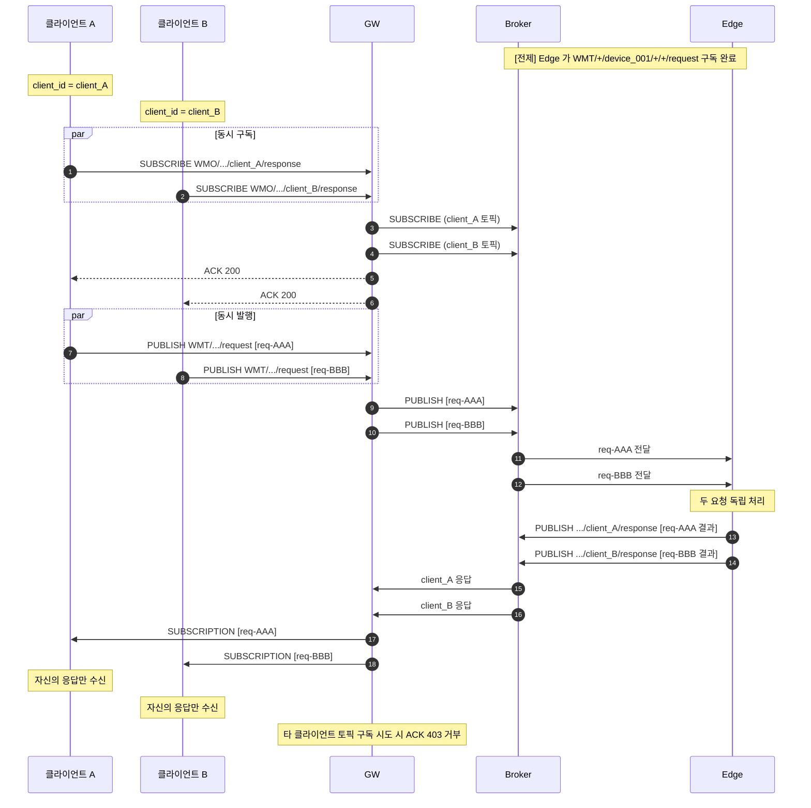

---

## 예외 코드 요약

| 발생 위치 | 예외 타입 | 원인 |
|-----------|-----------|------|
| SDK 내부 | `ValueError` | payload에 `action` 필드 없음 |
| GW ACK | `WssAckError(403)` | oem+asset 접근 권한 없음 |
| GW ACK | `WssAckError(403)` | WMO 구독 시 client_id 불일치 |
| GW ACK | `WssAckError(422)` | service 미허용 또는 토픽 형식 오류 |
| Edge 응답 | `RpcError` | 서버가 `error` 필드로 응답 |
| 타임아웃 | `RpcTimeoutError` | 응답 미수신, timeout 경과 |
| 연결 | `WssConnectionError` | WebSocket 연결 실패 또는 JWT 인증 오류 |

---

## 메시지 Envelope 규격 (WSS ↔ GW)

```json
// 발행 요청 (Client → GW)
{ "action": "PUBLISH", "req_id": "wss-pub-001",
  "topic": "WMT/…/request", "payload": { /* RPC 요청 */ } }

// 구독 요청 (Client → GW)
{ "action": "SUBSCRIBE", "req_id": "wss-sub-001",
  "topic": "WMO/…/response" }

// ACK (GW → Client)
{ "event": "ACK", "req_id": "wss-sub-001", "code": 200 }

// 구독 이벤트 전달 (GW → Client)
{ "event": "SUBSCRIPTION", "req_id": "wss-sub-001",
  "topic": "WMO/…/response", "payload": { /* RPC 응답 */ } }
```

---

## 참조

- [`TOPIC_AND_ACL_SPEC.md`](TOPIC_AND_ACL_SPEC.md) — WMT/WMO 토픽 패턴 및 ACL 규격
- [`RPC_DESIGN.md`](RPC_DESIGN.md) — RPC 방법론 및 전송 계층 설계
- [`system_specification_v1.md`](system_specification_v1.md) — WSS-MQTT API 전체 사양
