# RPC 시퀀스 다이어그램

> 클라이언트 SDK가 사용하는 RPC 패턴별 전체 흐름.  
> 정상 흐름, 예외 상황, 메시지 사양을 포함한다.

---

## 등장 인물 (Participants)

| 기호 | 이름 | 설명 |
|------|------|------|
| **App** | 애플리케이션 | SDK를 사용하는 최종 코드 |
| **SDK** | RpcClient / RpcClientAsync | maas-rpc-client-sdk |
| **GW** | WSS-MQTT API Gateway | WebSocket ↔ MQTT 프로토콜 변환 및 ACL 처리 |
| **Broker** | MQTT Broker | 토픽 기반 발행/구독 브로커 |
| **Edge** | 엣지 서버 (Machine) | 브로커에 연결된 RPC 서비스 제공 서버 |

---

## 메시지 사양 참조

### WSS Envelope (클라이언트 ↔ 게이트웨이)

```json
// 발행 요청 (Client → GW)
{
  "action": "PUBLISH",
  "req_id": "wss-req-001",
  "topic": "WMT/{service}/{thing_name}/{oem}/{asset}/request",
  "payload": { /* RPC 요청 Payload */ }
}

// 구독 요청 (Client → GW)
{
  "action": "SUBSCRIBE",
  "req_id": "wss-req-002",
  "topic": "WMO/{service}/{thing_name}/{oem}/{asset}/{client_id}/response"
}

// ACK (GW → Client)
{
  "event": "ACK",
  "req_id": "wss-req-001",
  "code": 200
}

// 구독 이벤트 전달 (GW → Client)
{
  "event": "SUBSCRIPTION",
  "req_id": "wss-req-002",
  "topic": "WMO/{service}/{thing_name}/{oem}/{asset}/{client_id}/response",
  "payload": { /* RPC 응답 Payload */ }
}
```

### RPC 요청 Payload (클라이언트 → 엣지 서버)

```json
{
  "request_id": "a3f9e2b1c4d5...",
  "response_topic": "WMO/{service}/{thing_name}/{oem}/{asset}/{client_id}/response",
  "request": {
    "action": "readDTC",
    "params": { "source": 1 }
  }
}
```

### RPC 응답 Payload (엣지 서버 → 클라이언트)

```json
// 성공
{ "request_id": "a3f9e2b1...", "result": { "dtcList": [] }, "error": null }

// 실패
{ "request_id": "a3f9e2b1...", "result": null,
  "error": { "code": "DEVICE_BUSY", "message": "처리 불가" } }

// call_stream 청크 (중간)
{ "request_id": "a3f9e2b1...", "result": { "chunk": [...] }, "done": false }

// call_stream 종료 청크
{ "request_id": "a3f9e2b1...", "result": { "chunk": [...] }, "done": true }
```

---

## 패턴 1 — `call()` : 단일 요청-응답 (Request-Response)

### 1.1 정상 흐름

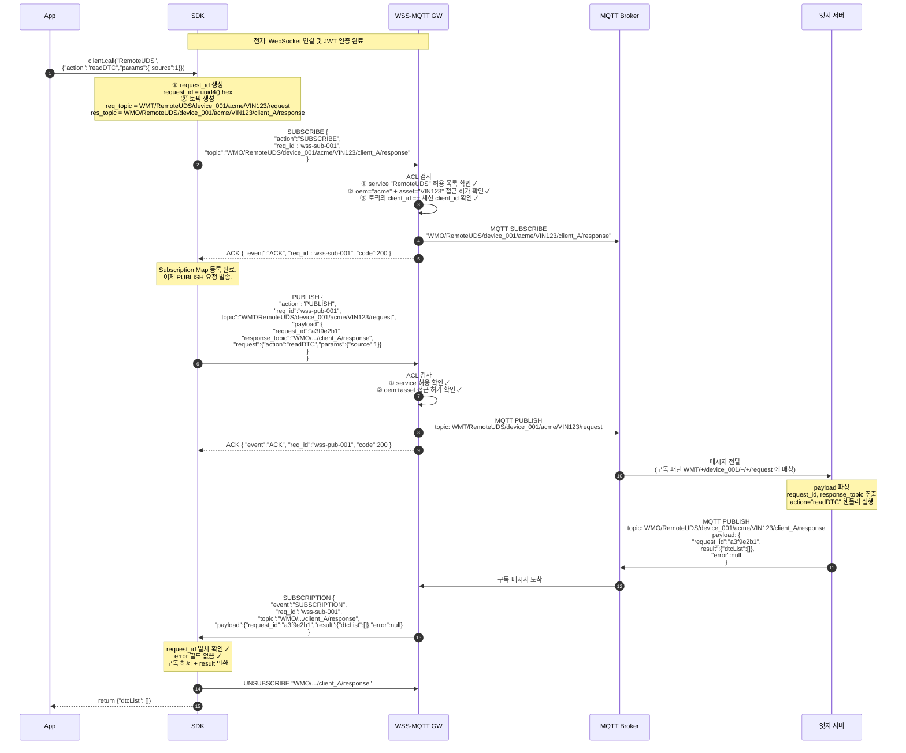

---

### 1.2 예외 — 엣지 서버가 에러 응답 (RpcError)

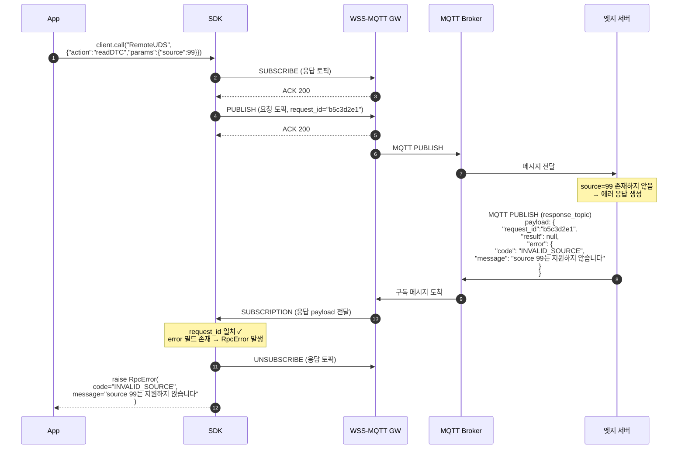

---

### 1.3 예외 — 타임아웃 (RpcTimeoutError)

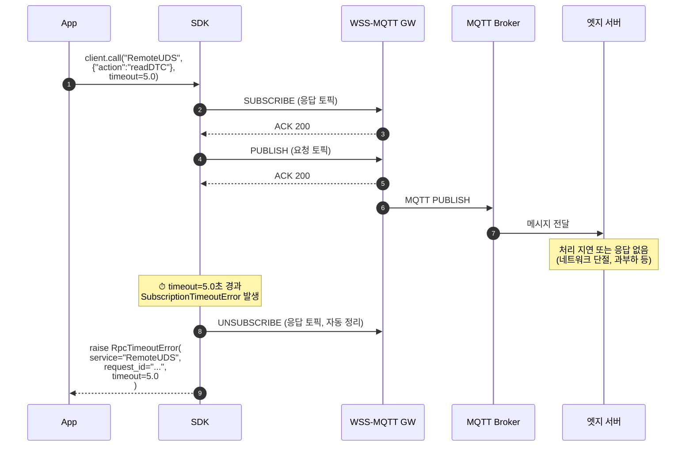

---

### 1.4 예외 — 게이트웨이 ACL 거부 (구독 단계)

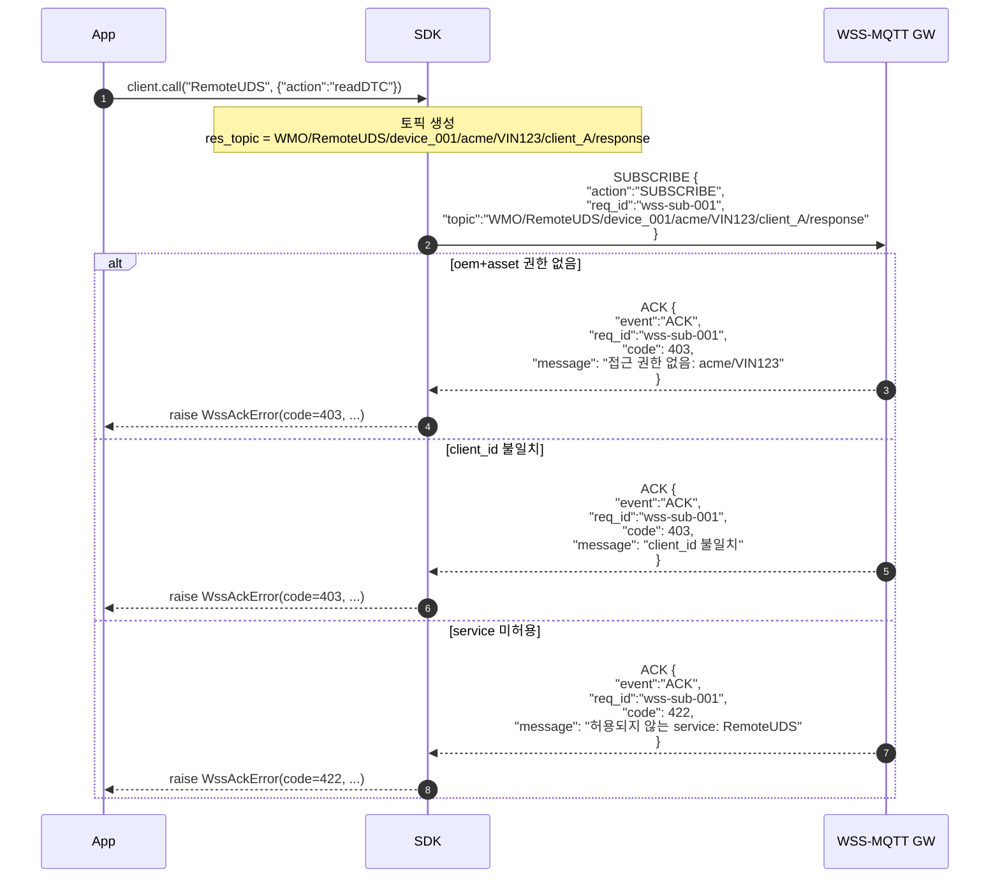

---

### 1.5 예외 — 게이트웨이 ACL 거부 (발행 단계)

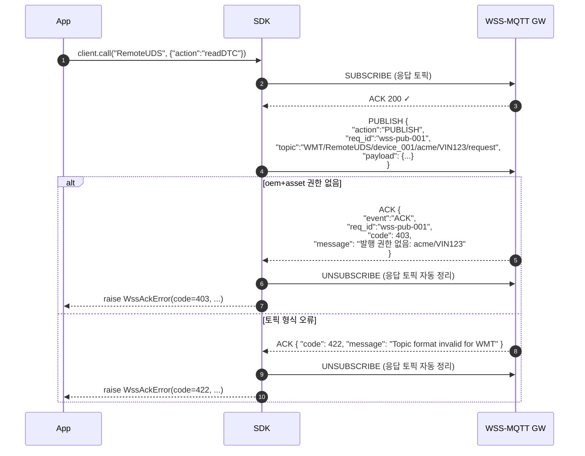

---

### 1.6 예외 — payload 검증 오류 (SDK 내부)

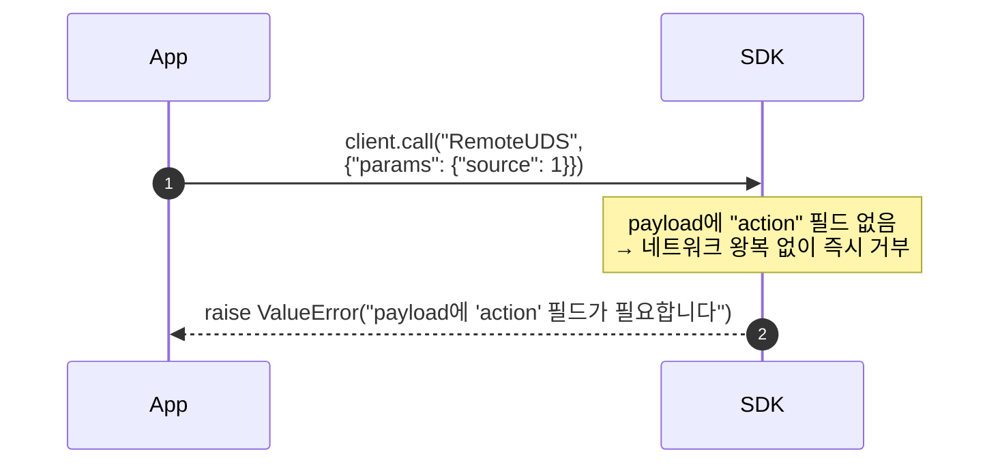

---

## 패턴 2 — `call_stream()` : 단일 요청, 멀티 응답

> 1회 요청 후 서버가 여러 청크를 순차 발행. `done: true` 또는 `stream_end: true` 수신 시 종료.  
> 동일 응답 토픽을 사용하며, 각 청크는 `request_id`로 매칭된다.

### 2.1 정상 흐름

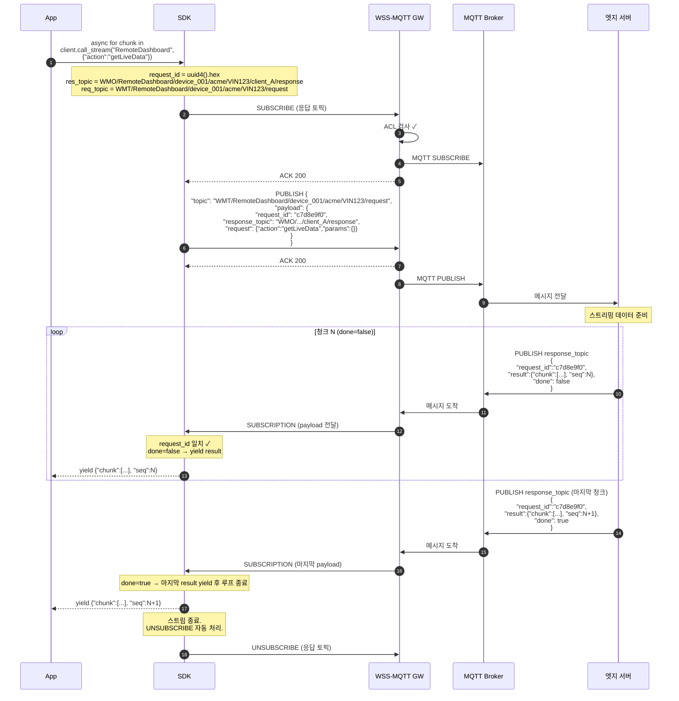

---

### 2.2 예외 — 스트림 중 에러 응답

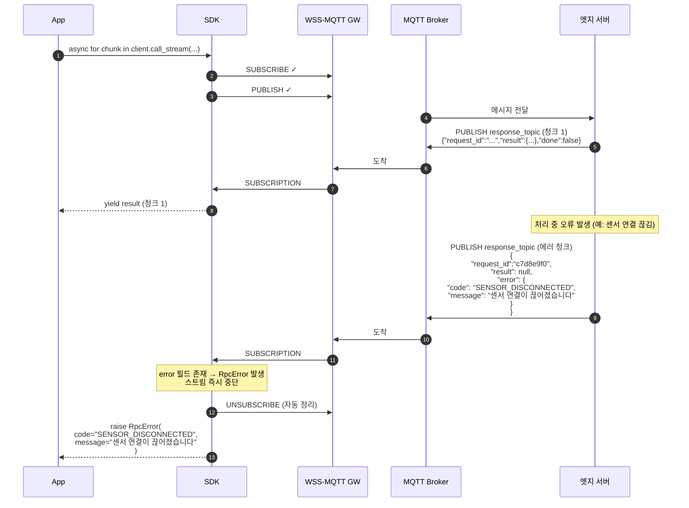

---

### 2.3 예외 — 첫 청크 수신 타임아웃

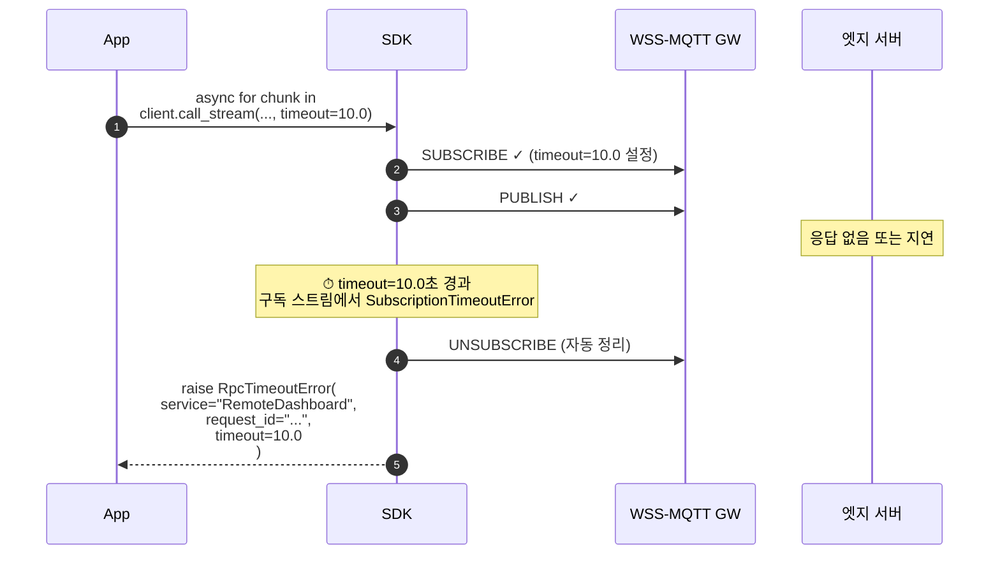

---

## 패턴 3 — 연결 수립 및 인증

> 모든 RPC 패턴의 전제 조건.

### 3.1 WebSocket 연결 + JWT 인증

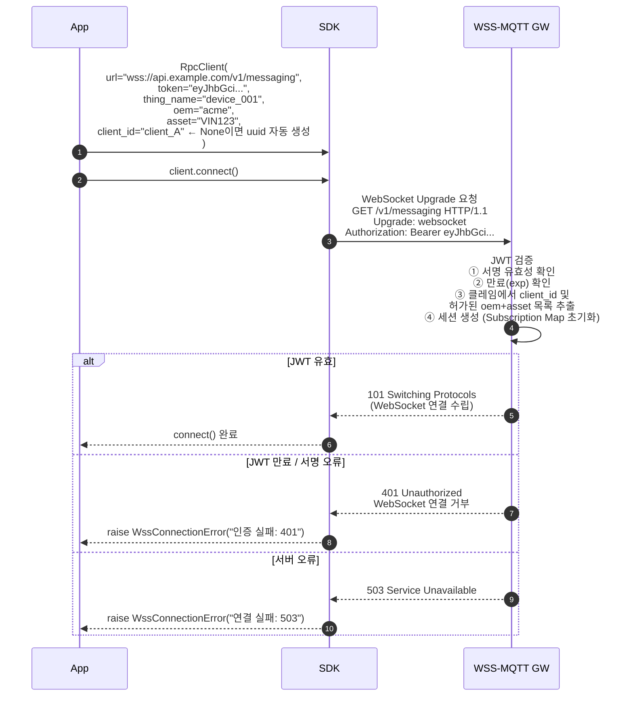

---

### 3.2 연결 종료

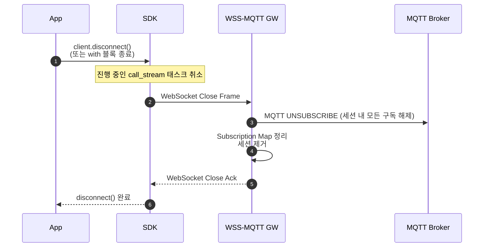

---

## 패턴 4 — 복수 클라이언트 동시 접근

> 동일 엣지 서버에 여러 클라이언트가 동시에 RPC 요청하는 경우.  
> 각 클라이언트는 고유한 `client_id`로 응답 토픽이 격리된다.

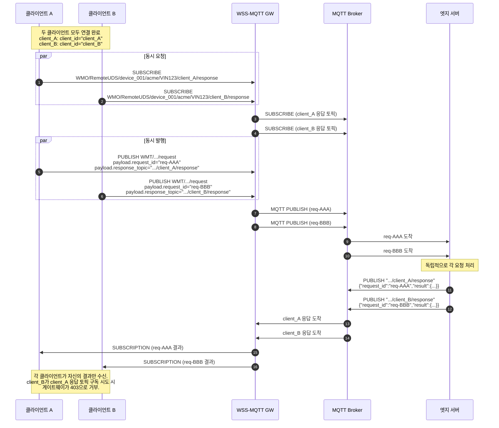

---

## 전체 예외 코드 요약

| 발생 위치 | 예외 / 코드 | 원인 | SDK 동작 |
|-----------|-------------|------|----------|
| SDK (내부) | `ValueError` | payload에 `action` 필드 없음 | 즉시 raise, 네트워크 요청 없음 |
| GW → SDK | `WssAckError(403)` | oem+asset 접근 권한 없음 | raise, 구독 자동 정리 |
| GW → SDK | `WssAckError(403)` | WMO 구독 시 client_id 불일치 | raise |
| GW → SDK | `WssAckError(422)` | service 미허용 | raise |
| GW → SDK | `WssAckError(422)` | 토픽 형식 오류 (세그먼트 수 불일치) | raise |
| Edge → SDK | `RpcError` | 서버가 `error` 필드로 응답 | raise, 구독 자동 정리 |
| SDK (타임아웃) | `RpcTimeoutError` | 응답 미수신, timeout 경과 | raise, 구독 자동 정리 |
| Transport | `WssConnectionError` | WebSocket 연결 실패, JWT 인증 오류 | raise |

---

## 참조

- `docs/TOPIC_AND_ACL_SPEC.md` — WMT/WMO 토픽 패턴 및 ACL 규격
- `docs/RPC_DESIGN.md` — RPC 방법론 및 전송 계층 설계
- `docs/system_specification_v1.md` — WSS-MQTT API 사양 (Envelope, ACK, SUBSCRIPTION 등)
- `SDK/client/python/maas-rpc-client-sdk/maas_rpc_client/client_async.py` — SDK 구현체
