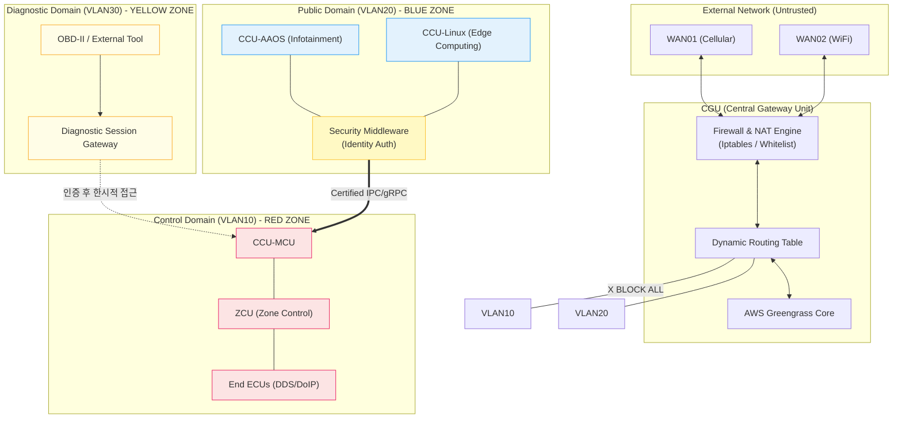
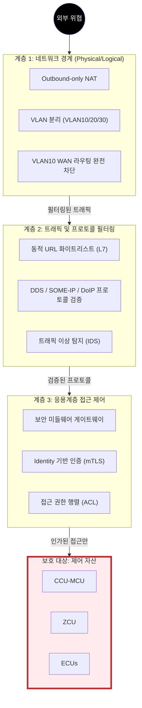
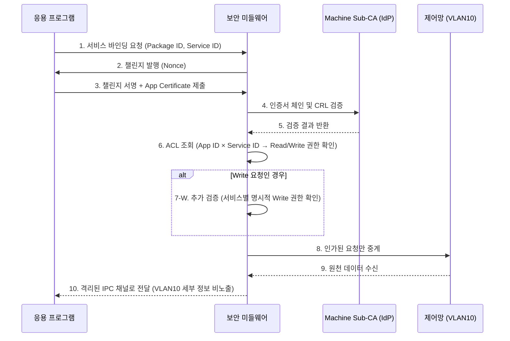

# SDM Connectivity 망분리 정책 시스템 요구사양서

| 항목 | 내용 |
| --- | --- |
| 문서 버전 | v2.0 |
| 작성일 | 2026-03-25 |
| 상태 | 초안 (Draft) |

---

## 1. 개요

### 1.1 목적

본 문서는 SDM(Software Defined Machine) 환경에서 제어망을 외부 위협으로부터 보호하기 위한 **망분리 정책(Network Separation Policy)**을 정의한다. CGU(Central Gateway Unit)를 중심으로 네트워크 계층 간 엄격한 격리와 자격 증명 기반의 통신을 구현함으로써, EU CRA(Cyber Resilience Act)의 'Security by Design' 원칙에 부합하는 보안 아키텍처를 수립하는 것을 목적으로 한다.

### 1.2 범위

본 사양서는 다음 영역의 요구사항을 정의한다.

- CGU의 네트워크 인터페이스 및 VLAN 분리 구조
- 도메인별 라우팅 및 트래픽 필터링 정책
- 응용계층의 제어망 접근 통제 정책
- 자격 증명 및 인증서 관리 정책
- 클라우드 기반 정책 배포 및 감사 정책
- 특수 환경(현장 로컬망, 진단) 연결 보안 정책

### 1.3 CRA 대응

본 망분리 정책은 CRA의 다음 핵심 요구사항을 직접적으로 충족한다.

| CRA 요구사항 | 본 문서의 대응 |
| --- | --- |
| Security by Design | VLAN 기반 물리/논리적 망분리 (§2) |
| 최소 권한 원칙 | Identity 기반 접근 제어 ACL (§4, Appendix B) |
| 보안 업데이트 지원 | OTA 기반 정책 배포 채널 (§6) |
| 취약점 공시 및 대응 | 인증서 폐기, Kill-switch, 감사 로그 (§5, §7) |

---

## 2. 네트워크 정의 (Network Definition)

### 2.1 전체 아키텍처



### 2.2 내부 네트워크 정의

| ID | 식별자 | 명칭 | 설명 | 외부 연결 |
| --- | --- | --- | --- | --- |
| NET-001 | **VLAN10** | 제어망 (Control Domain) | 실시간 제어 데이터, ECU 간 통신 | **금지 (폐쇄망)** |
| NET-002 | **VLAN20** | 공용망 (Public Domain) | 클라우드(CCP), API 서버 통신 | 화이트리스트 허용 |
| NET-003 | **VLAN30** | 진단망 (Diagnostic Domain) | OBD-II 단자를 통한 외부 진단 장치 연결 | 인증 후 한시적 허용 |

### 2.3 외부 인터페이스 (WAN)

| ID | 인터페이스 | 용도 | 비고 |
| --- | --- | --- | --- |
| NET-004 | **WAN01 (Cellular)** | 원격 관리, OTA, 클라우드 통신 | 기본 인터페이스 |
| NET-005 | **WAN02 (WiFi)** | 현장 로컬망 또는 일반 인터넷 접근 | 연결 환경 자동 감지 (§Appendix A) |
| NET-006 | WAN 이중화 | WAN01/WAN02 동시 운용 시 NAT 및 화이트리스트 정책은 두 인터페이스 모두에 동일하게 적용 | 전환 시 정책 연속성 보장 |

---

## 3. 라우팅 및 필터링 정책

### 3.1 제어망 (VLAN10) 정책

| ID | 요구사항 |
| --- | --- |
| RT-001 | WAN(WAN01, WAN02) 방향으로의 모든 라우팅을 차단한다. |
| RT-002 | VLAN10 내 허용 프로토콜은 **DDS, SOME/IP, DoIP**에 한정하며, 이 외의 패킷은 즉시 차단(DROP) 및 로그를 기록한다. |
| RT-003 | VLAN10 ↔ VLAN20 간 직접 라우팅을 금지한다. 제어망 데이터는 반드시 보안 미들웨어를 경유해야 한다. |
| RT-004 | VLAN10 내부 노드 간(MCU ↔ ZCU ↔ ECU) 포워딩은 허용하되, ESTABLISHED/RELATED 세션에 대한 응답 패킷을 명시적으로 허용한다. |

> **[예시] Iptables 핵심 규칙 구조**
> ```bash
> # 기본 정책: 전체 차단 (Default Deny)
> iptables -P FORWARD DROP
>
> # VLAN10: ESTABLISHED 응답 패킷 허용 (체인 최상단)
> iptables -A FORWARD -m state --state ESTABLISHED,RELATED -j ACCEPT
>
> # VLAN10: WAN 방향 차단 (명시적)
> iptables -A FORWARD -i eth0.10 -o wwan0 -j REJECT
> iptables -A FORWARD -i eth0.10 -o wlan0 -j REJECT
>
> # VLAN10: 허용 프로토콜 (DDS/SOME-IP/DoIP)
> iptables -A FORWARD -i eth0.10 -p udp --dport 7400:7500 -j ACCEPT  # DDS
> iptables -A FORWARD -i eth0.10 -p tcp --dport 30490 -j ACCEPT      # SOME/IP
> iptables -A FORWARD -i eth0.10 -p tcp --dport 13400 -j ACCEPT      # DoIP
>
> # VLAN10: 그 외 트래픽 명시적 차단 및 로그
> iptables -A FORWARD -i eth0.10 -j LOG --log-prefix "VLAN10_DENY: "
> iptables -A FORWARD -i eth0.10 -j DROP
> ```

### 3.2 공용망 (VLAN20) 정책

| ID | 요구사항 |
| --- | --- |
| RT-005 | Outbound-only NAT를 적용하여 외부로부터의 직접적인 Inbound 접근을 차단한다. |
| RT-006 | 화이트리스트(URL/IP 대역)에 등록된 목적지로의 아웃바운드 트래픽만 허용한다. |
| RT-007 | 화이트리스트에 미등록된 목적지로의 트래픽은 CCP L7 API Proxy로 강제 중계하여 정책 검증 후 허용 여부를 결정한다. |
| RT-008 | 화이트리스트는 AWS IoT Named Shadow와 동기화하여 동적으로 관리한다. |

### 3.3 진단망 (VLAN30) 정책

| ID | 요구사항 |
| --- | --- |
| RT-009 | 진단 장치는 CGU의 인증을 획득한 경우에만 VLAN30 세션을 개설할 수 있다. |
| RT-010 | 진단 세션은 최대 **2시간**으로 제한하며, 만료 시 자동으로 세션을 종료하고 VLAN30 접근을 차단한다. |
| RT-011 | 진단 세션 중 접근 가능한 범위는 사전 정의된 진단 ACL(화이트리스트 방식)에 한정하며, 제어 Write 명령은 별도 승인 절차를 거쳐야 한다. (§4.3 참조) |
| RT-012 | 진단 세션 중 이상 행동(비정상적 패킷 패턴, ACL 외 접근 시도) 감지 시 세션을 즉시 강제 종료한다. |

---

## 4. 도메인별 접근 제어 요구사항

### 4.1 계층적 방어 모델



### 4.2 응용계층 격리 (Application Layer Isolation)

| ID | 요구사항 |
| --- | --- |
| AC-001 | ZCU, CCU-MCU는 VLAN10에만 물리/논리적으로 연결하며, 공용망(VLAN20) 인터페이스를 제거한다. |
| AC-002 | CCU-AAOS, CCU-Linux 상의 응용 프로그램은 VLAN10 인터페이스에 직접 소켓을 생성하거나 패킷을 송수신하는 것을 원천 금지한다. |
| AC-003 | 응용 프로그램은 보안 미들웨어를 통한 IPC 또는 로컬 gRPC 채널을 통해서만 제어망 데이터에 접근할 수 있다. |
| AC-004 | 보안 미들웨어는 모든 요청에 대해 **Identity 기반 인증 및 ACL 검증**을 수행한 후 데이터를 중계한다. (상세: Appendix B) |

### 4.3 제어 명령(Write) 접근 통제

| ID | 요구사항 |
| --- | --- |
| AC-005 | ACL은 Read(데이터 구독)와 Write(제어 명령 전달)를 명시적으로 구분하여 관리한다. |
| AC-006 | Write 권한은 Read 권한보다 엄격히 제한하며, 제조사 서명이 포함된 앱 인증서와 서비스별 명시적 권한 부여가 동시에 충족된 경우에만 허용한다. |
| AC-007 | 보안 미들웨어 프로세스가 비정상 종료되거나 훼손 징후가 감지될 경우, CGU는 해당 미들웨어를 통한 모든 VLAN10 접근 경로를 자동으로 차단한다. |

---

## 5. 자격증명 및 키 관리 (PKI/mTLS)

### 5.1 계층적 PKI 구조

| 계층 | 구성 요소 | 역할 |
| --- | --- | --- |
| Root CA | 제조사 관리 (오프라인) | Sub-CA 인증서 발행 |
| Machine Sub-CA | 장비(CGU)별 고유 탑재 | 장비 내 Entity 인증서 실시간 발행·검증 |
| End-Entity | App Certificate, ECU Certificate | 미들웨어 접근 및 제어기 간 통신 보호 |

### 5.2 하드웨어 보안 요구사항

| ID | 요구사항 |
| --- | --- |
| PKI-001 | 모든 개인키(Private Key)는 HSM 또는 TEE 내부에서 생성·저장하며, 외부에 노출되어서는 안 된다. |
| PKI-002 | 보안 부팅(Secure Boot)을 통해 인증되지 않은 소프트웨어의 실행을 차단한다. |

### 5.3 상호 인증(mTLS) 요구사항

| ID | 요구사항 |
| --- | --- |
| PKI-003 | 모든 서비스 간 통신은 TLS 1.3 이상의 mTLS를 통한 상호 인증 후 수립되어야 한다. |
| PKI-004 | Perfect Forward Secrecy(PFS) 확보를 위해 Ephemeral Diffie-Hellman 키 교환 방식을 적용한다. |

### 5.4 인증서 생명주기 관리

| ID | 요구사항 |
| --- | --- |
| PKI-005 | 인증서 만료 전 자동 갱신을 시도하며, 갱신 실패 시 운영자에게 즉시 알림을 발송한다. |
| PKI-006 | **인터넷 단절 환경에서의 인증서 검증**은 CRL(Certificate Revocation List)의 로컬 캐싱 사본을 활용한다. OCSP는 온라인 환경에서만 사용한다. |
| PKI-007 | 인증서 만료 직전까지 갱신에 실패한 경우, 장비는 기존 인증서로 동작을 유지하되 경보 상태를 유지하고 갱신 재시도를 지속한다. 통신을 강제 중단하지 않는다. |
| PKI-008 | Machine Sub-CA 훼손이 감지된 경우, Root CA에서 해당 Sub-CA의 인증서를 즉시 폐기하고, 영향받은 장비의 인증서를 전수 재발급한다. |
| PKI-009 | 인증서 폐기 시 CRL 즉시 업데이트 또는 OCSP를 통해 해당 인증서 기반의 통신을 즉시 차단한다. |
| PKI-010 | 보안 정책 및 Root CA 업데이트는 무결성이 보장된 OTA 채널을 통해서만 수행한다. |

---

## 6. 정책 관리 및 배포 (CCP)

### 6.1 정책 배포 아키텍처

AWS IoT Named Shadow를 통해 장비별 방화벽 정책을 중앙에서 관리한다.

> **[Shadow 정책 JSON 구조 예시]**
> ```json
> {
>   "state": {
>     "desired": {
>       "firewall_policy": {
>         "version": "2026.03.25.v1",
>         "update_id": "req-98765",
>         "whitelist_urls": ["api.ccp-service.com", "ota.manufacturer.io"],
>         "site_lan_configs": [
>           { "site_id": "SITE_01", "server_ip": "172.16.10.100", "allowed_ports": [443] }
>         ],
>         "allowed_protocols": ["DDS", "SOME/IP", "DoIP"]
>       }
>     },
>     "reported": {
>       "firewall_policy": { "version": "2026.03.25.v1", "status": "applied" }
>     }
>   }
> }
> ```

### 6.2 정책 관리 요구사항

| ID | 요구사항 |
| --- | --- |
| MGT-001 | 정책 변경 시 `version` 및 `update_id`를 자동 생성하여 이력을 추적 가능하도록 한다. |
| MGT-002 | 관리자가 입력한 화이트리스트(URL, IP 대역)는 배포 전 자동으로 규격 유효성 검증을 수행한다. |
| MGT-003 | 정책 배포는 단일 장비, 현장 그룹, 전체 장비 단위로 선택적 타겟팅을 지원한다. |
| MGT-004 | 신규 장비 등록 시 OTA 및 인증 서버만 허용하는 **'표준 디폴트 정책'**을 자동 적용한다. |
| MGT-005 | 정책 적용 실패 또는 보안 무결성 이슈 발생 시 직전 정상 정책으로 즉시 롤백한다. |

### 6.3 오프라인 가용성 요구사항

| ID | 요구사항 |
| --- | --- |
| MGT-006 | 인터넷 단절 환경에서도 로컬에 캐싱된 마지막 `desired` 정책으로 방화벽을 계속 운용한다. |
| MGT-007 | 장비 재부팅 시 클라우드 연결 전까지 로컬 캐싱 정책을 로드하여 'Default Deny' 상태를 유지한다. |

### 6.4 긴급 제어 요구사항

| ID | 요구사항 |
| --- | --- |
| MGT-008 | 특정 위협 도메인/IP를 모든 장비에서 즉시 차단하는 **긴급 전역 차단(Kill-switch)** 기능을 구현한다. |
| MGT-009 | Kill-switch 발동 시점에 오프라인 상태인 장비는, 재연결 즉시 해당 차단 정책을 최우선으로 적용한다. 오프라인 기간 동안에는 기존 정책을 유지하되, Kill-switch 대상과의 통신 시도를 로그로 기록한다. |

---

## 7. 로깅 및 감사 (Audit & Logging)

| ID | 요구사항 |
| --- | --- |
| LOG-001 | 방화벽 차단 이벤트, 인증 시도(성공/실패), ACL 위반, 진단 세션 이력은 타임스탬프와 함께 보안 로그로 기록한다. |
| LOG-002 | 보안 로그는 CGU의 비휘발성 저장소에 기록하며, 주기적으로 CCP(클라우드)로 전송하여 이상 징후 분석에 활용한다. |
| LOG-003 | 로그의 위변조 방지를 위해 로그 레코드에 서명을 적용하거나, 실시간 스트리밍 전송을 통해 무결성을 보장한다. |
| LOG-004 | 정책 수정 및 배포를 수행한 작업자 ID, 일시, 변경 전/후 내용을 별도 감사 DB에 기록한다. |
| LOG-005 | 보안 로그의 보존 기간은 최소 **3년**으로 하며, 관련 법규 또는 고객 요구사항이 이를 초과하는 경우 그에 따른다. |

---

## 8. 결론

본 사양서는 SDM 환경의 제어망을 보호하기 위해 물리/논리적 망분리, 프로토콜 필터링, Identity 기반 접근 제어, 인증서 기반 신뢰 체계를 통합한 **다계층 망분리 정책**을 정의한다. 이를 통해 제어망의 무결성을 확보하고, 동시에 EU CRA의 보안 설계 요구사항을 충족할 수 있는 아키텍처 기반을 제공한다.

---

## Appendix A. 현장 로컬망(Site-LAN) 연결 보안 통제 규격

### A.1 개요

셀룰러 통신이 불안정한 현장 환경에서 WAN02(WiFi)를 통해 현장 관제 서버와 통신할 때 발생하는 특수 시나리오에 대한 보안 요구사항을 정의한다.

### A.2 Site-LAN 자동 감지 및 보안 요구사항

| ID | 요구사항 |
| --- | --- |
| SL-001 | CGU는 WAN02 연결 시 할당받은 IP 대역이 사전 정의된 현장 서버 대역과 일치할 경우 해당 연결을 'Site-WAN'으로 분류한다. |
| SL-002 | **DHCP 스푸핑 공격 방지:** Site-WAN 분류의 근거를 DHCP IP 대역만으로 한정하지 않는다. CGU는 현장 관제 서버의 인증서(PKI)를 추가로 검증하여 상호 인증이 성공한 경우에만 Site-WAN 정책을 활성화한다. |
| SL-003 | 현장 서버로의 모든 통신은 TLS 1.3 이상의 HTTPS를 사용하며, 외부 클라우드(CCP)와 동일한 수준의 화이트리스트 정책을 적용한다. |
| SL-004 | 클라우드(AWS)와의 연결이 단절된 경우, CGU는 로컬에 캐싱된 최신 화이트리스트 정책으로 현장 서버 접속을 유지한다. |
| SL-005 | 제어망(VLAN10)은 현장 로컬망 연결 여부와 무관하게 항상 폐쇄망으로 유지된다. |

> **데이터 흐름:** 제어기(VLAN10) ↔ 보안 미들웨어 ↔ 앱(VLAN20) ↔ CGU ↔ Site-WiFi ↔ 현장 서버

---

## Appendix B. 보안 미들웨어 자격 증명 및 접근 제어 규격

### B.1 개요

CCU-AAOS 및 CCU-Linux의 응용 프로그램이 제어망(VLAN10) 데이터에 접근하기 위해 보안 미들웨어와 수행하는 **Identity 기반 접근 제어(IBAC)** 의 상세 절차를 정의한다.

### B.2 인증 및 접근 절차



### B.3 보안 요구사항

| ID | 요구사항 |
| --- | --- |
| MW-001 | 각 앱별로 독립적인 통신 세션을 유지하며, 프로세스 간 메모리 격리를 시행한다. |
| MW-002 | 자격 증명 없이는 어떠한 프로세스도 VLAN10 인터페이스에 직접 접근할 수 없다. |
| MW-003 | 미들웨어 프로세스가 비정상 종료되거나 훼손 징후가 감지될 경우, VLAN10으로의 모든 접근 경로를 자동 차단한다. |
| MW-004 | 모든 인증 시도(성공/실패)와 ACL 위반은 타임스탬프와 함께 보안 로그로 기록하고 주기적으로 CCP로 전송한다. |

---

## Appendix C. AWS Greengrass 기반 정책 동기화 규격

### C.1 아키텍처 개요

| 구성 요소 | 역할 |
| --- | --- |
| AWS IoT Named Shadow | 장비별 화이트리스트 및 방화벽 정책을 JSON으로 관리 |
| Greengrass Shadow Manager | `desired` ↔ `reported` 상태 동기화. 오프라인 시 로컬 캐싱 유지 |
| Local Policy Enforcer | Shadow 변경 감지 후 `ipset` / `iptables` 규칙을 원자적으로 갱신 |

### C.2 정책 동기화 요구사항

| ID | 요구사항 |
| --- | --- |
| GG-001 | 방화벽 규칙 갱신은 원자적(Atomic) 방식(`ipset swap`)으로 수행하여 갱신 중 보안 홀을 방지한다. |
| GG-002 | 화이트리스트에 도메인 주소가 포함된 경우, 내부 DNS Resolver를 통해 IP로 변환하여 `ipset`에 등록하고 DNS TTL 만료 시 자동 갱신한다. |
| GG-003 | 비정상적인 정책 데이터 수신 시 해당 정책을 적용하지 않고 마지막 정상 정책을 유지하며 오류를 로그에 기록한다. |
| GG-004 | Shadow를 통해 전달되는 모든 정책 데이터는 AWS IoT의 mTLS 채널을 통해 보호된다. |

> **[원자적 업데이트 로직 예시]**
> ```python
> import subprocess
> import socket
> import logging
> from typing import List
>
> logger = logging.getLogger(__name__)
>
>
> class WhitelistEnforcer:
>     """ipset 기반 화이트리스트 원자적 업데이트 담당 클래스."""
>
>     def __init__(self, set_name: str = "CGU_WHITELIST") -> None:
>         self.set_name = set_name
>         subprocess.run(
>             ["ipset", "create", self.set_name, "hash:net", "-exist"], check=True
>         )
>
>     def _resolve_to_ip(self, entry: str) -> str:
>         """도메인 주소를 IP로 변환한다. 이미 IP인 경우 그대로 반환한다."""
>         try:
>             socket.inet_aton(entry)
>             return entry
>         except socket.error:
>             return socket.gethostbyname(entry)
>
>     def apply_new_policy(self, whitelist_data: List[str]) -> bool:
>         """새로운 화이트리스트 정책을 원자적으로 적용한다.
>
>         Args:
>             whitelist_data: 허용할 IP 대역 또는 도메인 목록.
>
>         Returns:
>             정책 적용 성공 여부.
>         """
>         temp_set = f"{self.set_name}_new"
>         try:
>             subprocess.run(
>                 ["ipset", "create", temp_set, "hash:net", "-exist"], check=True
>             )
>             for entry in whitelist_data:
>                 ip = self._resolve_to_ip(entry)
>                 subprocess.run(["ipset", "add", temp_set, ip], check=True)
>
>             # 원본 셋과 원자적 교체
>             subprocess.run(["ipset", "swap", temp_set, self.set_name], check=True)
>             logger.info("화이트리스트 정책 적용 성공: %d 항목", len(whitelist_data))
>             return True
>         except (subprocess.CalledProcessError, socket.gaierror) as e:
>             logger.error("화이트리스트 정책 적용 실패, 기존 정책 유지: %s", e)
>             return False
>         finally:
>             subprocess.run(["ipset", "destroy", temp_set], check=False)
> ```
