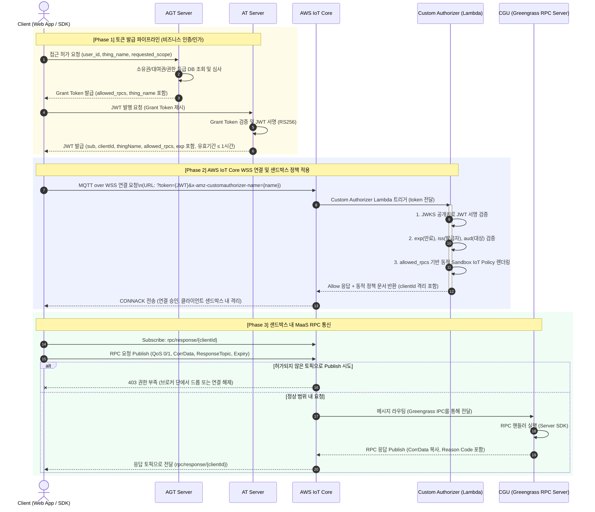
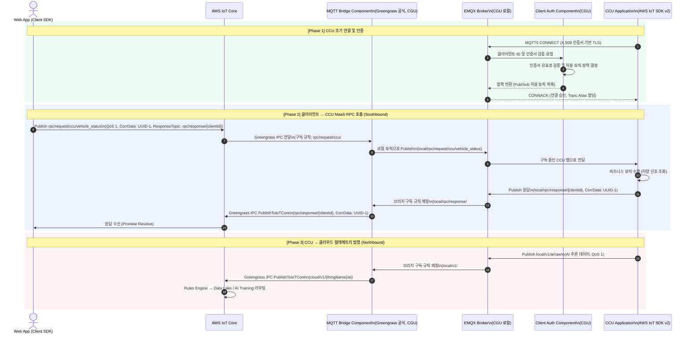
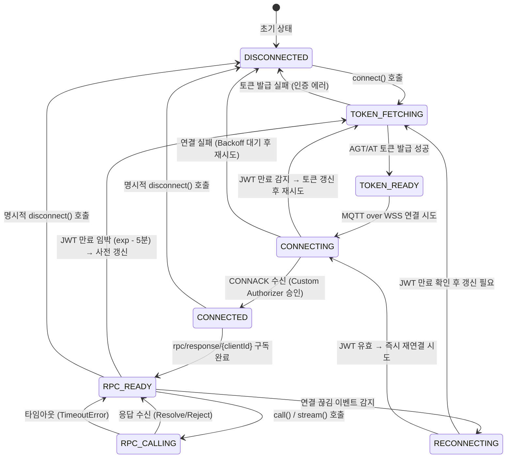
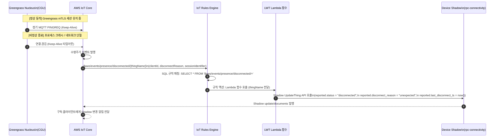
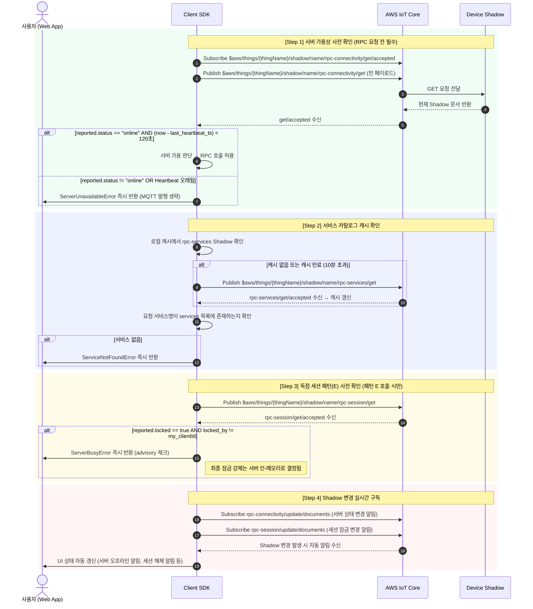
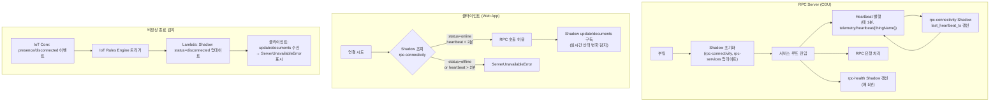

> **규범 안내 (2026):** 웹·외부 클라이언트가 **AWS IoT Core에 직접** 연결하는 RPC의 토픽·페이로드(`action`)·ACL은 [TOPIC_AND_ACL_SPEC.md](TOPIC_AND_ACL_SPEC.md)의 **WMT/WMO** 구조와 [RPC_DESIGN.md](RPC_DESIGN.md)를 따른다. SDK는 `maas-client-sdk`, `maas-server-sdk`를 사용한다.  
> 본 문서 본문에 나오는 `rpc/request/...`, `rpc/response/...`, `local/rpc/...` 등은 **CCU 내부 EMQX·MQTT Bridge 중계 경로** 설명 또는 과거 명칭이 포함될 수 있으므로, 신규 클라우드 직접 연동 설계 시에는 반드시 WMT/WMO 사양과 대조한다.

---

## 목차

1. [개요](#1-개요)
2. [목적](#2-목적)
3. [시스템 아키텍처](#3-시스템-아키텍처)
4. [기능 정의](#4-기능-정의)
   - 4.1 인증 및 인가 시스템
   - 4.2 MQTT 5.0 통신 표준
   - 4.3 RPC 패턴 정의 (패턴 A~E)
   - 4.4 연결 관리
   - 4.5 SDK 설계 요구사항
   - 4.6 MQTT Bridge 인프라 요구사항 (CCU MaaS 확장)
   - **4.7 AWS IoT Device Shadow 설계 및 활용**
   - 4.8 응용 서비스 연동 규격
5. [제약 사항](#5-제약-사항)
6. [성능 요구사항](#6-성능-요구사항)
7. [협의사항](#7-협의사항)

---

## 1. 개요

### 1.1. 배경 및 시스템 정의

SDM(Software Defined Machine)은 소프트웨어가 기계의 핵심 기능을 정의하고 제어하는 차세대 건설기계 플랫폼이며 클라우드 기반의 원격 관제, OTA 업데이트, 원격 진단, 자율 제어 등의 기능을 통합적으로 제공한다.

본 사양서는 이러한 SDM 플랫폼 위에서 **MaaS(Machine as a Service)** 패러다임을 구현하는 RPC(Remote Procedure Call) 프레임워크 전반의 시스템 요구사항을 정의한다. MaaS는 기계를 단순한 물리적 자산이 아닌, 인터넷을 통해 언제 어디서든 서비스 형태로 호출 및 제어 가능한 원격 서비스 엔드포인트로 추상화하는 개념이다.

본 프레임워크의 통신 기반은 **AWS IoT Core**를 중심 브로커(Message Broker)로 삼는 **MQTT 5.0 over WSS(WebSocket Secure)** 프로토콜이다. AWS IoT Core는 수백만 대의 기기를 동시에 관리할 수 있는 완전 관리형 MQTT 브로커 서비스로, 본 시스템에서는 클라이언트와 엣지 기기 간의 모든 RPC 메시지를 중계하는 핵심 인프라로 기능한다.

### 1.2. 시스템 구성 요소 요약

본 MaaS RPC 프레임워크는 다음의 논리적 구성 요소로 이루어진다.

| 구성 요소 | 약어 | 역할 |
| --- | --- | --- |
| Common Connectivity Platform | CCP | AWS Cloud 인프라 전체. IoT Core, Lambda, Cognito 등 포함 |
| AWS IoT Core | IoT Core | MQTT 5.0 메시지 브로커. 모든 RPC 메시지의 라우팅 허브 |
| Custom Authorizer | CA (Lambda) | WSS 연결 시 JWT 검증 및 동적 IoT 정책 생성 Lambda 함수 |
| Access Grant Token Server | AGT | 사용자의 장비 접근 권한 심사 및 승인 토큰 발급 서버 |
| Access Token Server | AT | AGT 승인 결과를 기반으로 JWT(Access Token) 발행 서버 |
| Connectivity Gateway Unit | CGU | AWS IoT Greengrass V2 Core Device. 엣지 게이트웨이 |
| Central Computing Unit | CCU | 기계의 핵심 연산 노드. 자율주행, 인포테인먼트, 원격 진단 등 수행 |
| EMQX Broker | EMQX | CGU 내 로컬 MQTT 5.0 브로커. CCU 기기들의 내부망 메시지 허브 |
| Client Auth Component | ClientAuth | CGU 내 Greengrass Component. EMQX에 연결하는 CCU 기기의 X.509 인증서 검증 및 토픽 정책 강제 |
| MQTT Bridge Component | Bridge | CGU 내 Greengrass 공식 MQTT Bridge Component. EMQX 로컬 토픽을 AWS IoT Core 토픽으로 양방향 중계 |
| RPC Server Component | RPC-S | CGU 내 Greengrass Component. MaaS 서비스 공급자 역할 |
| Client SDK | Client SDK | 웹 앱 또는 외부 시스템이 MaaS 서비스를 호출하기 위한 라이브러리 |
| Server SDK | Server SDK | CGU RPC Server Component 개발자가 MaaS 서비스를 구현하기 위한 라이브러리 |

### 1.3. 핵심 설계 철학

본 MaaS RPC 프레임워크는 다음의 다섯 가지 핵심 설계 철학을 기반으로 한다.

**① 서버 주도(Server-Driven) 서비스 정의**
모든 서비스(API)의 정의, 패턴, 권한 범위는 서버(RPC Server Component)가 주도하여 공표하며, 클라이언트는 해당 명세에 맞춰 호출 로직을 구성해야 한다. 서버가 수용하지 않는 토픽으로의 발행은 브로커 단에서 차단된다.

**② 샌드박스(Sandbox) 기반 최소 권한 통제**
클라이언트는 AWS IoT Core에 직접 영구 자격 증명을 보유하지 않는다. 반드시 비즈니스 인증 파이프라인(AGT → AT)을 통해 발급받은 단기 수명 JWT를 사용해 연결하며, 해당 JWT의 권한 범위를 기반으로 동적 생성된 IoT 정책(Sandbox Policy) 내에서만 동작한다. 이는 최소 권한의 원칙(Principle of Least Privilege)을 브로커 레벨에서 기계적으로 강제하는 구조다.

**③ 심층 방어(Defense in Depth) 아키텍처**
CGU만을 외부 인터넷과 연결되는 유일한 관문(Single Point of Contact)으로 지정한다. CCU는 외부 인터넷에 직접 노출되지 않으며, CCU의 모든 외부 통신은 CGU를 통해서만 이루어진다. 이는 기계의 핵심 제어 노드가 사이버 공격 표면에서 원천적으로 격리되도록 보장한다.

**④ MQTT 5.0 고급 기능 활성화**
본 프레임워크는 MQTT 3.1.1이 아닌 MQTT 5.0을 필수 프로토콜로 채택한다. Correlation Data(상관관계 데이터), Response Topic(응답 토픽), Message Expiry Interval(메시지 만료 간격), User Properties(사용자 속성), Topic Alias(토픽 별칭), Reason Code(이유 코드) 등 MQTT 5.0 고유의 메커니즘을 적극 활용하여 비동기 RPC 통신의 신뢰성, 효율성, 표현력을 최대화한다.

**⑤ MQTT Bridge를 통한 CCU MaaS 확장**
CGU 위에서 동작하는 EMQX 로컬 브로커, Client Auth Component, AWS Greengrass 공식 MQTT Bridge Component를 조합하면 CCU 수준의 서비스도 MaaS RPC로 노출할 수 있다. CCU 애플리케이션은 AWS IoT SDK v2를 사용하여 CGU 내 EMQX에 MQTT5 over TLS로 연결하고, MQTT Bridge Component가 로컬 토픽과 AWS IoT Core의 RPC 토픽 간 양방향 중계를 수행한다. 이 구조는 CCU가 외부 인터넷에 직접 노출되지 않으면서도 MaaS 서비스 공급자 또는 호출자로 기능할 수 있도록 확장성을 확보한다.

### 1.4. 적용 범위

본 사양서는 다음 항목에 적용된다.

- AWS IoT Core 기반 MQTT 5.0 브로커 연결 및 보안 정책
- AGT/AT 기반 인증·인가 파이프라인 구조
- Custom Authorizer Lambda 함수 설계 및 동적 정책 생성 규칙
- RPC 통신 패턴 (패턴 A~E) 정의 및 표준
- MQTT 토픽 네임스페이스 및 구조 규칙
- CGU RPC Server SDK 설계 요구사항
- Client SDK 설계 요구사항
- EMQX + Client Auth Component + MQTT Bridge Component 기반 CCU MaaS 연동 방안
- 연결 관리 및 세션 수명주기 관리
- VISSv3, 원격시동 등 응용 서비스 연동 규격
- 향후 순수 WSS 확장 아키텍처 검토 기준

---

## 2. 목적

### 2.1. 문서의 목적

본 시스템 요구사양서(SysRS, System Requirements Specification)는 SDM 플랫폼 위에서 동작하는 MaaS RPC 프레임워크의 아키텍처 설계 기준과 기능·비기능 요구사항을 공식적으로 명세하는 문서다.

본 문서는 다음의 독자를 대상으로 한다.

- **총괄**: 시스템 구조 설계 및 기술 스택 의사결정
- **2세부 (CCP)**:
    - 인증·인가 아키텍처 및 보안 정책 검토
    - AWS 리소스 프로비저닝 및 네트워크 정책 구성
    - AGT/AT 서버, Custom Authorizer Lambda 구현
    - Client SDK 구현 및 활용 기준
- **1세부 (CGU)**:
    - CGU Greengrass Component (EMQX, Client Auth Component, MQTT Bridge Component) 구현
    - VISSv3 RPC 서비스 구현
    - RPC Server SDK 구현 및 활용 기준 (표준 Python SDK)
- **2세부 (CCU):**
    - RPC Server SDK 구현 및 활용 기준 (확장 언어 SDK)
- **3세부 (FMS/CCU):**
    - 요구사항 도출
    - RPC 응용 서비스 구현

### 2.2. 시스템의 목적

SDM MaaS RPC 프레임워크의 궁극적 목적은 **기계를 언제 어디서든 안전하게 원격으로 호출 가능한 서비스 엔드포인트로 만드는 것**이다. 구체적으로 다음과 같은 목적을 달성해야 한다.

**① 원격 제어 및 모니터링 통합 플랫폼 구축**
기계의 물리적 위치에 관계없이 웹 브라우저, 모바일 앱, 관제 시스템 등 다양한 클라이언트가 동일한 인터페이스로 기계를 제어하고 상태를 조회할 수 있는 통합 통신 플랫폼을 구축한다.

**② 표준화된 비동기 RPC 인터페이스 제공**
기계가 제공하는 다양한 서비스를 일관된 RPC 패턴으로 표준화하여, 서비스 구현자와 호출자 간의 인터페이스 계약을 명확히 한다.

**③ 엔터프라이즈급 보안 아키텍처 내재화**
JWT 기반 단기 수명 토큰, Lambda Custom Authorizer를 통한 동적 IoT 정책, 토픽 레벨의 최소 권한 강제 등 다계층 보안 메커니즘을 프레임워크 수준에서 강제하여 개별 서비스 구현자가 보안을 별도로 고려하지 않아도 되는 구조를 만든다.

**④ 프로토콜 통합 및 RPC 서버 확장**
클라우드 향 MQTT 5.0(CGU-CCP 레벨), 로컬 MQTT 5.0(CCU-EMQX 레벨) 등 서로 다른 네트워크 계층의 통신 노드들을 EMQX 로컬 브로커 + MQTT Bridge Component 아키텍처를 통해 단일 MaaS 서비스 체계 아래에 통합한다.

**⑤ 글로벌 규제 대응 기반 마련**
EU 사이버 복원력법(CRA), UN R155, ISO/SAE 21434 등 글로벌 사이버 보안 규제에 대응하는 아키텍처적 기반을 제공한다.

### 2.3. 용도 및 활용 방안

MaaS RPC 프레임워크는 다음과 같은 구체적인 응용 서비스를 지원하는 기반 인프라로 활용된다.

| 응용 서비스 | 활용 RPC 패턴 | 설명 |
| --- | --- | --- |
| **VISSv3 차량 신호 서비스** | 패턴 A (Liveness) | VISS(Vehicle Information Service Specification) v3 기반으로 기계의 실시간 신호(RPM, 온도, 위치 등)를 표준화된 트리 구조로 조회 |
| **원격 시동 / 시동 차단** | 패턴 D (Time-bound) | 시동 명령은 지연 전달 시 위험하므로 엄격한 만료 간격 적용. 인가된 사용자만 호출 가능 |
| **원격 작업등/경보음 제어** | 패턴 B (Reliable) | 하드웨어 상태 변경이 반드시 확인되어야 하는 신뢰성 보장 제어 |
| **원격 CAN 로그 추출** | 패턴 C (Streaming) | 진단 데이터 대용량 스트리밍. Topic Alias 및 EOF 마커 활용 |
| **원격 UDS 진단** | 패턴 E (Exclusive Session) | ECU 리셋, DTC 조회 등 독점 세션이 필요한 원격 OBD/UDS 진단 |
| **펌웨어 OTA 트리거** | 패턴 B + Greengrass OTA | 원격 업데이트 명령 전송 후 Greengrass 배포 파이프라인 연동 |
| **에너지 관리** | 패턴 A / B | 배터리 잔량, 충전 상태 조회 및 충전 제어 |
| **원격 잠금/잠금 해제** | 패턴 B (Reliable) | 기계 도어락, 운전석 접근 제어 등 보안 게이팅 |

---

## 3. 시스템 아키텍처

### 3.1. 전체 시스템 구성 개요

```mermaid
graph TD
    subgraph ClientZone["🖥️ 클라이언트 영역"]
        WebApp["Web App / Mobile App<br/>(Client SDK 탑재)"]
        ExtSvc["외부 연동 시스템<br/>(관제 센터, B2B 파트너)"]
    end

    subgraph AuthZone["🔐 비즈니스 백엔드 (인증/인가 파이프라인)"]
        AGT["AGT Server<br/>(Access Grant Token)<br/>장비 접근 권한 심사 및 승인"]
        AT["AT Server<br/>(Access Token)<br/>단기 수명 JWT 발행 및 서명"]
        AGT -- "승인 내역 (allowed_rpcs, thingName)" --> AT
    end

    subgraph AWSZone["☁️ AWS Cloud (CCP - Common Connectivity Platform)"]
        IoTCore["AWS IoT Core<br/>(MQTT 5.0 Broker)<br/>메시지 라우팅 허브"]
        CA["Custom Authorizer<br/>(AWS Lambda)<br/>JWT 검증 & 동적 IoT 정책 생성"]
        Shadow["AWS IoT Device Shadow<br/>(RPC 서버 상태 관리)"]
        Rules["AWS IoT Rules Engine<br/>(텔레매틱스 라우팅)"]
        IoTCore -- "JWT 검증 요청" --> CA
        CA -- "동적 Sandbox Policy 반환" --> IoTCore
        IoTCore --> Shadow
        IoTCore --> Rules
    end

    subgraph CGUZone["🟢 CGU (Connectivity Gateway Unit) - AWS Greengrass Core Device"]
        GGNucleus["Greengrass Nucleus<br/>(코어 엔진: mTLS, OTA, TES, IPC)"]
        RPCServer["RPC Server Component<br/>(Server SDK 탑재)<br/>MaaS 서비스 공급자 (CGU 레벨)"]
        EMQX["EMQX Broker<br/>(로컬 MQTT 5.0 브로커)<br/>CCU 기기 메시지 허브"]
        ClientAuth["Client Auth Component<br/>(X.509 인증서 검증)<br/>CCU 기기 접근 토픽 정책 강제"]
        MQTTBridge["MQTT Bridge Component<br/>(Greengrass 공식 컴포넌트)<br/>로컬 EMQX ↔ AWS IoT Core 양방향 중계"]
        PresenceMonitor["Presence Monitor<br/>($aws/events/presence/disconnected/+)"]
        GGNucleus --- RPCServer
        GGNucleus --- MQTTBridge
        GGNucleus --- PresenceMonitor
        EMQX <--> ClientAuth
        EMQX <--> MQTTBridge
    end

    subgraph CCUZone["🔵 CCU (Central Computing Unit) - 내부망 전용"]
        CCUApp1["AI / Vision App<br/>(AWS IoT SDK v2 탑재)"]
        CCUApp2["Remote Diagnostic App<br/>(AWS IoT SDK v2 탑재)"]
        CCUApp3["Vehicle Control App<br/>(AWS IoT SDK v2 탑재)"]
    end

    %% Client -> Auth -> AWS
    WebApp -- "① 접근 허가 요청 (User ID, 장비 ID, Scope)" --> AGT
    WebApp -- "② JWT 발행 요청 (Grant Token)" --> AT
    WebApp -- "③ MQTT over WSS 연결<br/>(?token=JWT&x-amz-customauthorizer-name=...)" --> IoTCore
    WebApp <== "④ 샌드박스 내 RPC 통신 (MQTT 5.0)<br/>허용된 토픽만 Pub/Sub" ==> IoTCore

    %% AWS <-> CGU (Greengrass IPC)
    IoTCore <== "⑤ TLS/mTLS 영구 세션 (MQTT 5.0)<br/>Greengrass IPC를 통한 메시지 중계" ==> GGNucleus

    %% CCU -> EMQX (Internal Network MQTT5)
    CCUApp1 & CCUApp2 & CCUApp3 -- "⑥ MQTT5 over TLS<br/>(X.509 인증서 기반)<br/>내부망 Automotive Ethernet" --> EMQX

    %% Styling
    classDef client fill:#e0f2fe,stroke:#0284c7,stroke-width:2px,color:#0c4a6e;
    classDef auth fill:#fef9c3,stroke:#ca8a04,stroke-width:2px,color:#713f12;
    classDef aws fill:#ffedd5,stroke:#ea580c,stroke-width:2px,color:#7c2d12;
    classDef cgu fill:#dcfce7,stroke:#16a34a,stroke-width:2px,color:#14532d;
    classDef ccu fill:#dbeafe,stroke:#2563eb,stroke-width:2px,color:#1e3a8a;

    class WebApp,ExtSvc client;
    class AGT,AT auth;
    class IoTCore,CA,Shadow,Rules aws;
    class GGNucleus,RPCServer,EMQX,ClientAuth,MQTTBridge,PresenceMonitor cgu;
    class CCUApp1,CCUApp2,CCUApp3 ccu;
```



### 3.2. 보안 인증 파이프라인 (Authentication Pipeline)



### 3.3. MQTT Bridge를 통한 CCU MaaS 확장 아키텍처

CGU 내의 EMQX Broker, Client Auth Component, MQTT Bridge Component(Greengrass 공식)를 조합하면 CCU 애플리케이션이 외부 인터넷에 직접 연결되지 않고도 MaaS RPC의 호출자(Client) 또는 서비스 공급자(Server)로 기능할 수 있다.



### 3.4. 연결 관리 및 세션 수명주기



### 3.5. 기술 스택 매트릭스

| 계층 | CCP (AWS Cloud) | CGU (Greengrass Core Device) | CCU (Central Computing Unit) |
| --- | --- | --- | --- |
| **인프라 환경** | AWS Public Cloud (Managed) | Edge Device (게이트웨이) | Edge Device (메인 컴퓨팅) |
| **운영체제** | AWS 내부 (Serverless) | Linux (Yocto Project) | Linux / Android Automotive OS |
| **핵심 런타임** | AWS IoT Core (MQTT 5.0 Broker) | AWS IoT Greengrass V2 Nucleus | RTOS / Linux Native / Container |
| **로컬 브로커** | - | EMQX Broker (MQTT 5.0, 로컬 허브) | - |
| **통신 미들웨어** | MQTT 5.0 | Greengrass IPC V2 (클라우드향) / MQTT 5.0 over TLS (CCU향) | MQTT 5.0 over TLS (AWS IoT SDK v2) |
| **CCU 연결 방식** | - | Client Auth Component (X.509 검증) + MQTT Bridge Component (토픽 중계) | X.509 인증서 기반 TLS 1.2/1.3 |
| **RPC 프레임워크** | - | RPC Server SDK (Python) | AWS IoT Device SDK v2 (C++ / Python) |
| **보안 자격 증명** | IAM, Custom Authorizer (Lambda) | X.509 mTLS + TES (임시 IAM) | X.509 클라이언트 인증서, Secure Boot, TPM |
| **외부 네트워크** | TLS 1.3 (인터넷) | TLS/TCP (클라우드향) | 외부 인터넷 직접 접근 불가 (내부망 전용) |
| **내부 물리/링크** | WAN, 5G/LTE | WAN 모뎀 + Automotive Ethernet (내부망) | Automotive Ethernet (CGU향 전용) |

---

## 4. 기능 정의

### 4.1. 인증 및 인가 시스템 (Authentication & Authorization)

### 4.1.1. AGT (Access Grant Token) 서버 요구사항

AGT 서버는 비즈니스 백엔드 시스템의 일부로, 클라이언트가 특정 기계에 접근하여 MaaS 서비스를 사용할 자격이 있는지를 심사하는 권한 획정 역할을 수행한다.

**[AGT-01] 접근 심사 로직**
AGT 서버는 다음의 데이터를 입력으로 받아 심사를 수행해야 한다.
- `user_id`: 로그인한 사용자의 고유 식별자
- `thing_name`: 접근을 요청하는 기계(AWS IoT Thing)의 고유 이름
- `requested_scope`: 사용자가 요청하는 서비스 범위 (예: `["status", "control/*", "diag/can_log"]`)

심사 기준은 다음을 포함해야 한다.
- 사용자가 해당 기계의 소유자 또는 인가된 운용자인지 확인
- 사용자의 권한 등급에 따라 허용 가능한 RPC 범위를 결정
- 대여 기간, 운용 시간대 등 동적 조건 반영

**[AGT-02] 승인 토큰(Grant Token) 반환**
심사를 통과하면 AGT 서버는 다음 정보를 포함한 승인 토큰을 반환해야 한다.
- `thing_name`: 접근이 허가된 기계 이름
- `allowed_rpcs`: 최종 허가된 RPC 목록 (예: `["status", "control/worklight", "uds/*"]`)
- `grant_exp`: 승인 토큰의 유효 만료 시간

**[AGT-03] 거부 응답**
심사 실패 시 명확한 에러 코드와 사유를 반환해야 한다.
- `403 Forbidden`: 권한 없음
- `404 Not Found`: 기계 정보 없음
- `423 Locked`: 해당 기계가 현재 다른 운용자에게 독점 잠금 상태

### 4.1.2. AT (Access Token) 서버 요구사항

AT 서버는 AGT의 심사 결과를 기계적으로 검증 가능한 JWT(JSON Web Token)로 변환하여 발행하는 역할을 수행한다.

**[AT-01] JWT 발행 요구 사항**
AT 서버는 AGT가 발급한 Grant Token을 검증한 후, 다음의 클레임(Claims)을 포함한 JWT를 발행해야 한다.

```json
{
  "iss": "https://at.maas.sdm.example.com",
  "sub": "user-uuid-1234",
  "aud": "aws-iot-core-maas",
  "clientId": "web-client-{UUID-v4}",
  "thingName": "excavator-001",
  "allowed_rpcs": ["status", "control/worklight", "uds/*"],
  "exp": 1711234567,
  "iat": 1711230967,
  "jti": "unique-token-id-xyz"
}
```

- `clientId`는 AWS IoT Core 브로커에서 클라이언트를 식별하는 유일한 ID이며, 충돌 방지를 위해 UUID v4 기반으로 생성해야 한다.
- `exp`(만료 시간)는 보안 강화를 위해 발행 시점으로부터 **최대 1시간(3600초)**을 초과해서는 안 된다.
- JWT 서명 알고리즘은 **RS256** (RSA + SHA-256)을 사용하며, JWKS(JSON Web Key Set) 엔드포인트를 통해 공개키를 배포해야 한다.

**[AT-02] JWKS 엔드포인트 제공**
Custom Authorizer Lambda가 JWT 서명을 검증할 수 있도록 AT 서버는 표준 JWKS 엔드포인트를 제공해야 한다.
- 엔드포인트: `GET https://at.maas.sdm.example.com/.well-known/jwks.json`
- 공개키는 주기적으로 로테이션되어야 하며, Lambda는 키 ID(`kid`)를 기반으로 올바른 공개키를 선택해야 한다.

### 4.1.3. Custom Authorizer Lambda 요구사항

Custom Authorizer Lambda는 클라이언트가 AWS IoT Core에 WSS 연결을 시도할 때 호출되는 AWS Lambda 함수로, 브로커의 게이트키퍼(Gatekeeper) 역할을 수행한다.

**[CA-01] Lambda 동작 로직**

Lambda는 다음의 순서로 동작해야 한다.

1. **무결성 검증**: AT 서버의 JWKS 엔드포인트에서 공개키를 조회하여 JWT의 서명(Signature)을 검증한다. 검증 실패 시 즉시 `Deny` 응답을 반환한다.
2. **유효성 검증**: JWT의 `exp`(만료), `iss`(발급자), `aud`(대상) 클레임을 검증한다. 하나라도 위반 시 `Deny` 응답을 반환한다.
3. **동적 정책 렌더링**: JWT 페이로드의 `clientId`, `thingName`, `allowed_rpcs`를 추출하여 해당 세션에만 유효한 최소 권한 IoT 정책 문서를 즉석에서 생성한다.
4. **응답 반환**: 생성된 정책 문서와 함께 `Allow` 응답을 AWS IoT Core로 반환한다.

**[CA-02] 동적 Sandbox 정책 명세**

Lambda가 생성하는 동적 정책은 다음의 구조를 가져야 하며, `allowed_rpcs` 배열을 기반으로 `iot:Publish` 권한의 Resource를 동적으로 구성한다.

```json
{
  "Version": "2012-10-17",
  "Statement": [
    {
      "Effect": "Allow",
      "Action": "iot:Connect",
      "Resource": "arn:aws:iot:{region}:{account}:client/${Token.clientId}"
    },
    {
      "Effect": "Allow",
      "Action": "iot:Subscribe",
      "Resource": [
        "arn:aws:iot:{region}:{account}:topicfilter/rpc/response/${Token.clientId}",
        "arn:aws:iot:{region}:{account}:topicfilter/telemetry/heartbeat/${Token.thingName}"
      ]
    },
    {
      "Effect": "Allow",
      "Action": "iot:Receive",
      "Resource": [
        "arn:aws:iot:{region}:{account}:topic/rpc/response/${Token.clientId}",
        "arn:aws:iot:{region}:{account}:topic/telemetry/heartbeat/${Token.thingName}"
      ]
    },
    {
      "Effect": "Allow",
      "Action": "iot:Publish",
      "Resource": [
        "arn:aws:iot:{region}:{account}:topic/rpc/request/{allowed_rpc_1}",
        "arn:aws:iot:{region}:{account}:topic/rpc/request/{allowed_rpc_2}"
      ]
    }
  ]
}
```

- **iot:Connect**: 토큰에 명시된 `clientId`로만 연결 허용. 타인의 `clientId`로 위장(Spoofing) 불가.
- **iot:Subscribe / iot:Receive**: 자신의 전용 응답 토픽(`rpc/response/{clientId}`)과 허가된 기계의 Heartbeat 토픽만 구독 가능. 타인의 응답 토픽 도청(Eavesdropping) 불가.
- **iot:Publish**: `allowed_rpcs` 배열에 명시된 정확한 RPC 토픽으로만 명령 발행 가능. 허가받지 않은 서비스 호출 불가.

**[CA-03] Lambda 성능 요구사항**
- Lambda 응답 시간(Cold Start 포함)은 **5초 이내**여야 한다.
- JWKS 공개키는 Lambda 내부에 **최소 5분간 캐싱**하여 AT 서버에 대한 반복 호출을 방지해야 한다.
- Lambda 동시 실행(Concurrency) 한도는 예상 최대 연결 수의 2배 이상으로 프로비저닝해야 한다.

### 4.2. MQTT 5.0 통신 표준

### 4.2.1. 연결 파라미터

**[MQTT-01] CGU (Greengrass Core Device) 연결 파라미터**

CGU는 AWS IoT Core와 TLS 기반 영구 세션을 유지해야 한다.

| 파라미터 | 값 | 설명 |
| --- | --- | --- |
| `Clean Start` | `0` (False) | 재연결 시 기존 세션 복원 (영구 세션) |
| `Session Expiry Interval` | `604800` (7일) | 오프라인 상태에서도 세션 7일 유지 |
| `Keep Alive` | `120초` | 브로커와의 연결 활성 유지 간격 |
| `Protocol Version` | MQTT 5.0 | 반드시 MQTT 5.0 사용 |
| `TLS` | TLS 1.3 (fallback: TLS 1.2) | X.509 클라이언트 인증서 기반 mTLS |

**[MQTT-02] 클라이언트 (Web App / Client SDK) 연결 파라미터**

| 파라미터 | 값 | 설명 |
| --- | --- | --- |
| `Clean Start` | `1` (True) | 연결 시마다 새 세션 시작 (과거 Stale 메시지 방지) |
| `Session Expiry Interval` | `0` | 연결 종료 시 세션 즉시 소멸 |
| `Keep Alive` | `30~45초` | ALB/API Gateway Idle Timeout(60초) 방지를 위해 짧게 설정 |
| `Protocol Version` | MQTT 5.0 | 반드시 MQTT 5.0 사용 |
| `Transport` | MQTT over WSS (포트 443) | 웹 브라우저 환경의 유일한 지원 프로토콜 |

### 4.2.2. MQTT 5.0 필수 속성 사용 표준

**[MQTT-03] Correlation Data (상관관계 데이터)**
- 클라이언트는 모든 RPC 요청 시 고유한 UUID v4를 Correlation Data로 삽입해야 한다.
- RPC Server는 응답 시 수신된 Correlation Data를 변경 없이 그대로 복사하여 응답 메시지에 포함해야 한다.
- 클라이언트 SDK는 Correlation Data를 Key로 하는 Pending Requests Map을 유지하여, 응답 수신 시 해당 Future/Promise를 찾아 Resolve/Reject 처리한다.

**[MQTT-04] Response Topic (응답 토픽)**
- 모든 RPC 요청 메시지에는 `Response Topic` 속성을 반드시 포함해야 한다.
- Response Topic의 구조: `rpc/response/{clientId}`
- `clientId`는 JWT 클레임에 포함된 값과 동일해야 하며, Custom Authorizer가 구독 권한을 해당 `clientId`로 제한하므로 타인의 응답을 수신하는 것이 구조적으로 불가능하다.

**[MQTT-05] Message Expiry Interval (메시지 만료 간격)**
- 각 RPC 패턴에 따라 다음의 만료 간격을 적용해야 한다.

| RPC 패턴 | 권장 Expiry Interval | 설명 |
| --- | --- | --- |
| 패턴 A (Liveness) | 3초 | 네트워크 지연 시 브로커 자동 폐기 |
| 패턴 B (Reliable Control) | 30초 이내 | 하드웨어 구동 시간 고려, 적절히 설정 |
| 패턴 C (Streaming) | 없음 (기본값) | 대용량 스트리밍은 만료 없음 |
| 패턴 D (Time-bound Safety) | **2~3초 (엄격)** | 지연 명령 원천 차단 필수 |
| 패턴 E (Exclusive Session) | 없음 (기본값) | 세션 명령은 만료 없음 |

**[MQTT-06] User Properties (사용자 속성)**
모든 RPC 메시지는 다음의 User Properties를 표준적으로 사용한다.

| 키 | 값 예시 | 필수 여부 | 설명 |
| --- | --- | --- | --- |
| `content-type` | `application/json` | 필수 | 페이로드 포맷 명시 |
| `error_detail` | `relay_fault` | 오류 응답 시 | 에러 상세 사유 (Reason Code와 함께 사용) |
| `is_EOF` | `true` | 스트리밍 마지막 청크 | 스트리밍 종료 마커 |
| `timestamp` | `1711234567890` | 패턴 D에 선택적 필수 | 명령 생성 시각 (2차 유효성 검증용) |

**[MQTT-07] Reason Code (이유 코드) 표준**
RPC Server는 응답 시 다음의 표준 Reason Code를 사용해야 한다.

| Reason Code | 16진수 | 의미 | 상세 처리 |
| --- | --- | --- | --- |
| Success | `0x00` | 명령 정상 수행 | - |
| Unspecified Error | `0x80` | 서버 측 알 수 없는 하드웨어/시스템 에러 | `error_detail` User Property에 상세 첨부 |
| Implementation Specific Error | `0x83` | 비즈니스 로직 에러 (현재 수행 불가 상태) | `error_detail`에 상태 코드 첨부 |
| Not Authorized | `0x87` | 명령 수행 권한 없음 | - |
| Server Busy | `0x8A` | 다른 클라이언트가 독점 세션 점유 중 | `error_detail: session_locked_by_another_client` |
| Topic Name Invalid | `0x90` | 지원하지 않는 RPC 요청 토픽 | - |
| Payload Format Invalid | `0x99` | 페이로드 포맷 에러 또는 파싱 실패 | - |

### 4.2.3. MQTT 토픽 네임스페이스

**[MQTT-08] 토픽 구조 표준**

모든 MaaS RPC 관련 토픽은 다음의 네임스페이스 규칙을 따라야 한다.

| 토픽 유형 | 패턴 | 예시 |
| --- | --- | --- |
| RPC 요청 (상태 조회) | `rpc/request/status` | `rpc/request/status` |
| RPC 요청 (제어 명령) | `rpc/request/control/{action}` | `rpc/request/control/worklight` |
| RPC 요청 (진단) | `rpc/request/diag/{action}` | `rpc/request/diag/can_log` |
| RPC 요청 (UDS 세션) | `rpc/request/uds/{action}` | `rpc/request/uds/ecu_reset` |
| RPC 요청 (CCU 서비스) | `rpc/request/ccu/{action}` | `rpc/request/ccu/viss/get` |
| RPC 요청 (안전 제어) | `rpc/request/safety/{action}` | `rpc/request/safety/stop_engine` |
| RPC 요청 (세션 관리) | `rpc/request/session/{action}` | `rpc/request/session/start` |
| RPC 응답 | `rpc/response/{clientId}` | `rpc/response/web-client-uuid-xyz` |
| 텔레메트리 | `telemetry/{thingName}/{dataType}` | `telemetry/excavator-001/heartbeat` |
| 기기 섀도우 | `$aws/things/{thingName}/shadow/...` | (AWS 관리 토픽) |

### 4.3. RPC 패턴 정의

RPC Server가 제공하는 서비스의 특성에 따라 다음 5가지 패턴으로 분류된다. 서버는 각 서비스를 설계 시 어느 패턴에 해당하는지 명시해야 하며, 클라이언트는 서버가 지정한 패턴에 맞춰 요청을 구성해야 한다.

### 4.3.1. 패턴 A: 상태 및 정보 조회 (Liveness / Health Check)

서버가 장비의 현재 상태나 센서 값을 즉각적으로 반환하는 읽기 전용(Read-Only) 서비스 패턴이다. 빠르고 가벼운 통신을 목표로 한다.

**서버 구현 요구사항:**
- 요청 수신 즉시 로컬 상태를 조회하여 Response Topic으로 발행한다.
- 메시지 유실에 민감하지 않으므로 **QoS 0**으로 응답한다.
- 수신된 Correlation Data를 반드시 응답에 포함한다.
- 응답 지연이 발생할 경우 클라이언트가 타임아웃 처리를 담당하므로, 서버는 지연 응답을 강제 폐기하는 로직을 별도로 구현하지 않아도 된다.

**클라이언트 호출 규칙:**
- **QoS**: `0` (재전송 없음)
- **Message Expiry Interval**: `3초`
- **Timeout**: 앱 내 타이머 3초 설정. 초과 시 ’응답 없음’으로 UI 업데이트.

**적용 서비스 예시:**
- 기계 전반 상태 조회 (CPU, 메모리, 엔진 RPM, 온도, 센서 값)
- VISSv3 차량 신호 실시간 조회 (`Vehicle.Speed`, `Vehicle.FuelLevel` 등)
- 기기 활성 상태 확인 (Liveness / Ping)

### 4.3.2. 패턴 B: 신뢰성 보장 단일 제어 (Reliable Control)

서버가 하드웨어 상태를 변경하며, 그 성공/실패 결과가 반드시 클라이언트에게 보장되어야 하는 제어 서비스 패턴이다.

**서버 구현 요구사항:**
- 하드웨어 제어 로직을 수행한 후, 결과를 **QoS 1**로 응답하여 전달을 보장한다.
- 제어 성공 시 Reason Code `0x00 (Success)`를 반환한다.
- 제어 실패 시 적절한 Reason Code(`0x80`, `0x83`)를 설정하고, User Property에 실패 사유(`error_detail`)를 포함한다.

**클라이언트 호출 규칙:**
- **QoS**: `1` (전달 보장)
- **Timeout**: 기계적 구동 시간 및 네트워크 지연을 고려하여 `10~15초`로 설정.
- Timeout 발생 시 실패로 간주하고 사용자에게 명확한 피드백을 제공한다.

**적용 서비스 예시:**
- 작업등 켜기/끄기, 경보음 제어
- 도어락 제어, 운전석 잠금
- 에너지 관리 (충전 시작/중지)
- 원격 잠금/잠금 해제
- OTA 업데이트 트리거

### 4.3.3. 패턴 C: 대용량 데이터 스트리밍 (Chunked Streaming)

서버가 MQTT 페이로드 제한(AWS IoT Core: 128KB)을 초과하는 대용량 데이터를 분할 전송하는 서비스 패턴이다.

**서버 구현 요구사항:**
- 요청을 받으면 데이터를 청크(Chunk) 단위로 분할하여 동일한 Correlation Data와 함께 연속 발행한다.
- 대역폭 최적화를 위해 연속 발행 시 **Topic Alias(토픽 별칭)**를 적극 활용한다.
- 마지막 청크 메시지의 User Property에 반드시 `is_EOF=true`를 포함하여 전송 종료를 알린다.
- **자원 누수 방지**: `$aws/events/presence/disconnected/{clientId}` 토픽을 구독하여, 스트리밍 중 클라이언트의 연결 끊김이 감지되면 즉시 전송 루프를 중단해야 한다.
- 청크 크기는 기본 **64KB**를 권장하며, AWS IoT Core의 단일 메시지 128KB 제한을 초과해서는 안 된다.

**클라이언트 호출 규칙:**
- 동일한 Correlation Data를 가진 응답이 연속으로 도착하는 것을 예상하고 메모리 버퍼에 누적한다.
- User Property에서 `is_EOF=true`를 감지하면 누적을 종료하고, 전체 페이로드를 병합(Merge) 및 파싱한다.
- 스트리밍 도중 서버 연결이 끊기면 `RpcStreamInterruptedException`을 발생시켜 UI에 알린다.

**적용 서비스 예시:**
- CAN 버스 진단 로그 추출
- 대용량 이벤트 로그 다운로드
- 원격 스크린샷/카메라 스냅샷 전송
- 지도 데이터, 작업 계획 파일 전송

### 4.3.4. 패턴 D: 시한성 안전 제어 (Time-bound Safety Command)

즉시 실행되지 않으면 오히려 위험한 명령을 처리하는 서비스 패턴이다. 통신 지연으로 늦게 도착한 명령이 실행되어서는 안 되는 안전 임계 서비스에 적용한다.

**서버 구현 요구사항:**
- 브로커의 Message Expiry Interval을 통과한 메시지는 기본적으로 유효한 명령으로 간주하고 즉시 실행한다.
- Greengrass Component 재시작 직후 이전 세션의 잔류 메시지가 한꺼번에 수신되는 것을 방지하기 위해, 선택적으로 메시지의 `timestamp` User Property를 2차 검증할 수 있다.
- 2차 검증 조건: `현재 시각 - timestamp > 허용 오차(기본 5초)`인 경우 명령 폐기 및 `0x83 (Implementation Specific Error)` 응답.

**클라이언트 호출 규칙:**
- **Message Expiry Interval**: 반드시 `2~3초`로 엄격하게 설정.
- **Clean Start**: 웹앱 연결/재연결 시 항상 `True`로 설정하여, 과거 제어 명령의 뒤늦은 응답이 UI에 오표출되는 것을 차단.
- 요청 메시지의 User Property에 `timestamp: {현재 Unix 타임스탬프(ms)}`를 포함한다.

**적용 서비스 예시:**
- 원격 시동 / 긴급 시동 차단
- 붐 이동, 주행 시작 등 즉시 실행 위험 명령
- 지오펜싱 위반 시 긴급 정지 명령
- 안전 잠금 해제 (Safety Lock Override)

### 4.3.5. 패턴 E: 독점 세션 제어 및 진단 (Exclusive Session / Remote UDS)

장비의 통신 버스(CAN/DoIP)를 독점해야 하는 원격 UDS 진단, 펌웨어 업데이트 등 오직 하나의 클라이언트만 제어할 수 있도록 세션 잠금(Lock)을 강제하는 서비스 패턴이다.

**서버 구현 요구사항:**

- **세션 락(Lock) 관리**: RPC Server는 내부 메모리에 `current_locked_client` 상태를 관리한다. `session/start` 요청을 받으면 해당 `clientId`를 기록하고 잠금 상태로 전환한다.
- **권한 검증 및 거절**: 다른 `clientId`의 제어 요청이 들어오면, Reason Code `0x8A (Server Busy)` 및 `error_detail: session_locked_by_another_client` User Property와 함께 즉시 거절한다.
- **[필수] 데드락(Deadlock) 방지**:
    - `$aws/events/presence/disconnected/{locked_clientId}` 이벤트를 구독하여, 세션 점유자의 연결이 끊기면 즉시 락을 강제 해제해야 한다.
    - 세션 점유 후 일정 시간(기본 **30분**) 동안 명령이 없으면 Idle Timeout으로 락을 자동 해제해야 한다.

**클라이언트 호출 규칙:**

- 실제 진단 명령 전, 반드시 `rpc/request/session/start`를 호출하여 제어권을 획득해야 한다.
- 작업 완료 후 반드시 `rpc/request/session/stop`을 호출하여 제어권을 반납해야 한다.
- `0x8A (Server Busy)` 수신 시, “현재 장비가 다른 사용자에 의해 진단/제어 중입니다”라는 안내 UI를 표시한다.
- **QoS**: `1` (세션 획득/해제 명령은 반드시 전달 보장)

**적용 서비스 예시:**
- 원격 UDS 진단 (DTC 조회, ECU 리셋, 파라미터 설정)
- CAN 버스 독점 모드 진단
- 펌웨어 업데이트 진행 (OTA 전용 세션)
- DoIP 원격 진단 세션

### 4.4. 연결 관리 (Connection Management)

연결 관리는 MaaS RPC 프레임워크의 신뢰성을 보장하는 핵심 기능이다. 클라이언트 SDK와 RPC Server Component 모두에서 연결 수명주기를 체계적으로 관리해야 한다.

### 4.4.1. CGU 연결 관리 요구사항

**[CONN-01] 영구 세션 관리**
CGU의 Greengrass Nucleus는 AWS IoT Core와 영구 세션(Persistent Session)을 유지해야 한다.
- `Session Expiry Interval = 604800초 (7일)` 설정 필수
- `Clean Start = False` 설정 필수
- 재연결 시 브로커에 저장된 구독 정보 및 미전달 메시지가 자동 복원되어야 한다.

**[CONN-02] 오프라인 메시지 스풀링**
CGU는 통신 음영 지역 진입 등으로 오프라인이 되었을 때 이후 수신해야 할 메시지가 유실되지 않도록 다음을 구현해야 한다.
- 스풀러 저장 매체: 디스크 기반 파일 시스템 (`spoolerStorageType: File`)
- 오프라인 QoS 0 메시지: 즉시 폐기 (`keepQos0WhenOffline: false`)
- 오프라인 QoS 1 메시지 최대 보관 기간: 7일 (`maxRetentionTimeInSeconds: 604800`)
- 최대 스풀러 용량은 기기의 저장장치 여건에 따라 설정하되, 용량 초과 시 오래된 데이터부터 삭제한다.

**[CONN-03] 지터 백오프(Jitter Backoff) 재연결**
CGU는 연결 실패 또는 단절 후 재연결 시 지수 백오프(Exponential Backoff)에 무작위 지터(Jitter)를 결합한 알고리즘으로 재연결을 시도해야 한다.
- 초기 대기: `1초`
- 최대 대기: `300초 (5분)`
- 지터: `[0, current_backoff * 0.5]` 범위의 무작위 값 추가
- 이를 통해 Thundering Herd Problem(다수 기기의 동시 재연결로 인한 서버 과부하)을 방지한다.

**[CONN-04] RPC Server 상태 브로드캐스팅**
RPC Server Component는 자신의 가용 상태, 서비스 목록, 세션 잠금 상태 등을 클라이언트와 클라우드 관제 시스템이 언제든 조회할 수 있도록 **AWS IoT Device Shadow**를 기본 메커니즘으로 사용한다. Heartbeat 토픽은 Shadow의 실시간성 보완 목적으로 병용한다.

- **기본 방식 (필수): AWS IoT Device Shadow** — Named Shadow를 기능별로 분리하여 운영한다. 상세 설계는 **§4.7 AWS IoT Device Shadow 설계 및 활용**에 정의한다.
- **보완 방식 (선택): Heartbeat Pattern** — 컴포넌트가 주기적(매 1분)으로 `telemetry/heartbeat/{thingName}` 토픽에 생존 신호를 발행하여, Shadow 업데이트의 지연 또는 누락을 보완한다. 클라이언트는 2분 이상 Heartbeat가 없으면 Shadow 상태와 무관하게 서버를 응답 불가로 간주한다.

### 4.4.2. 클라이언트 연결 관리 요구사항

**[CONN-05] Clean Start 강제**
Client SDK는 초기 연결 및 재연결 시 항상 `Clean Start = True`로 연결해야 한다. 이를 통해 과거 세션의 Stale Response(찌꺼기 응답)가 수신되는 것을 방지한다.

**[CONN-06] 응답 토픽 자동 구독**
연결 성공 직후, SDK는 `rpc/response/{clientId}` 토픽을 자동으로 구독해야 한다. 이 토픽은 모든 RPC 응답이 수신되는 유일한 경로다.

**[CONN-07] JWT 토큰 수명주기 관리 (Token Rotation)**
JWT의 보안 수명은 최대 1시간이며, 만료 시 AWS IoT Core는 WSS 연결을 강제 종료한다. Client SDK는 다음을 구현해야 한다.

1. **사전 갱신(Pre-emptive Rotation)**: JWT의 `exp` 타임스탬프를 파싱하여, 만료 **5분 전** 백그라운드에서 조용히 새 JWT를 재발급받아야 한다.
2. **재연결 투명성(Transparent Reconnect)**: 토큰 만료로 연결이 끊겨도, SDK는 즉시 새 토큰으로 재연결(`Clean Start = True`)을 시도해야 한다.
3. **대기열 보존**: 재연결 진행 중 `Pending Requests Map`의 기존 RPC 호출은 Timeout 내라면 재연결 후 투명하게 응답을 기다릴 수 있어야 한다.

**[CONN-08] 네트워크 단절 시 일괄 처리**
WSS 연결이 끊기는 이벤트 발생 시, `Pending Requests Map`에 대기 중인 모든 Future/Promise를 즉각 `NetworkDisconnectedError`로 일괄 강제 Reject해야 한다. UI가 무한 로딩 상태에 빠지지 않도록 한다.

**[CONN-09] 메모리 누수 방지**
타임아웃이 발생하여 에러를 반환한 경우, 반드시 `Pending Requests Map`에서 해당 Correlation Data Key를 삭제해야 한다.

### 4.5. SDK 설계 요구사항

### 4.5.1. Server SDK (RPC Server Component용) 요구사항

Server SDK는 CGU Greengrass Component 개발자가 비즈니스 로직만 집중하여 MaaS 서비스를 구현할 수 있도록, 통신 복잡도를 완전히 추상화하는 Python 라이브러리다.

**[SDK-S-01] 타겟 환경**
- 언어: Python 3.8+
- 의존성: `awsiotsdk` (Greengrass IPC 또는 Direct Connect)

**[SDK-S-02] 핵심 모듈 구성**

| 모듈 | 역할 |
| --- | --- |
| Connection & Lifecycle Manager | IoT Core 연결, 부팅/종료 수명주기 이벤트 처리 |
| Shadow Manager | Named Shadow(`rpc-connectivity`, `rpc-services`, `rpc-session`, `rpc-health`) 읽기/쓰기, delta 변경 감지 및 적용 |
| RPC Dispatcher | 토픽 라우팅, 메시지 파싱/검증, 응답 포맷터 |
| Session & Lock Manager | 독점 세션 Lock 상태 관리, `rpc-session` Shadow 동기화, 데드락 방지 엔진 |
| Presence Monitor | `$aws/events/presence/disconnected/+` 구독, 단절 이벤트 처리 |
| Heartbeat Publisher | 주기적(1분) 생존 신호 발행, Shadow `last_heartbeat_ts` 갱신 |
| Error Mapper | Python Exception → MQTT Reason Code 자동 변환 |

**[SDK-S-03] 데코레이터 기반 핸들러 등록 인터페이스**
개발자는 데코레이터(`@rpc.handler`) 또는 명시적 라우터 등록 방식으로 서비스를 등록할 수 있어야 한다.

```python
# 패턴 A: Liveness
@rpc.handler(topic="status", pattern="A_Liveness")
def handle_status(request: RpcRequest) -> dict:
    return {"engine_rpm": 1200, "cpu": 45}

# 패턴 B: Reliable Control
@rpc.handler(topic="control/worklight", pattern="B_Reliable")
def handle_worklight(request: RpcRequest) -> dict:
    if not hw_control.turn_on():
        raise HardwareFaultException("Relay error")
    return {"status": "ON"}

# 패턴 C: Streaming
@rpc.handler(topic="diag/can_log", pattern="C_Streaming")
def handle_can_log(request: RpcRequest):
    for chunk in log_reader.read_in_chunks(chunk_size=65536):
        yield chunk  # SDK가 Chunking, Alias, EOF 처리 대행

# 패턴 D: Time-bound Safety
@rpc.handler(topic="safety/stop_engine", pattern="D_Timebounded",
             secondary_validation_window_ms=5000)
def handle_stop_engine(request: RpcRequest) -> dict:
    hw_control.emergency_stop()
    return {"result": "stopped"}

# 패턴 E: Exclusive Session
@rpc.handler(topic="session/start", pattern="E_Exclusive_Acquire")
def start_uds_session(request: RpcRequest):
    pass  # SDK가 Lock 획득 처리

@rpc.handler(topic="uds/ecu_reset", pattern="E_Exclusive_Locked")
def reset_ecu(request: RpcRequest) -> dict:
    hw_control.reset_ecu()
    return {"result": "reset_complete"}
```

**[SDK-S-04] Thread-Safety 및 비동기 처리**
스트리밍 패턴(C)이 동작하는 동안 다른 단일 제어(B) 요청이 블로킹되지 않도록, SDK 내부 핸들러 호출은 `concurrent.futures.ThreadPoolExecutor` 또는 `asyncio`를 기반으로 병렬 처리되어야 한다.

**[SDK-S-05] 미처리 예외 자동 캡처**
핸들러 내에서 처리되지 않은 모든 런타임 예외는 SDK가 자동으로 캡처하여 클라이언트에게 `0x80 (Unspecified Error)` 및 에러 트레이스백 일부를 User Property에 담아 반환한다.

### 4.5.2. Client SDK 요구사항

Client SDK는 클라이언트 어플리케이션이 MaaS 서비스를 REST API 호출처럼 직관적으로 사용할 수 있도록, 복잡한 MQTT 비동기 메시징을 캡슐화하는 라이브러리다.

**[SDK-C-01] 타겟 환경 및 지원 언어**
- JavaScript/TypeScript (웹 브라우저 및 Node.js)
- Python (관제 시스템, B2B 연동)
- Java/Kotlin (Android 기반 모바일 앱)

**[SDK-C-02] 핵심 모듈 구성**

| 모듈 | 역할 |
| --- | --- |
| Connection & Session Manager | AGT/AT 토큰 파이프라인, WSS 연결, Clean Start 강제, 토큰 자동 갱신 |
| RPC Invoker & Future Map | Correlation Data 생성, Pending Requests Map 관리, 응답 매칭 |
| Error & Reason Code Mapper | MQTT Reason Code → 언어별 표준 Exception 변환 |
| Stream Receiver | 청크 수신 버퍼 관리, EOF 감지, 비동기 제너레이터 반환 |

**[SDK-C-03] 개발자 인터페이스 표준**

```python
# 초기화 및 연결 (maas-client-sdk, MQTT 5.0 / WMT·WMO 토픽)
from maas_client import MaasClientAsync

client = MaasClientAsync(
    endpoint="xxxxx-ats.iot.ap-northeast-2.amazonaws.com",
    client_id="webapp-uuid",
    token_provider=my_at_fetcher_function,
)
await client.connect()

VIN = "VIN-123456"

# 패턴 A: Liveness (빠른 상태 조회)
try:
    status = await client.call(
        thing_type="CGU",
        service="viss",
        action="get_status",
        vin=VIN,
        payload={},
        qos=0,
        timeout=3.0,
    )
except TimeoutError:
    show_ui("장비 오프라인")

# 패턴 B: Reliable Control
try:
    result = await client.call(
        thing_type="CGU",
        service="control",
        action="worklight_on",
        vin=VIN,
        payload={"state": "ON"},
        qos=1,
        timeout=15.0,
    )
except RpcServerError as e:
    show_ui(f"제어 실패: {e}")

# 패턴 C: Streaming
async for ev in client.stream(
    thing_type="CGU",
    service="diagnostics",
    action="can_log",
    vin=VIN,
    payload={"hours": 1},
):
    process_chunk(ev.payload)

# 패턴 D: Time-bound Safety Command
await client.call(
    thing_type="CGU",
    service="safety",
    action="stop_engine",
    vin=VIN,
    payload={"force": True},
    qos=1,
    timeout=5.0,
    expiry=2,
)

# 패턴 E: Exclusive Session
try:
    async with client.exclusive_session("CGU", "uds", VIN, timeout=10.0) as session:
        await session.call("ecu_reset", payload={})
except ServerBusyError:
    show_ui("다른 사용자가 진단 중입니다.")
```

**[SDK-C-04] 샌드박스 권한 이탈 예외 처리**
허가받지 않은 토픽으로 Publish를 시도하여 브로커가 연결을 끊는 경우, SDK는 이를 일반 `NetworkError`나 `TimeoutError`가 아닌 명시적인 `NotAuthorizedError` (MQTT 5.0 Reason Code `0x87`)로 래핑하여 애플리케이션에 전달해야 한다.

### 4.6. MQTT Bridge 인프라 요구사항 (CCU MaaS 확장)

CGU 위에서 동작하는 EMQX Broker, Client Auth Component, AWS Greengrass 공식 MQTT Bridge Component의 조합을 통해 CCU 애플리케이션이 MaaS RPC 통신에 참여할 수 있다. CCU는 외부 인터넷에 직접 연결되지 않으며, CGU 내부의 EMQX를 로컬 MQTT 브로커로 사용하여 내부망 내 통신을 수행한다. MQTT Bridge Component가 로컬 EMQX 토픽과 AWS IoT Core 토픽 사이를 규칙 기반으로 양방향 중계한다.

### 4.6.1. EMQX Broker 요구사항

EMQX는 CGU 위에서 Greengrass Custom Component(또는 Docker Container Component) 형태로 구동되는 고성능 오픈소스 MQTT 5.0 브로커다. CCU 기기들의 내부망 메시지 허브 역할을 수행한다.

**[EMQX-01] 기본 구성 요구사항**
- **MQTT 버전**: MQTT 5.0 필수 지원. MQTT 3.1.1은 하위 호환으로만 허용.
- **리슨 포트**: TLS 전용 포트(기본 `8883`)만 활성화. 비암호화 포트(`1883`)는 반드시 비활성화한다.
- **인증 방식**: 외부 플러그인(Client Auth Component)과 연동하는 External Authentication/Authorization HTTP Hook 방식으로 설정한다.
- **최대 세션 수**: CGU의 하드웨어 사양에 따라 결정하되, 최소 50개 이상의 동시 클라이언트 세션을 지원해야 한다.

**[EMQX-02] 세션 관리 정책**
EMQX는 CCU 기기의 연결 세션 정책을 CGU 레벨에서 정의하고 강제해야 한다. CCU 클라이언트는 EMQX에 연결 시 다음 파라미터 정책을 적용받는다.

| 파라미터 | 권장 값 | 설명 |
| --- | --- | --- |
| `Clean Start` | `0` (False) | CCU 재시작 후 구독 및 미전달 QoS 1 메시지 복원 |
| `Session Expiry Interval` | `3600초 (1시간)` | 짧은 네트워크 단절 시 세션 유지. 장기 오프라인은 재인증 요구 |
| `Keep Alive` | `60초` | CCU 앱 연결 활성 확인 주기 |
| `Max Packet Size` | `131072 (128KB)` | AWS IoT Core 단일 메시지 한도와 일치시킴 |

**[EMQX-03] 오프라인 메시지 큐잉**
- EMQX는 CCU 클라이언트가 일시적으로 오프라인 상태가 되었을 때, QoS 1로 발행된 메시지를 메모리 또는 디스크 큐에 보관해야 한다.
- 최대 큐잉 시간은 `Session Expiry Interval`과 일치시킨다.
- QoS 0 메시지는 CCU 오프라인 시 즉시 폐기한다.

### 4.6.2. Client Auth Component 요구사항

Client Auth Component는 CGU 위에서 동작하는 Greengrass Custom Component로, EMQX에 연결하려는 CCU 기기의 인증 및 인가를 전담하는 게이트키퍼(Gatekeeper) 역할을 수행한다.

**[AUTH-01] X.509 인증서 기반 인증**
- CCU 기기는 AWS IoT Core에 등록된 X.509 클라이언트 인증서를 사용하여 EMQX에 TLS 연결을 수행한다.
- Client Auth Component는 EMQX의 External Auth HTTP Hook을 통해 연결 요청을 수신하고, 인증서의 CN(Common Name) 또는 SAN(Subject Alternative Name)을 기반으로 기기 신원을 검증한다.
- 검증 실패(인증서 미제출, 만료, 미등록 기기 등) 시 EMQX는 해당 클라이언트의 연결을 즉시 거부한다.

**[AUTH-02] 토픽 정책 강제 (Topic ACL)**
- Client Auth Component는 각 CCU 클라이언트 ID에 허용된 발행(Publish) 및 구독(Subscribe) 토픽 목록을 관리하고, EMQX의 Authorization Hook을 통해 정책을 강제한다.
- 허가받지 않은 토픽으로의 Publish/Subscribe 시도는 EMQX 단에서 차단되며, 해당 기기에는 MQTT `PUBACK` Reason Code `0x87 (Not Authorized)` 또는 `SUBACK` Reason Code `0x87`을 반환한다.
- 정책은 기기 등록 시 동적으로 적용되어야 하며, 신규 기기 추가 시 CGU 재시작 없이 정책을 갱신할 수 있어야 한다.

**[AUTH-03] 허용 토픽 정책 기준**
각 CCU 기기에 부여되는 토픽 정책은 다음의 원칙을 따른다.

| 기기 유형 | Publish 허용 토픽 예시 | Subscribe 허용 토픽 예시 |
| --- | --- | --- |
| AI/Vision App | `local/v1/ai/#` | `local/cmd/v1/ai/#` |
| Remote Diagnostic App | `local/rpc/response/#`, `local/v1/diag/#` | `local/rpc/request/ccu/diag/#`, `local/cmd/v1/diag/#` |
| Vehicle Control App | `local/rpc/response/#`, `local/v1/vehicle/#` | `local/rpc/request/ccu/vehicle/#` |

### 4.6.3. MQTT Bridge Component 요구사항

MQTT Bridge Component는 AWS IoT Greengrass가 공식적으로 지원하는 컴포넌트로, CGU 내 EMQX 로컬 브로커와 AWS IoT Core 사이의 메시지를 규칙 기반으로 양방향 중계한다. 이 컴포넌트는 Greengrass Nucleus의 IPC를 통해 AWS IoT Core와 통신하므로, CCU 기기가 AWS IoT Core에 직접 연결하지 않아도 클라우드와 데이터를 교환할 수 있다.

**[BRIDGE-01] 토픽 매핑 규칙 (Topic Mapping)**
MQTT Bridge Component의 브리지 규칙은 CGU 배포 단계의 Greengrass 컴포넌트 설정(Configuration)에 정의되며, 다음의 방향별 매핑 패턴을 구성해야 한다.

**Northbound (CCU → 클라우드) 매핑:**

| 로컬 EMQX 토픽 (Source) | AWS IoT Core 토픽 (Target) | 설명 |
| --- | --- | --- |
| `local/v1/ai/#` | `cloud/v1/{thingName}/ai/#` | AI/Vision 데이터 클라우드 발행 |
| `local/v1/diag/#` | `cloud/v1/{thingName}/diag/#` | 진단 로그 클라우드 발행 |
| `local/v1/vehicle/#` | `cloud/v1/{thingName}/vehicle/#` | 차량 텔레메트리 클라우드 발행 |
| `local/rpc/response/#` | `rpc/response/#` | CCU MaaS RPC 응답 클라우드 전달 |

**Southbound (클라우드 → CCU) 매핑:**

| AWS IoT Core 토픽 (Source) | 로컬 EMQX 토픽 (Target) | 설명 |
| --- | --- | --- |
| `rpc/request/ccu/#` | `local/rpc/request/ccu/#` | 클라우드 발 RPC 명령 CCU 전달 |
| `cmd/v1/{thingName}/#` | `local/cmd/v1/#` | 클라우드 발 제어 명령 CCU 전달 |

**[BRIDGE-02] QoS 매핑 정책**
MQTT Bridge는 로컬 EMQX와 AWS IoT Core 사이에서 QoS 레벨을 그대로 유지하여 전달한다. AWS IoT Core는 QoS 2를 지원하지 않으므로, QoS 0 또는 QoS 1만 사용한다. 브리지 설정에서 QoS 2 메시지가 감지될 경우 QoS 1로 다운그레이드하여 처리한다.

**[BRIDGE-03] 오프라인 큐잉 및 재전송**
- 클라우드 연결이 끊겼을 때(CGU 오프라인), MQTT Bridge는 Northbound QoS 1 메시지를 로컬에 큐잉해야 한다.
- 큐잉은 Greengrass Nucleus의 스풀러(Spooler)를 활용하며, 스풀러 설정은 `§4.4.1 [CONN-02]`의 CGU 오프라인 스풀링 정책을 따른다.
- 연결 복구 시 큐에 쌓인 메시지를 순차적으로 재전송한다.

**[BRIDGE-04] 페이로드 크기 제한 처리**
MQTT Bridge를 통해 전달되는 단일 메시지는 AWS IoT Core의 128KB 한도를 준수해야 한다.
- CCU 앱은 128KB 이상의 데이터를 전송해야 할 경우, RPC 패턴 C(청크 스트리밍)를 활용하거나 S3 Pre-signed URL 방식을 사용해야 한다.
- MQTT Bridge Component 자체에는 페이로드 분할 기능이 없으므로, 128KB 초과 메시지 처리 로직은 CCU 애플리케이션 또는 Client Auth Component 레벨에서 사전 차단해야 한다.

**[BRIDGE-05] 트래픽 스로틀링**
소프트웨어 버그로 인한 CCU 측 무한 발행 루프 방지를 위해, EMQX 또는 Client Auth Component 레벨에서 토픽별 초당 최대 메시지 수(Rate Limit)를 설정해야 한다. 설정값은 AWS IoT Core 계정의 초당 발행 한도(기본 20,000 TPS)와 CGU에 연결된 CCU 기기 수를 고려하여 결정한다.

### 4.6.4. CCU 연동 요구사항

**[CCU-01] AWS IoT SDK v2 기반 연결**
CCU 애플리케이션은 AWS IoT Device SDK v2를 사용하여 CGU 내 EMQX에 MQTT5 over TLS로 연결한다. 연결 대상 엔드포인트는 AWS IoT Core가 아닌 CGU의 EMQX 브로커 주소(`{CGU_IP}:8883`)다.

**[CCU-02] 지원 언어**
AWS IoT Device SDK v2는 다음의 언어로 CCU 환경에서 활용할 수 있다.
- C++ (AAOS Native 계층, Linux 기반 제어 프로세스)
- Python (스크립팅, 데이터 분석, 진단 앱)
- Java (Android Automotive OS 기반 앱)

**[CCU-03] 세션 관리 책임**
CCU 애플리케이션의 MQTT 세션 정책(`Clean Start`, `Session Expiry Interval`, `Keep Alive`)은 CGU의 Client Auth Component가 기기 등록 시 정의한다. CCU 앱 개발자는 별도로 복잡한 세션 관리 로직을 구현할 필요 없이, SDK가 제공하는 연결 인터페이스만 사용하면 된다.

**[CCU-04] MaaS RPC 참여 방식**
MQTT Bridge를 통해 CCU 앱이 MaaS RPC 서비스를 제공하거나 호출하는 경우, 다음의 토픽 체계를 사용한다.

- **CCU가 RPC 서비스를 제공하는 경우 (RPC Server 역할)**:
    1. CCU 앱은 `local/rpc/request/ccu/{action}` 토픽을 구독한다.
    2. 클라우드 클라이언트가 `rpc/request/ccu/{action}`으로 요청을 발행하면, MQTT Bridge가 `local/rpc/request/ccu/{action}`으로 중계한다.
    3. CCU 앱은 요청을 처리한 후 `local/rpc/response/{clientId}` 토픽으로 응답을 발행한다.
    4. MQTT Bridge가 `rpc/response/{clientId}`로 클라우드에 중계한다.
- **CCU가 텔레메트리를 발행하는 경우 (Publisher 역할)**:
    1. CCU 앱은 `local/v1/{dataType}/{...}` 토픽으로 데이터를 발행한다.
    2. MQTT Bridge가 `cloud/v1/{thingName}/{dataType}/{...}` 토픽으로 클라우드에 중계한다.

### 4.7. AWS IoT Device Shadow 설계 및 활용

AWS IoT Device Shadow는 기기의 현재 상태를 클라우드에 영속적으로 저장하는 가상 상태 저장소다. 기기가 오프라인 상태일 때도 클라이언트는 Shadow를 통해 마지막으로 알려진 상태를 조회하거나, `desired` 상태를 기록하여 기기가 재연결될 때 자동으로 동기화되도록 할 수 있다. MaaS RPC 프레임워크에서 Shadow는 RPC Server의 **생존(Liveness), 상태(Status), 서비스 목록(Service Catalog), 세션 잠금(Session Lock)** 정보를 관리하는 핵심 상태 저장 계층으로 기능한다.

#### 4.7.1. Shadow 설계 원칙

**[SHADOW-00] Named Shadow 분리 원칙**
단일 Classic Shadow(이름 없는 기본 Shadow)에 모든 정보를 집약하는 방식은 다음의 문제를 유발한다.
- 섀도우 문서 크기 한도(8KB)를 초과할 위험
- 서로 다른 갱신 주기와 중요도를 가진 정보가 혼재하여 불필요한 버전 충돌 증가
- 구독 클라이언트가 자신과 무관한 delta 알림을 과도하게 수신

따라서 본 프레임워크는 **Named Shadow를 기능 도메인별로 분리**하여 운영한다. 각 Named Shadow는 독립적인 버전 카운터, delta 토픽, 접근 정책을 갖는다.

| Named Shadow | 용도 | 주요 갱신 주체 | 갱신 트리거 |
|---|---|---|---|
| `rpc-connectivity` | RPC Server 연결 상태 및 생존 정보 | RPC Server (CGU) | 부팅, 종료, 재연결, 주기적 Heartbeat |
| `rpc-services` | 제공 서비스 카탈로그 및 능력 목록 | RPC Server (CGU) | 부팅, 서비스 등록/변경 |
| `rpc-session` | 독점 세션 잠금 상태 | RPC Server (CGU) | 세션 획득, 세션 해제, 데드락 타임아웃 |
| `rpc-health` | 시스템 건강 지표 및 오류 통계 | RPC Server (CGU) | 주기적(5분), 임계값 초과 이벤트 |

**[SHADOW-00-A] Shadow 접근 제어 원칙**
- **RPC Server(CGU)**: Greengrass IPC를 통해 Named Shadow를 읽기·쓰기한다. Greengrass 컴포넌트 레시피의 `accessControl` 속성에 허용 Shadow 리소스를 명시한다.
- **클라이언트(Web App)**: Custom Authorizer Lambda가 생성하는 동적 Sandbox Policy에 `iot:Subscribe`, `iot:Receive` 권한을 통해 해당 기기의 Shadow `get/accepted` 및 `update/documents` 토픽만 조회할 수 있다. `desired` 상태 쓰기는 원칙적으로 허용하지 않는다 (단, 관리자 역할에 한해 별도 정책으로 허용 가능).
- **클라우드 관리 시스템(CCP)**: AWS SDK 또는 IoT REST API를 통해 Shadow를 읽기·쓰기한다.

#### 4.7.2. `rpc-connectivity` Shadow — 연결 상태 및 생존 관리

RPC Server의 연결 상태, 소프트웨어 버전, 마지막 생존 시각 등을 저장한다. 클라이언트가 RPC 요청 전 서버의 가용성을 판단하는 데 사용하는 1차 조회 대상이다.

**Shadow 문서 구조:**

```json
{
  "state": {
    "reported": {
      "status": "online",
      "last_boot_ts": 1711230000,
      "last_heartbeat_ts": 1711234500,
      "sdk_version": "1.2.0",
      "greengrass_version": "2.12.1",
      "disconnect_reason": null
    },
    "desired": {
      "rpc_enabled": true
    }
  },
  "metadata": { "...": "..." },
  "version": 47,
  "timestamp": 1711234567
}
```

| 필드 | 타입 | 설명 |
|---|---|---|
| `status` | string | 현재 연결 상태. `"online"` \| `"offline"` \| `"initializing"` \| `"degraded"` |
| `last_boot_ts` | number | RPC Server 컴포넌트가 마지막으로 구동된 Unix 타임스탬프(초) |
| `last_heartbeat_ts` | number | 마지막 Heartbeat 발행 Unix 타임스탬프(초). 클라이언트가 실시간성 판단에 사용 |
| `sdk_version` | string | RPC Server SDK 버전 |
| `greengrass_version` | string | Greengrass Nucleus 버전 |
| `disconnect_reason` | string\|null | 마지막 비정상 종료 원인. 정상 상태 시 `null` |
| `desired.rpc_enabled` | boolean | 클라우드 관리자가 원격으로 RPC 서비스를 활성/비활성하는 원격 제어 필드 |

**[SHADOW-CON-01] 부팅 시 초기화 시퀀스**
RPC Server Component가 구동될 때 다음 순서로 Shadow를 초기화해야 한다.

1. `rpc-connectivity` Shadow GET 요청 → 마지막 저장 상태 조회
2. `reported.status = "initializing"` 으로 업데이트 → 클라이언트에게 초기화 중임을 알림
3. 내부 초기화 완료(하드웨어 연결 확인, 서비스 등록) 후 `reported.status = "online"`, `reported.last_boot_ts = now()` 업데이트
4. `desired.rpc_enabled` 값을 확인하여 `false`이면 서비스를 비활성 상태로 유지

**[SHADOW-CON-02] 정상 종료 시 처리**
컴포넌트가 정상 종료 시그널(SIGTERM)을 수신하면 다음을 수행해야 한다.

1. 진행 중인 RPC 응답을 마무리(최대 5초 대기)
2. `rpc-session` Shadow의 `reported.locked_by = null` 업데이트 (잠금 강제 해제)
3. `rpc-connectivity` Shadow의 `reported.status = "offline"`, `reported.disconnect_reason = "graceful_shutdown"` 업데이트
4. 컴포넌트 종료

**[SHADOW-CON-03] 비정상 종료 감지 및 자동 상태 업데이트 (IoT Rules Engine 연동)**
Greengrass IPC 환경에서는 LWT(Last Will and Testament)를 직접 사용할 수 없으므로, AWS IoT Core의 **수명주기 이벤트(Lifecycle Event)** 와 **IoT Rules Engine**을 연동하여 비정상 종료를 자동 감지하고 Shadow를 업데이트한다.



**Lambda 함수 구현 요점:**

```python
import boto3
import time

iot_client = boto3.client('iot-data')

def handler(event, context):
    thing_name = event['clientId'].split(':')[0]  # thingName 추출 규칙에 맞게 조정
    payload = {
        "state": {
            "reported": {
                "status": "disconnected",
                "disconnect_reason": event.get('disconnectReason', 'unexpected'),
                "last_disconnect_ts": int(time.time())
            }
        }
    }
    iot_client.update_thing_shadow(
        thingName=thing_name,
        shadowName='rpc-connectivity',
        payload=json.dumps(payload)
    )
```

**[SHADOW-CON-04] `desired.rpc_enabled` 원격 제어 처리**
RPC Server는 구동 후 `rpc-connectivity` Shadow의 `update/delta` 토픽을 구독해야 한다. `desired.rpc_enabled = false` delta를 수신하면 새로운 RPC 요청 수신을 중단하고 진행 중인 요청만 완료한 뒤 대기 상태로 전환한다. `desired.rpc_enabled = true`를 수신하면 서비스를 재개하고 `reported.rpc_enabled = true`로 동기화한다.

#### 4.7.3. `rpc-services` Shadow — 서비스 카탈로그 관리

RPC Server가 제공하는 서비스 목록, 각 서비스의 패턴 유형, 버전 정보를 저장한다. 클라이언트는 이 Shadow를 조회하여 어떤 RPC 서비스가 사용 가능한지를 동적으로 파악한다.

**Shadow 문서 구조:**

```json
{
  "state": {
    "reported": {
      "firmware_version": "3.2.1-release",
      "hardware_model": "excavator-M7",
      "services": {
        "status":              { "pattern": "A", "version": "1.0", "qos": 0 },
        "control/worklight":   { "pattern": "B", "version": "1.1", "qos": 1 },
        "control/horn":        { "pattern": "B", "version": "1.0", "qos": 1 },
        "diag/can_log":        { "pattern": "C", "version": "2.0", "qos": 1 },
        "safety/stop_engine":  { "pattern": "D", "version": "1.0", "qos": 1, "expiry_ms": 2000 },
        "session/start":       { "pattern": "E_acquire", "version": "1.0", "qos": 1 },
        "session/stop":        { "pattern": "E_release", "version": "1.0", "qos": 1 },
        "uds/ecu_reset":       { "pattern": "E_locked", "version": "1.0", "qos": 1 },
        "ccu/viss/get":        { "pattern": "A", "version": "1.0", "qos": 0, "via_bridge": true }
      }
    }
  },
  "version": 12,
  "timestamp": 1711230005
}
```

| 필드 | 설명 |
|---|---|
| `firmware_version` | 기계 펌웨어 버전. 클라이언트가 서비스 호환성 판단에 활용 |
| `hardware_model` | 기계 모델 식별자. 서비스 가용성이 모델에 따라 다를 수 있음 |
| `services.{name}.pattern` | 해당 서비스의 RPC 패턴 유형 (A/B/C/D/E_acquire/E_release/E_locked) |
| `services.{name}.version` | 서비스 API 버전. 하위 호환성 관리에 사용 |
| `services.{name}.qos` | 해당 서비스 호출 시 사용해야 하는 QoS 레벨 |
| `services.{name}.expiry_ms` | 패턴 D 서비스의 Message Expiry Interval (밀리초) |
| `services.{name}.via_bridge` | `true`이면 MQTT Bridge를 통해 CCU가 처리하는 서비스 |

**[SHADOW-SVC-01] 서비스 카탈로그 등록 시점**
RPC Server SDK는 `@rpc.handler` 데코레이터로 등록된 핸들러 목록을 부팅 완료 시점에 자동으로 수집하여 `rpc-services` Shadow의 `reported` 상태를 갱신해야 한다. 개발자가 별도의 카탈로그 등록 코드를 작성할 필요가 없다.

**[SHADOW-SVC-02] 클라이언트의 서비스 카탈로그 활용**
Client SDK는 초기 연결 시 `rpc-services` Shadow를 한 번 조회하여 로컬에 캐싱한다. 이후 `update/documents` 토픽을 구독하여 서비스 목록 변경 시 캐시를 자동 갱신한다. 클라이언트가 카탈로그에 없는 서비스를 호출하려 할 경우 SDK 레벨에서 `ServiceNotFoundError`를 즉시 반환하여 불필요한 MQTT 발행을 방지한다.

#### 4.7.4. `rpc-session` Shadow — 독점 세션 잠금 상태 관리

패턴 E(Exclusive Session) 서비스의 잠금 상태를 저장한다. Shadow를 통해 클라이언트와 관제 시스템이 현재 세션 점유 상태를 실시간으로 조회할 수 있다. **단, Shadow는 최종 일관성(Eventual Consistency) 특성을 가지므로, 실제 뮤텍스(Mutex) 잠금 강제는 반드시 RPC Server의 인-메모리(In-Memory) 상태로 수행하고, Shadow는 해당 상태의 외부 가시화(Visibility) 목적으로만 사용한다.**

**Shadow 문서 구조:**

```json
{
  "state": {
    "reported": {
      "locked": false,
      "locked_by": null,
      "lock_acquired_ts": null,
      "lock_expires_ts": null,
      "idle_timeout_sec": 1800,
      "session_count_today": 14
    }
  },
  "version": 38,
  "timestamp": 1711234200
}
```

| 필드 | 타입 | 설명 |
|---|---|---|
| `locked` | boolean | 현재 독점 세션 잠금 여부 |
| `locked_by` | string\|null | 잠금을 보유한 클라이언트의 `clientId`. 미잠금 시 `null` |
| `lock_acquired_ts` | number\|null | 잠금 획득 Unix 타임스탬프(초) |
| `lock_expires_ts` | number\|null | 잠금 자동 해제 예정 Unix 타임스탬프(초). `lock_acquired_ts + idle_timeout_sec` |
| `idle_timeout_sec` | number | Idle Timeout 기본값(초). 관리자가 `desired`로 원격 조정 가능 |
| `session_count_today` | number | 당일 세션 획득 누적 횟수. 진단 통계 목적 |

**[SHADOW-SES-01] 세션 획득 시 Shadow 업데이트**
RPC Server가 `session/start` 요청을 승인하고 인-메모리 잠금을 설정한 직후, `rpc-session` Shadow를 다음과 같이 업데이트해야 한다.

```python
shadow_payload = {
    "state": {
        "reported": {
            "locked": True,
            "locked_by": client_id,
            "lock_acquired_ts": int(time.time()),
            "lock_expires_ts": int(time.time()) + self.idle_timeout_sec,
            "session_count_today": self.session_count_today + 1
        }
    }
}
```

**[SHADOW-SES-02] 세션 해제 시 Shadow 업데이트**
다음의 세 가지 경우 모두에서 Shadow를 해제 상태로 업데이트해야 한다.

- **명시적 해제** (`session/stop` 요청 수신 또는 `StopSession` 호출)
- **Presence Monitor 강제 해제** (잠금 보유자의 `disconnected` 이벤트 수신)
- **Idle Timeout 강제 해제** (내부 타이머 만료)

```python
shadow_payload = {
    "state": {
        "reported": {
            "locked": False,
            "locked_by": None,
            "lock_acquired_ts": None,
            "lock_expires_ts": None
        }
    }
}
```

**[SHADOW-SES-03] Shadow 버전 기반 낙관적 잠금 (Optimistic Locking)**
동시에 복수의 클라이언트가 세션 획득을 시도하는 경합 상황에서, Shadow 문서의 `version` 필드를 활용하여 중복 잠금을 방지할 수 있다. RPC Server는 세션 획득 시 Shadow Update 요청에 현재 `version` 값을 포함시키고, AWS IoT Core가 version 불일치로 `update/rejected`를 반환하면 재시도 없이 즉시 `0x8A (Server Busy)`로 거절 응답을 보낸다.

> **주의**: Shadow 기반 낙관적 잠금은 보조 수단이며, 1차 잠금 강제는 반드시 RPC Server의 인-메모리 뮤텍스로 수행해야 한다. Shadow의 최종 일관성 특성으로 인해 Shadow만으로 강한 잠금 보장이 불가능하다.

#### 4.7.5. `rpc-health` Shadow — 시스템 건강 지표 관리

RPC Server의 시스템 자원 사용 현황과 최근 오류 통계를 저장한다. 클라우드 관제 대시보드 및 AWS IoT Device Defender와의 연동에 활용된다.

**Shadow 문서 구조:**

```json
{
  "state": {
    "reported": {
      "last_updated_ts": 1711234500,
      "cpu_percent": 12.5,
      "memory_mb": 98,
      "uptime_sec": 86400,
      "pending_requests": 2,
      "errors_last_1h": {
        "0x80": 3,
        "0x83": 1,
        "0x87": 0,
        "timeout": 5
      },
      "rpc_calls_last_1h": 342,
      "active_stream_sessions": 0
    },
    "desired": {
      "log_level": "INFO",
      "health_report_interval_sec": 300
    }
  },
  "version": 291,
  "timestamp": 1711234500
}
```

| 필드 | 설명 |
|---|---|
| `cpu_percent` | RPC Server Component 프로세스의 CPU 사용률(%) |
| `memory_mb` | RPC Server Component 프로세스의 메모리 사용량(MB) |
| `uptime_sec` | 마지막 부팅 이후 경과 시간(초) |
| `pending_requests` | 현재 처리 중인 RPC 요청 수 |
| `errors_last_1h` | 최근 1시간 내 Reason Code별 오류 발생 횟수 |
| `rpc_calls_last_1h` | 최근 1시간 내 RPC 처리 건수 |
| `active_stream_sessions` | 현재 진행 중인 패턴 C 스트리밍 세션 수 |
| `desired.log_level` | 원격 로그 레벨 조정 (`DEBUG`/`INFO`/`WARNING`/`ERROR`) |
| `desired.health_report_interval_sec` | 건강 지표 갱신 주기 원격 조정(초) |

**[SHADOW-HLT-01] 갱신 주기 및 임계값 초과 즉시 갱신**
`rpc-health` Shadow는 기본 **5분(300초)** 주기로 갱신한다. 단, 다음의 임계값 초과 이벤트 발생 시에는 주기와 무관하게 즉시 갱신한다.
- `cpu_percent > 80%` 지속 30초 이상
- `memory_mb > 200MB`
- `errors_last_1h.{any} > 10` (특정 오류가 1시간 내 10회 초과)
- `active_stream_sessions` 변경 시

**[SHADOW-HLT-02] `desired.log_level` delta 처리**
RPC Server는 `rpc-health` Shadow의 `update/delta` 토픽을 구독하여 `desired.log_level` 변경을 감지하고, 컴포넌트 재시작 없이 실시간으로 로그 레벨을 변경해야 한다.

#### 4.7.6. 클라이언트의 Shadow 활용 패턴

Client SDK는 MaaS RPC 통신 전 다음의 Shadow 활용 시퀀스를 내장해야 한다.



**[SHADOW-CLI-01] Shadow 조회 타임아웃**
Shadow GET 요청 후 `get/accepted` 또는 `get/rejected` 응답이 **3초 이내** 도착하지 않으면 SDK는 Shadow 조회 실패로 간주하고 `ShadowFetchTimeoutError`를 발생시킨다. 이 경우 클라이언트는 Heartbeat 토픽의 최근 수신 여부로 서버 가용성을 대체 판단한다.

**[SHADOW-CLI-02] Shadow 캐시 전략**
매 RPC 요청 전마다 Shadow GET 요청을 보내는 것은 AWS IoT Core의 Shadow 요청 한도와 지연 시간을 고려할 때 비효율적이다. Client SDK는 다음의 캐시 전략을 적용한다.

| Shadow | 캐시 유효 시간 | 강제 갱신 트리거 |
|---|---|---|
| `rpc-connectivity` | 30초 | `update/documents` 수신 시 |
| `rpc-services` | 10분 | `update/documents` 수신 시 |
| `rpc-session` | 5초 | `update/documents` 수신 시 |
| `rpc-health` | 5분 | 관제 대시보드 요청 시 |

**[SHADOW-CLI-03] `update/delta` 구독을 통한 원격 제어 반응**
Client SDK는 `rpc-connectivity/update/delta` 토픽을 구독하여, `desired.rpc_enabled = false` delta를 수신하면 진행 중인 RPC 호출을 `ServiceDisabledError`로 즉시 종료하고 사용자에게 알린다.

#### 4.7.7. Shadow와 Heartbeat의 병용 전략 (Dual-Mode Liveness)

Shadow 단독 사용 시 비정상 종료를 감지하는 데 IoT Rules Engine + Lambda 호출 레이턴시(수 초)가 소요될 수 있다. Heartbeat 단독 사용 시 Shadow의 영속성과 상태 이력이 없다. 따라서 본 프레임워크는 두 방식을 **계층적으로 병용**한다.



**판단 우선순위:**

| 우선순위 | 판단 근거 | 의미 |
|---|---|---|
| 1 | `rpc-connectivity.status == "offline"` (Shadow) | 서버가 정상 종료됨 |
| 2 | `rpc-connectivity.status == "disconnected"` (Shadow) | 서버가 비정상 종료됨 (IoT Rules 감지) |
| 3 | `(now - last_heartbeat_ts) > 120초` (Shadow 내 Heartbeat 타임스탬프) | Shadow는 online이나 Heartbeat 없음 → 응답 불가 의심 |
| 4 | Shadow GET 타임아웃 (3초 초과) | Shadow 서비스 자체에 문제. Heartbeat 최근 수신 여부로 대체 판단 |
| 5 | `rpc-connectivity.status == "online"` + Heartbeat 최근 수신 | 서버 정상 가동 중 |

#### 4.7.8. AWS IoT Core Shadow 서비스 제약 사항

| 항목 | 제약 값 | 비고 |
|---|---|---|
| Shadow 문서 최대 크기 | **8KB** | `rpc-services`의 services 목록이 크면 초과 주의 |
| 초당 Shadow 업데이트 한도 (Thing당) | **10 TPS** | 임계값 초과 이벤트 빈발 시 스로틀링 가능 |
| Shadow 버전 최대값 | 제한 없음 | 버전은 단조증가(monotonically increasing) |
| Named Shadow 최대 개수 (Thing당) | **10개** | 현재 설계는 4개 사용. 여유 충분 |
| Shadow GET/UPDATE 응답 시간 | 통상 100~500ms | 네트워크 상태에 따라 변동 |
| Shadow REST API 접근 | AWS SDK 또는 HTTPS | 클라우드 관리 시스템에서 직접 접근 가능 |

### 4.8. 응용 서비스 연동 규격

### 4.8.1. VISSv3 (Vehicle Information Service Specification v3) 연동

VISSv3는 W3C 표준 기반의 차량 신호 조회 인터페이스 규격이다. 본 MaaS RPC 프레임워크는 VISSv3의 데이터 모델(VSS, Vehicle Signal Specification)을 패턴 A(Liveness) 기반으로 노출한다.

**[APP-VISS-01] 토픽 구조**
- 요청: `rpc/request/ccu/viss/get`
- 요청: `rpc/request/ccu/viss/subscribe` (주기적 변경 알림)

**[APP-VISS-02] 요청 페이로드 구조**

```json
{
  "requestId": "req-uuid-001",
  "path": "Vehicle.Chassis.Axle.Row1.WheelDiameter",
  "filter": null
}
```

**[APP-VISS-03] 응답 페이로드 구조**

```json
{
  "requestId": "req-uuid-001",
  "ts": "2026-03-24T12:00:00.000Z",
  "data": {
    "path": "Vehicle.Chassis.Axle.Row1.WheelDiameter",
    "dp": {
      "value": "18",
      "ts": "2026-03-24T12:00:00.000Z"
    }
  }
}
```

**[APP-VISS-04] VISSv3 보안 토큰 통합**
VISSv3 표준의 `atr(Access Token Request)` 기반 보안 모델은 본 프레임워크의 AGT/AT 파이프라인과 통합될 수 있다. AT 서버가 발행하는 JWT의 `allowed_rpcs` 클레임에 VISSv3 접근 경로 스코프를 포함시키는 방식으로 연동한다.

### 4.8.2. 원격 시동 서비스 연동

원격 시동은 패턴 D(Time-bound Safety Command)를 사용하는 가장 대표적인 MaaS 응용 서비스다.

**[APP-RSTART-01] 보안 요구사항**
- 원격 시동 RPC(`rpc/request/safety/start_engine`)는 AGT 심사 단계에서 별도의 추가 인증(이중 인증, MFA)을 요구해야 한다.
- JWT의 `allowed_rpcs`에 `safety/start_engine`이 명시적으로 포함된 경우에만 해당 토픽으로 발행이 허용된다.
- Message Expiry Interval은 **3초**를 초과해서는 안 된다.

**[APP-RSTART-02] 시동 조건 검증**
RPC Server(CGU)는 시동 명령 수신 전 다음 조건을 반드시 로컬에서 검증해야 한다.
- 기어 위치: 중립 또는 주차
- 안전 잠금 상태: 잠금 해제
- 시스템 건강 상태: 정상 범위 내

조건 미충족 시 Reason Code `0x83 (Implementation Specific Error)` 및 구체적인 `error_detail`을 반환한다.

**[APP-RSTART-03] 시동 성공 확인**
시동 명령 후 30초 이내에 별도의 패턴 A 상태 조회로 실제 시동 여부를 확인하는 로직을 클라이언트에 구현해야 한다.

---

## 5. 제약 사항

### 5.1. AWS IoT Core 서비스 제약

| 항목 | 제약 값 | 비고 |
| --- | --- | --- |
| 단일 MQTT 메시지 최대 크기 | 128KB | 초과 시 연결 강제 종료 또는 메시지 폐기 |
| 클라이언트당 최대 구독 토픽 수 | 50개 | AWS IoT Core 기본 할당량 |
| 초당 최대 메시지 발행 수 (계정당) | 20,000 TPS | 클라우드 할당량 증설 가능 |
| 지원 QoS 레벨 | 0, 1 | **QoS 2 미지원** (브로커 성능 최적화 정책) |
| MQTT 버전 | 5.0 / 3.1.1 | 본 시스템은 반드시 MQTT 5.0 사용 |
| Custom Authorizer 응답 시간 | 최대 5초 | 초과 시 연결 거부 |
| Device Shadow 문서 크기 | 최대 8KB | Shadow 설계 시 참조 |
| 최대 동시 연결 수 (계정당) | 500,000 | 클라우드 할당량 증설 가능 |
| Persistent Session 최대 유지 기간 | 최대 7일 | `Session Expiry Interval ≤ 604800초` |

### 5.2. 프로토콜 제약

**[CONST-01] QoS 2 사용 금지**
AWS IoT Core의 정책에 따라, 전체 시스템 어디에서도 MQTT QoS 2는 사용하지 않는다. QoS 1로 대체하며, 중복 메시지 수신 가능성은 `Correlation Data` 기반의 멱등성(Idempotency) 로직으로 처리한다.

**[CONST-02] MQTT 5.0 필수**
MQTT 3.1.1은 본 프레임워크가 의존하는 Correlation Data, Response Topic, Message Expiry Interval, User Properties 등 핵심 기능을 지원하지 않는다. MQTT 3.1.1 사용은 금지되며, 모든 클라이언트와 서버 컴포넌트는 반드시 MQTT 5.0을 사용해야 한다.

**[CONST-03] WSS 전용 (클라이언트)**
웹 브라우저 환경의 JavaScript 표준 WebSocket API는 연결 시 커스텀 HTTP 헤더 주입이 불가능한 경우가 많다. 따라서 JWT는 반드시 **Query String Parameter**를 통해 전달해야 한다.

연결 URL 형식:

```
wss://{iot-endpoint}.iot.{region}.amazonaws.com/mqtt
  ?x-amz-customauthorizer-name={authorizer-name}
  &token={JWT}
```

**[CONST-04] CGU 유일한 외부 연결점**
CCU는 외부 인터넷에 직접 연결되어서는 안 된다. CCU의 모든 외부 통신은 반드시 CGU를 통해서만 이루어져야 한다. 이 원칙을 위반하는 아키텍처는 보안 심의를 통과할 수 없다.

### 5.3. 보안 제약

**[CONST-SEC-01] JWT 최대 유효 기간**
AT 서버가 발행하는 JWT의 `exp`는 발행 시점으로부터 **최대 1시간(3600초)**을 초과해서는 안 된다. 이는 토큰 탈취 시 피해를 최소화하기 위한 필수 보안 정책이다.

**[CONST-SEC-02] 영구 AWS 자격 증명 하드코딩 금지**
CGU 또는 CCU의 소스 코드, 설정 파일, 환경 변수에 AWS Access Key ID 및 Secret Access Key를 하드코딩하는 것은 금지된다. Greengrass TES(Token Exchange Service)를 통한 임시 자격 증명만 허용한다.

**[CONST-SEC-03] IoT 정책 와일드카드 남용 금지**
Custom Authorizer Lambda가 생성하는 동적 IoT 정책에서 `iot:Publish` Resource에 와일드카드(`*`)를 사용하는 것은 금지된다. 정책은 반드시 `allowed_rpcs`에 명시된 정확한 토픽 ARN으로만 구성되어야 한다.

**[CONST-SEC-04] 클라이언트 ID 유일성 보장**
각 클라이언트의 `clientId`는 UUID v4 기반으로 생성되어야 하며, 동일한 `clientId`로 다수의 동시 연결은 허용되지 않는다. AWS IoT Core는 동일 `clientId`로 새 연결이 오면 기존 연결을 강제 종료한다.

**[CONST-SEC-05] mTLS 인증서 관리**
CGU가 AWS IoT Core와 연결 시 사용하는 X.509 클라이언트 인증서의 Private Key는 소프트웨어 파일 시스템에 평문으로 저장되어서는 안 된다. 가능한 경우 TPM(Trusted Platform Module) 또는 HSM(Hardware Security Module)에 보관해야 한다.

### 5.4. CCU 격리 제약

**[CONST-CCU-01] Automotive Ethernet VLAN 격리 필수**
CGU와 CCU 간의 내부 통신은 외부 WAN 인터페이스와 완전히 분리된 별도의 Automotive Ethernet VLAN(제어망)을 통해서만 이루어져야 한다.

**[CONST-CCU-02] Air-Gapped 유지**
CCU는 어떠한 경우에도 외부 인터넷과 직접 연결되는 소켓을 생성해서는 안 된다. 방화벽(`iptables` / `nftables`)을 통해 CCU의 외부향 트래픽은 전면 차단되어야 한다.

### 5.5. 향후 순수 WSS 확장 검토 시 제약

현재 시스템은 AWS IoT Core를 중심 브로커로 사용하는 MQTT over WSS 아키텍처를 채택하고 있다. 향후 순수 WebSocket(WSS) 기반의 자체 브로커로 확장을 검토할 경우, 다음의 제약 사항을 사전에 반드시 협의해야 한다.

**[CONST-WSS-01] 순수 WSS 전환 시 선결 과제**

| 항목 | 현재 (AWS IoT Core + MQTT 5.0) | 순수 WSS 전환 시 |
| --- | --- | --- |
| 인증/인가 | Custom Authorizer Lambda (AWS 관리형) | 자체 WebSocket 서버에 JWT 검증 미들웨어 구현 필요 |
| 영구 세션 관리 | AWS IoT Core 네이티브 지원 | 자체 세션 스토어(Redis 등) 구현 필요 |
| 메시지 라우팅 | IoT Core Rules Engine | 자체 라우팅 로직 구현 필요 |
| 확장성 (Scalability) | AWS 완전 관리형 (수백만 연결 지원) | 자체 WebSocket 서버 수평 확장 설계 필요 |
| 고가용성 (HA) | AWS 내장 HA | 다중 AZ 배포 및 로드밸런서 설계 필요 |
| Device Shadow | AWS IoT Core 네이티브 | 자체 구현 필요 |
| OTA 연동 | Greengrass 내장 OTA 연동 | 별도 OTA 파이프라인 구축 필요 |

**[CONST-WSS-02] 단계적 전환 권장**
순수 WSS로의 전환은 전면 교체가 아닌 단계적 접근을 권장한다.
- 1단계: AWS IoT Core Custom Endpoint를 유지하되, 자체 Custom Authorizer 고도화
- 2단계: 특정 서비스 도메인(예: 저지연 실시간 제어)에만 순수 WSS 병행 운영
- 3단계: 트래픽 비중과 비용/성능 분석 결과에 따라 전면 전환 여부 결정

---

## 6. 성능 요구사항

### 6.1. 응답 시간 (Latency) 요구사항

RPC 응답 시간은 클라이언트가 요청을 발행한 시점부터 응답 토픽에서 응답을 수신하는 시점까지의 End-to-End 지연 시간을 기준으로 측정한다.

| RPC 패턴 | 목표 응답 시간 | 최대 허용 응답 시간 | 비고 |
| --- | --- | --- | --- |
| 패턴 A (Liveness) | 500ms 이내 | 3,000ms (3초) | 3초 초과 시 클라이언트 타임아웃 |
| 패턴 B (Reliable Control) | 2,000ms 이내 | 15,000ms (15초) | 하드웨어 구동 시간 포함 |
| 패턴 D (Time-bound Safety) | 500ms 이내 | 2,000ms (2초) | 2초 초과 시 브로커에서 폐기 |
| 패턴 E (세션 획득) | 1,000ms 이내 | 10,000ms (10초) | UDS 세션 진입 시간 포함 |

**스트리밍(패턴 C)의 경우:**
- 첫 번째 청크 수신 시간: 요청 후 **3,000ms 이내**
- 청크 간 최대 간격: **2,000ms 이내** (이상 지연 시 클라이언트 스트리밍 인터럽트 처리)
- 64KB 청크 기준 전체 스트리밍 처리량: **최소 1Mbps** (4G LTE 환경 기준)

### 6.2. 동시 연결 및 처리량 요구사항

| 항목 | 목표 | 최대 허용 |
| --- | --- | --- |
| CGU당 동시 활성 WebSocket(WSS) 클라이언트 수 | 10개 | 50개 |
| AWS IoT Core 계정당 동시 연결 기기 수 | 10,000대 | 500,000대 (할당량 증설) |
| 초당 RPC 요청 처리량 (단일 CGU) | 100 RPS | 500 RPS |
| 초당 텔레메트리 발행 처리량 (단일 CGU) | 1,000 TPS | 5,000 TPS |
| 패턴 C 동시 스트리밍 세션 수 (단일 CGU) | 2개 | 5개 |

### 6.3. 가용성 (Availability) 요구사항

| 항목 | 목표 | 비고 |
| --- | --- | --- |
| AWS IoT Core 서비스 가용성 | 99.9% (SLA) | AWS 보장 |
| CGU RPC Server Component 가용성 | 99.5% | 계획 유지보수 제외 |
| AGT/AT 서버 가용성 | 99.9% | 다중 AZ 배포 필수 |
| Custom Authorizer Lambda 가용성 | 99.99% | AWS Lambda SLA |
| CGU 오프라인 메시지 보관 보장 기간 | 7일 | 네트워크 단절 시 QoS 1 메시지 보장 |

### 6.4. 보안 성능 요구사항

| 항목 | 목표 | 비고 |
| --- | --- | --- |
| Custom Authorizer Lambda Cold Start | 2,000ms 이내 | JWKS 캐싱으로 최소화 |
| Custom Authorizer Lambda Warm 응답 | 500ms 이내 | JWKS 캐싱 활용 시 |
| JWT 사전 갱신 실행 타이밍 | 만료 5분 전 | 사용자 경험 영향 없이 갱신 |
| 재연결 후 서비스 복구 시간 | 5,000ms 이내 | 토큰 유효 시 |
| 재연결 후 서비스 복구 시간 (토큰 만료 시) | 15,000ms 이내 | 토큰 갱신 포함 |

### 6.5. CGU 리소스 사용량 요구사항

| 항목 | 허용 범위 | 비고 |
| --- | --- | --- |
| RPC Server Component CPU 사용률 | 평균 20% 이하, 피크 60% 이하 | 단일 코어 기준 |
| RPC Server Component 메모리 사용량 | 256MB 이하 | Python 런타임 포함 |
| EMQX Broker CPU 사용률 | 평균 15% 이하 | 단일 코어 기준 |
| EMQX Broker 메모리 사용량 | 256MB 이하 | 동시 연결 수에 따라 변동 |
| MQTT Bridge Component CPU 사용률 | 평균 5% 이하 | 단일 코어 기준 |
| MQTT Bridge Component 메모리 사용량 | 64MB 이하 | - |
| 스풀러(Spooler) 최대 디스크 사용량 | 1GB 이하 | 7일 오프라인 메시지 보관 |

### 6.6. 네트워크 조건별 성능 기준

| 네트워크 조건 | 패턴 A 목표 응답 시간 | 패턴 B 목표 응답 시간 | 비고 |
| --- | --- | --- | --- |
| Wi-Fi (10ms RTT) | 200ms | 1,000ms | 최적 조건 |
| 4G LTE (50ms RTT) | 500ms | 2,000ms | 일반적인 현장 조건 |
| 3G (200ms RTT) | 1,500ms | 5,000ms | 음영 지역 진입 전 |
| 고지연 위성 통신 (600ms RTT) | 2,500ms | - | 패턴 D 사용 금지 권장 |

---

## 7. 협의사항

본 장은 시스템 구현 과정에서 관련 부서 및 팀 간에 반드시 명시적인 합의가 이루어져야 하는 항목들을 정의한다. 협의가 완료되지 않은 항목은 설계 진행을 보류해야 한다.

### 7.1. 아키텍처 및 인프라 관련 협의

**[협의-ARCH-01] AWS 계정 구조 및 리전(Region) 결정**
- **협의 대상**: 아키텍처팀, 인프라팀, 보안팀
- **내용**: AWS IoT Core, Lambda, Cognito 등 MaaS 관련 리소스를 배포할 AWS 계정 구조(단일 계정 vs 멀티 계정)와 서비스 리전을 결정해야 한다. 기계 운용 지역(국내/해외), 데이터 주권(Data Sovereignty) 규제, 지연 시간 등을 종합적으로 검토한다.
- **상태**: 미결

**[협의-ARCH-02] Custom Authorizer Lambda 캐시 정책**
- **협의 대상**: 보안팀, 백엔드 개발팀
- **내용**: Lambda가 JWKS 공개키를 캐싱하는 시간을 결정해야 한다. 캐싱 시간이 길수록 AT 서버 부하가 줄지만, 키 로테이션 시 무결한 키가 즉시 적용되지 않을 수 있다. 권장값은 5~15분이나 보안팀의 키 로테이션 정책과 연계하여 확정해야 한다.
- **상태**: 미결

**[협의-ARCH-03] Device Shadow 세부 설계 확정**
- **협의 대상**: 아키텍처팀, 펌웨어 개발팀, 클라이언트 앱팀
- **내용**: RPC Server 생존 및 상태 관리 방식은 **§4.7**에 정의된 바와 같이 AWS IoT Device Shadow(4종 Named Shadow)와 Heartbeat 병용 전략으로 결정되었다. 다음의 세부 항목을 확정해야 한다.
  1. **비정상 종료 감지 Lambda 구현 주체**: IoT Rules Engine + Lambda 연동 구현 및 배포 책임 부서 결정
  2. **`rpc-session` Shadow의 `idle_timeout_sec` 서비스별 기본값**: UDS 진단(30분), 펌웨어 업데이트(120분) 등 서비스 유형별 기본값 확정
  3. **클라이언트 Shadow 캐시 유효 시간 조정**: `§4.7.6 [SHADOW-CLI-02]`의 캐시 시간이 UX(서버 상태 감지 지연)와 AWS Shadow 요청 비용 사이의 균형에 맞는지 검토
  4. **`desired` 상태 쓰기 권한 부여 대상**: 어떤 역할(관리자, 서비스 기사 등)에게 `desired.rpc_enabled`, `desired.log_level` 등의 원격 제어 권한을 부여할지 결정
- **상태**: 방향 확정 완료, 세부 협의 필요

**[협의-ARCH-04] AGT/AT 서버 구현 책임 주체**
- **협의 대상**: 백엔드 개발팀, 플랫폼팀, 비즈니스팀
- **내용**: AGT 서버와 AT 서버를 하나의 통합 인증 서버로 구현할지, 별도 서버로 분리 구현할지 결정해야 한다. 또한 기존 사용 중인 인증 시스템(OAuth2 서버, Keycloak 등)과의 통합 방안을 확정해야 한다.
- **상태**: 미결

### 7.2. 보안 정책 관련 협의

**[협의-SEC-01] JWT 유효 기간 정책**
- **협의 대상**: 보안팀, 백엔드 개발팀, 클라이언트 앱팀
- **내용**: JWT의 최대 유효 기간을 1시간으로 제한하는 것은 보안 정책이지만, 클라이언트 UX와 AT 서버 부하에 영향을 미친다. 유효 기간(15분/30분/1시간), 사전 갱신 타이밍(만료 2분 전/5분 전), 리프레시 토큰 사용 여부를 협의한다.
- **상태**: 미결 (1시간 권장, 사전 갱신 5분 전 권장)

**[협의-SEC-02] allowed_rpcs 권한 범위 설계 세부 규격**
- **협의 대상**: 아키텍처팀, 보안팀, 서비스 기획팀
- **내용**: `allowed_rpcs` 배열의 와일드카드 허용 수준을 결정해야 한다. 예를 들어 `uds/*`를 허용하면 모든 UDS 서브 서비스에 접근 가능하게 된다. 운용자 등급별 허용 범위 매트릭스를 사전에 정의해야 한다.
- 예시: 오너(Owner) = 전체 권한 / 운용자(Operator) = 제어 불가 조회 전용 / 서비스 기사(Technician) = 진단 전용
- **상태**: 미결

**[협의-SEC-03] 원격 시동 추가 인증 정책**
- **협의 대상**: 보안팀, 서비스 기획팀, 법무팀
- **내용**: 원격 시동(`safety/start_engine`)과 같이 고위험 명령에 대해 단순 JWT 인증 외에 추가적인 인증 단계(예: PIN 코드 입력, OTP, 생체 인증)를 요구할지 여부를 결정해야 한다. 이는 AGT 서버의 심사 로직에 반영되어야 한다.
- **상태**: 미결 (추가 인증 필요 서비스 목록 선정 필요)

**[협의-SEC-04] TPM 활용 범위**
- **협의 대상**: 하드웨어팀, 펌웨어 개발팀, 보안팀
- **내용**: CGU 하드웨어 내 TPM 모듈의 존재 여부 및 지원 표준(TPM 2.0)을 확인하고, X.509 Private Key의 TPM 저장 구현 방안을 협의해야 한다. TPM이 미탑재된 기기의 경우 소프트웨어적 보안 대안(암호화 저장소 등)을 별도로 정의해야 한다.
- **상태**: 미결

**[협의-SEC-05] EU 사이버 복원력법(CRA) 적용 범위 및 준수 일정**
- **협의 대상**: 아키텍처팀, 보안팀, 법무팀, 경영진
- **내용**: EU CRA는 2027년 12월 11일 전면 적용되며, 취약점 보고 의무는 2026년 9월 11일부터 발효된다. MaaS RPC 프레임워크 및 CGU/CCU 소프트웨어 스택이 CRA 규제 대상인지 법무팀의 검토가 필요하며, 대상인 경우 SBOM(소프트웨어 구성 명세서) 작성, 24시간 내 취약점 보고 프로세스, 5년 이상 OTA 보안 업데이트 보장 체계를 구축해야 한다.
- **상태**: 검토 필요

### 7.3. 기능 요구사항 관련 협의

**[협의-FUNC-01] CCU MaaS 확장 범위 및 우선순위**
- **협의 대상**: 아키텍처팀, CCU 개발팀, 서비스 기획팀
- **내용**: EMQX + MQTT Bridge Component 구조를 통해 CCU 서비스를 MaaS RPC로 노출할 수 있으나, CCU 개발팀과의 토픽 네임스페이스 설계 및 Client Auth Component 정책 협의가 선행되어야 한다. CCU에서 외부로 노출할 서비스 목록, 로컬 토픽 구조, 브리지 매핑 규칙, AWS IoT SDK v2 연동 방식 등을 협의해야 한다.
- **상태**: 미결

**[협의-FUNC-02] VISSv3 표준 준수 수준**
- **협의 대상**: 아키텍처팀, CCU 개발팀, 서비스 기획팀
- **내용**: VISSv3를 W3C 표준 수준으로 완전 구현할지, 또는 VSS(Vehicle Signal Specification) 데이터 모델만을 차용하여 독자 API로 구현할지 결정해야 한다. 완전 표준 준수 시 외부 에코시스템과의 연동이 용이하지만, 구현 복잡도가 높아진다.
- **상태**: 미결

**[협의-FUNC-03] 패턴 C 대용량 스트리밍 스토리지 연동**
- **협의 대상**: 아키텍처팀, 인프라팀
- **내용**: 128KB 이상의 대용량 데이터(예: 수십 MB의 CAN 로그 파일) 전송 시, MQTT Chunking 방식과 Amazon S3 Pre-signed URL 방식 중 어느 방식을 기본으로 사용할지 결정해야 한다. S3 방식의 경우 IAM 정책 및 TES 권한 설계가 추가로 필요하다.
- **상태**: 미결 (50MB 이하는 Chunking, 이상은 S3 방식 권장)

**[협의-FUNC-04] 패턴 E 독점 세션 Idle Timeout 기본값**
- **협의 대상**: 서비스 기획팀, 펌웨어 개발팀, UX팀
- **내용**: 독점 세션(패턴 E)의 Idle Timeout 기본값을 결정해야 한다. 너무 짧으면 작업 중 갑자기 세션이 해제될 수 있고, 너무 길면 장비가 불필요하게 오랫동안 잠금 상태를 유지할 수 있다. 운용 시나리오별로 다른 기본값을 설정할 수 있도록 서비스 유형별 타임아웃 매트릭스를 협의해야 한다.
- **추천값**: UDS 진단 30분, 펌웨어 업데이트 2시간
- **상태**: 미결

**[협의-FUNC-05] 원격 UDS 보안 등급 분류**
- **협의 대상**: 보안팀, 서비스 기획팀, 법무팀
- **내용**: UDS 진단 서비스 중 일부(예: ECU 리프로그래밍, 보안 접근 레벨 해제)는 단순한 RPC 권한 제어 외에 UDS 표준의 Security Access 서비스(`0x27`)와 연계하여 추가 인증 레이어를 구현해야 할 수 있다. 원격 UDS 서비스의 위험 등급 분류 및 등급별 추가 보안 요구사항을 별도 문서로 정의해야 한다.
- **상태**: 별도 문서 협의 필요

### 7.4. SDK 및 개발 환경 관련 협의

**[협의-SDK-01] Client SDK 지원 언어 우선순위**
- **협의 대상**: 클라이언트 앱팀, 아키텍처팀
- **내용**: Client SDK를 JavaScript(TypeScript), Python, Java/Kotlin 중 어느 언어부터 우선 구현할지 결정해야 한다. 웹앱 우선이면 JavaScript, 관제 시스템 우선이면 Python을 먼저 개발하는 것이 효율적이다.
- **상태**: 미결

**[협의-SDK-02] Server SDK 오픈소스 배포 여부**
- **협의 대상**: 아키텍처팀, 법무팀, 경영진
- **내용**: RPC Server SDK 및 Client SDK를 내부 전용으로 유지할지, 외부 파트너 또는 오픈소스로 배포할지 결정해야 한다. 오픈소스 배포 시 라이선스 정책, 취약점 공개 정책, 기여(Contribution) 정책 등을 사전에 확정해야 한다.
- **상태**: 미결

**[협의-SDK-03] CCU용 AWS IoT Device SDK v2 언어 및 빌드 환경**
- **협의 대상**: CCU 개발팀, 아키텍처팀
- **내용**: CCU 애플리케이션에서 AWS IoT Device SDK v2를 사용할 언어(C++ / Python / Java)와 빌드 환경(크로스 컴파일 툴체인, Yocto 레이어 통합 여부)을 결정해야 한다. Android Automotive OS 기반 CCU의 경우 Java SDK, Linux 기반 CCU의 경우 C++ SDK가 일반적이나, 실제 CCU 런타임 환경 및 보안 정책(SELinux, 네트워크 네임스페이스 격리 등)과의 호환성을 사전 검증해야 한다.
- **상태**: 미결

### 7.5. 운영 및 모니터링 관련 협의

**[협의-OPS-01] MaaS RPC 트래픽 모니터링 대시보드**
- **협의 대상**: 인프라팀, DevOps팀
- **내용**: AWS IoT Core의 CloudWatch 메트릭, Lambda 실행 로그, CGU 컴포넌트 로그를 통합하는 MaaS 전용 운영 대시보드를 구축해야 한다. RPC 응답 시간, 에러율, Reason Code 분포, 동시 연결 수 등을 실시간으로 모니터링할 수 있어야 한다.
- **상태**: 미결

**[협의-OPS-02] AWS IoT Defender 활용**
- **협의 대상**: 보안팀, 인프라팀
- **내용**: AWS IoT Device Defender를 활용하여 기기 행동 이상 감지(비정상 메시지 발행, 권한 이탈 시도 등)를 자동화할지 결정해야 한다. CRA 준수 측면에서도 이상 징후 자동 감지 및 보고 체계 구축이 권장된다.
- **상태**: 적용 권장, 구현 범위 협의 필요

**[협의-OPS-03] RPC 감사 로그(Audit Log) 보존 정책**
- **협의 대상**: 보안팀, 법무팀, 인프라팀
- **내용**: 누가 언제 어떤 기계에 어떤 RPC 명령을 내렸는지를 추적하는 감사 로그의 보존 기간, 저장 방식(AWS CloudTrail, S3, DynamoDB 등), 접근 권한을 결정해야 한다. 규제 산업(건설, 농업 등)의 경우 법적 의무 보존 기간이 있을 수 있다.
- **상태**: 미결

**[협의-OPS-04] 순수 WSS 전환 로드맵 및 평가 기준**
- **협의 대상**: 아키텍처팀, 인프라팀, 경영진
- **내용**: 향후 순수 WebSocket 기반 자체 브로커로의 전환을 검토하는 경우, 명확한 전환 트리거 조건(예: AWS IoT Core 월 비용 임계값, 특정 기능 미지원 항목)과 전환 성공 기준(KPI)을 사전에 정의해야 한다. 무분별한 전환은 오히려 운영 복잡도와 보안 리스크를 높일 수 있으므로 신중한 판단이 필요하다.
- **상태**: 장기 검토 필요, 현 시점 전환 불필요

---

## 부록 A. 용어 정의

| 용어 | 설명 |
| --- | --- |
| MaaS (Machine as a Service) | 기계를 원격 서비스 엔드포인트로 추상화하여, 네트워크를 통해 기계의 기능을 서비스 형태로 호출하는 개념 |
| RPC (Remote Procedure Call) | 원격 컴퓨터의 프로시저(함수)를 로컬에서 호출하듯 사용하는 통신 방식 |
| MQTT 5.0 | ISO/IEC 20922 기반의 경량 Pub/Sub 메시지 프로토콜. 5.0은 2019년 OASIS 표준 |
| WSS (WebSocket Secure) | TLS 위에서 동작하는 WebSocket 프로토콜 (포트 443) |
| CGU (Connectivity Gateway Unit) | AWS IoT Greengrass V2 Core Device가 설치된 엣지 게이트웨이 기기 |
| CCU (Central Computing Unit) | 기계의 핵심 연산을 담당하는 내부 컴퓨팅 노드 (Air-Gapped) |
| CCP (Common Connectivity Platform) | SDM 플랫폼의 AWS Cloud 인프라 전체 |
| AGT (Access Grant Token) | 장비 접근 허가 및 허용 RPC 범위 확정을 담당하는 서버 |
| AT (Access Token) | MQTT 통신에 사용될 JWT를 발행하는 서버 |
| Custom Authorizer | AWS IoT Core에 등록된 Lambda 함수. WSS 연결 시 JWT 검증 및 동적 IoT 정책 생성 |
| Sandbox Policy | Custom Authorizer Lambda가 동적으로 생성하는 최소 권한 AWS IoT 정책 |
| Correlation Data | MQTT 5.0 헤더 속성. 요청-응답 비동기 매핑을 위한 고유 ID |
| Response Topic | MQTT 5.0 헤더 속성. 서버가 응답을 발행할 목적지 토픽 |
| Message Expiry Interval | MQTT 5.0 헤더 속성. 브로커가 미전달 메시지를 보관하는 최대 시간 |
| Reason Code | MQTT 5.0의 응답 상태 코드. HTTP Status Code와 유사 |
| Topic Alias | MQTT 5.0 기능. 긴 토픽 이름을 짧은 숫자 ID로 대체하여 대역폭 절약 |
| LWT (Last Will and Testament) | MQTT 클라이언트가 비정상 종료 시 브로커가 대신 발행하는 유언 메시지 |
| EMQX Broker | CGU 위에서 동작하는 오픈소스 고성능 MQTT 5.0 브로커. CCU 기기들의 로컬 메시지 허브 역할 수행 |
| Client Auth Component | CGU 내 Greengrass Component. EMQX에 연결하는 CCU 기기의 X.509 인증서 검증 및 토픽 ACL 정책 강제 |
| MQTT Bridge Component | AWS Greengrass가 공식 지원하는 컴포넌트. 로컬 EMQX 토픽과 AWS IoT Core 토픽 간 양방향 메시지 중계 |
| TES (Token Exchange Service) | Greengrass 내장 기능. 임시 AWS IAM 자격 증명을 동적 발급 |
| mTLS | 클라이언트와 서버가 서로의 인증서를 검증하는 양방향 TLS |
| VISS (Vehicle Information Service Specification) | W3C 표준. 차량 신호를 표준화된 인터페이스로 접근하는 규격. 현재 v3 |
| VSS (Vehicle Signal Specification) | COVESA 주도의 차량 신호 데이터 모델 표준. VISS의 데이터 계층 |
| UDS (Unified Diagnostic Services) | ISO 14229 표준의 차량 진단 프로토콜 |
| OTA (Over-The-Air) | 무선 네트워크를 통한 소프트웨어/펌웨어 원격 업데이트 |
| SBOM (Software Bill of Materials) | 소프트웨어를 구성하는 모든 컴포넌트와 의존성의 목록 |
| CRA (Cyber Resilience Act) | EU의 디지털 요소 포함 제품 대상 사이버 보안 의무화 법안 (2024년 발효) |
| Thundering Herd | 다수 클라이언트가 동시에 서버에 연결을 시도하여 서버가 마비되는 현상 |
| Jitter Backoff | 재연결 대기 시간에 무작위성을 추가하여 동시 접속 집중을 분산하는 기법 |
| Pending Requests Map | 클라이언트 SDK 내부의 발송된 RPC 요청 대기열. Correlation Data를 Key로 사용 |
| Stale Response | 오래된 세션에서 남은 응답 메시지. Clean Start로 방지 |
| Air-Gapped | 외부 인터넷과 물리적/논리적으로 완전히 격리된 네트워크 환경 |
| Defense in Depth | 다계층의 보안 통제를 중첩 적용하여 단일 방어선 실패 시에도 시스템을 보호하는 전략 |
| AWS IoT Device Shadow | AWS IoT Core가 제공하는 기기 가상 상태 저장소. 기기 오프라인 중에도 상태 유지 및 조회 가능 |
| Named Shadow | 하나의 Thing에 여러 개의 이름 있는 Shadow를 생성하는 기능. Classic Shadow와 달리 기능별 분리 가능 |
| Shadow `reported` | 기기가 실제 현재 상태를 클라우드에 보고하는 Shadow 필드 |
| Shadow `desired` | 클라우드 또는 관리자가 기기에 원하는 상태를 지시하는 Shadow 필드 |
| Shadow `delta` | `desired`와 `reported` 간의 차이. 기기는 `delta` 토픽을 구독하여 상태 변경 명령을 수신 |
| Shadow `version` | Shadow 문서의 단조증가 버전 번호. 낙관적 잠금(Optimistic Locking)에 활용 |
| Eventual Consistency | 분산 시스템에서 일정 시간이 지나면 모든 노드가 동일한 상태에 도달하는 일관성 모델. Shadow의 특성 |
| Lifecycle Event | AWS IoT Core가 기기의 연결/단절 시 자동 발행하는 수명주기 이벤트 토픽 |
| IoT Rules Engine | AWS IoT Core 내장 규칙 엔진. 특정 토픽의 메시지를 SQL로 필터링하여 Lambda 등 후속 액션 실행 |

---

## 부록 B. 참조 문서

| 문서 번호 | 문서명 | 비고 |
| --- | --- | --- |
| SDM-MaaS-RPC-PAT | RPC 패턴 정의서 | MQTT 5.0 기반 5종 RPC 패턴 시퀀스 다이어그램 |
| SDM-MaaS-SEC-POL | RPC 보안 정책서 | AGT/AT/Custom Authorizer 인증 파이프라인 상세 |
| SDM-SDK-CGU-SYSRS | CGU RPC Server SDK 설계 요구사양서 | Python 기반 Server SDK 상세 설계 |
| SDM-SDK-CLIENT-SYSRS | Client SDK 설계 요구사양서 | 다국어 Client SDK 상세 설계 |
| SDM-BRIDGE-SYSRS | MQTT Bridge 인프라 시스템 요구사양서 | EMQX + Client Auth + MQTT Bridge Component 상세 설계 |
| MQTT-5.0-SPEC | MQTT Version 5.0 | OASIS Standard (2019-03-07) |
| VISSv3-SPEC | Vehicle Information Service Specification v3 | W3C Community Group |
| VSS-SPEC | Vehicle Signal Specification | COVESA (Connected Vehicle Systems Alliance) |
| ISO-14229 | Unified Diagnostic Services (UDS) | ISO/TC 22/SC 31 |
| AWS-IOT-CORE-DOCS | AWS IoT Core 개발자 가이드 | https://docs.aws.amazon.com/iot |
| AWS-GG-V2-DOCS | AWS IoT Greengrass V2 개발자 가이드 | https://docs.aws.amazon.com/greengrass |
| EU-CRA | Regulation (EU) 2024/2847 (Cyber Resilience Act) | EUR-Lex |
| UN-R155 | UN Regulation No. 155 (Vehicle Cybersecurity) | UNECE WP.29 |
| ISO-SAE-21434 | Road vehicles – Cybersecurity engineering | ISO/TC 22/SC 32 |

---

*본 문서는 SDM 플랫폼 아키텍처팀이 관리하며, 변경 사항은 반드시 문서 번호 및 개정 이력을 업데이트하고 관련 팀의 검토를 거쳐야 한다.*

*Copyright © 2026 SDM Platform Team. All Rights Reserved. Internal Use Only.*