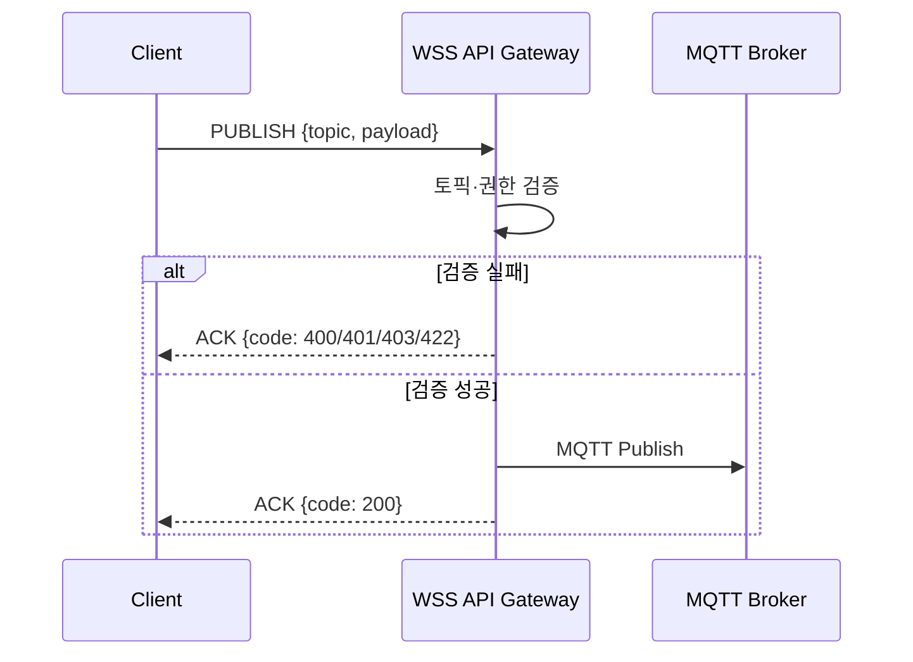
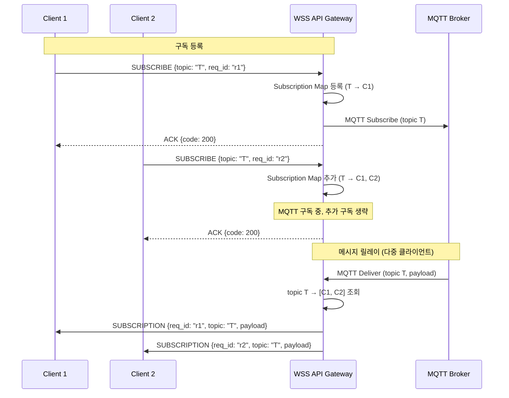
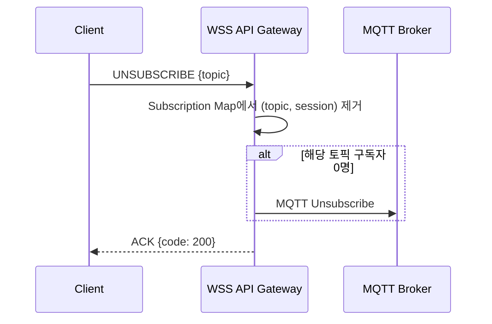

# WSS-MQTT API 사양서

> **문서 목적**  
> 본 문서는 WebSocket Secure(WSS) 클라이언트와 MQTT 브로커 사이에서 프로토콜 변환을 수행하는 **WSS-MQTT API**의 사양을 정의한다.  
> 이 API는 (1) 클라이언트의 WSS 메시지를 수신하여 MQTT로 발행하거나 구독 요청을 처리하고, (2) MQTT 브로커로부터 수신한 메시지를 WSS로 전달하여 클라이언트에게 배포한다. 클라이언트 연동을 위한 인터페이스, 메시지 형식, 인증·타임아웃·에러 처리 정책을 포함한다.

---

## 1. 개요 (Overview)

### 1.1. 시스템 역할

WSS API 게이트웨이는 다음의 역할을 수행한다.

- **다중화 계층 (Multiplexing Layer):** 단일 WebSocket 연결 내에서 다수의 논리적 채널(Topic 기반)을 관리한다.
- **라우팅 계층 (Routing Layer):** 클라이언트의 발행/구독 요청을 검증하고 MQTT 브로커로 중계한다.
- **프로토콜 어댑터 (Protocol Adapter):** WebSocket 기반 클라이언트와 MQTT 브로커 간의 프로토콜 변환을 담당한다.

### 1.2. 적용 범위

본 사양서는 다음을 포함한다.

- 통신 프로토콜 및 인코딩 규격
- 메시지 Envelope 인터페이스 규격
- 인증·인가 및 에러 처리 정책
- 생명주기(Lifecycle) 제어 및 타임아웃 정책
- 통신 시퀀스 및 사례

---

## 2. 용어 정의 (Terms)

본 문서에서 사용하는 주요 용어의 정의는 다음과 같다.


| 용어                                | 정의                                                                                                                               |
| --------------------------------- | -------------------------------------------------------------------------------------------------------------------------------- |
| **ACK**                           | API 게이트웨이가 요청 처리 결과를 클라이언트에 알리는 이벤트 유형. `req_id`와 HTTP 상태 코드(`code`)를 포함한다.                                                      |
| **ACL**                           | Access Control List. 토픽 경로 기반의 발행·구독 권한 제어 정책. 구체적 정책은 API 서버 사양에 따른다.                                                           |
| **API 게이트웨이**                     | 클라이언트와 MQTT 브로커 사이에서 WebSocket-MQTT 프로토콜 변환 및 라우팅을 수행하는 서버 계층.                                                                   |
| **TGU (Telematics Gateway Unit)** | MQTT 브로커에 연결되어 클라이언트의 제어를 수신하고 응답을 발행하는 단위.                                                                                      |
| **Envelope**                      | 메시지의 라우팅·상관관계를 위한 메타데이터(헤더) 영역. `action`/`event`, `req_id`, `topic` 등이 해당한다.                                                     |
| **SUBSCRIPTION**                  | 구독 이벤트. 구독한 토픽에 TGU가 메시지를 발행했을 때 API 게이트웨이가 클라이언트에게 전달하는 이벤트. `event` 값은 `"SUBSCRIPTION"`. `req_id`로 원본 SUBSCRIBE 요청과 상관관계를 맺는다. |
| **MQTT Broker**                   | MQTT 프로토콜 기반의 메시지 브로커. 토픽별 발행·구독 및 메시지 전달을 담당한다.                                                                                 |
| **Payload**                       | 비즈니스 로직에 필요한 실제 데이터. 게이트웨이는 이를 해석하지 않고 그대로 중계한다.                                                                                 |
| **PUBLISH**                       | 지정된 토픽으로 메시지를 발행하는 클라이언트 액션.                                                                                                     |
| **req_id**                        | 클라이언트가 생성한 요청 식별자. 요청-응답 상관관계에 사용된다.                                                                                             |
| **SUBSCRIBE**                     | 지정된 토픽에서 메시지를 수신하도록 구독하는 클라이언트 액션.                                                                                               |
| **Subscription Map**              | 게이트웨이 메모리에서 WSS 세션과 MQTT 토픽 구독을 매핑하는 내부 구조.                                                                                      |
| **Topic**                         | 메시지의 목적지를 나타내는 MQTT 토픽 경로 문자열. 구체적 패턴은 API 서버 사양에 따른다.                                                                           |
| **TTL**                           | Time-to-Live. 구독 자원의 최대 유효 시간(초). 만료 시 자동 해제된다.                                                                                  |
| **UNSUBSCRIBE**                   | 지정된 토픽에 대한 구독을 해제하는 클라이언트 액션.                                                                                                    |
| **WSS**                           | WebSocket Secure. TLS 상위의 WebSocket 프로토콜.                                                                                        |


---

## 3. 아키텍처 설계 원칙 (Architectural Principles)

본 연동 구간의 설계 및 구현은 다음의 3대 핵심 원칙을 준수한다.

### 3.1. 투명한 라우팅 (Transparent Relay / Dumb Pipe)

API 게이트웨이는 라우팅에 필요한 최소한의 메타데이터(Envelope 필드)만 파싱한다. **비즈니스 Payload의 내용을 역직렬화하거나 의미를 해석하지 않는다.**

- **파싱 대상:** `action`/`event`, `req_id`, `topic` (라우팅·상관관계용 필드)
- **비파싱 대상:** `payload` — 검증 및 변환 없이 MQTT 브로커로 그대로 전달(Bypass)
- **목적:** 게이트웨이의 비즈니스 로직 의존성을 제거하여 확장성과 유지보수성을 확보한다.

### 3.2. 상태 비저장 (Stateless)

API 게이트웨이는 클라이언트의 장기 상태나 세션 데이터를 영구 보관하지 않는다.

- **유지 대상:** 라우팅을 위한 일회성 Subscription Map 및 TTL 타이머
- **미유지 대상:** 사용자 식별자, 히스토리, 선호도 등 비라우팅 데이터
- **영속성 책임:** 데이터의 영속성은 MQTT 브로커 및 백엔드 서비스에 위임한다.

### 3.3. 명시적 권한 통제 (Explicit ACL)

모든 발행 및 구독 요청은 토픽 경로에 기반하여 인가(Authorization) 검사를 거친다. 토픽 패턴·권한 정책은 API 서버의 독립적인 사양에 따르며, 본 문서에서는 이를 정의하지 않는다. 거절 시 클라이언트는 `403`(권한 없음) 또는 `422`(허용되지 않는 토픽 패턴)로 통보받는다.

---

## 4. 연결 및 인증 (Connection & Authentication)

### 4.1. 엔드포인트


| 항목               | 값                                 |
| ---------------- | --------------------------------- |
| **프로토콜**         | WebSocket Secure (`wss`)          |
| **경로**           | `wss://[API_DOMAIN]/v1/messaging` |
| **쿼리 파라미터 (선택)** | `token`: 인증 토큰 (별도 헤더 미지원 시)      |


### 4.2. 연결 수립

1. 클라이언트는 `wss` 엔드포인트로 WebSocket 핸드셰이크를 수행한다.
2. 서버는 연결 수락 시 HTTP 101 Switching Protocols로 응답한다.
3. 연결 거부 시 HTTP 4xx/5xx 및 `Connection: close`로 응답한다.

### 4.3. 인증 방식

- **권장:** `Authorization: Bearer [JWT]` 헤더를 WebSocket 업그레이드 요청에 포함한다.
- **대안:** 쿼리 파라미터 `?token=[JWT]`로 전달 (로그 노출 주의, HTTPS 필수).
- **미인증 연결:** 401 Unauthorized로 거부한다.

### 4.4. 연결 유지 (Heartbeat)

- **Ping/Pong:** WebSocket 프레임 기반 Ping/Pong을 사용한다. 서버는 일정 주기(권장 30초)로 Ping을 발송할 수 있으며, 클라이언트는 Pong으로 응답한다.
- **타임아웃:** 양측 모두 미응답 시 연결을 종료로 간주한다. 클라이언트는 재연결 정책을 구현한다.
- **재연결:** 클라이언트는 연결 끊김 시 exponential backoff로 재연결을 시도할 수 있다. 재연결 후 구독 상태는 TTL 만료로 사라지므로, 활성 구독을 다시 SUBSCRIBE로 등록하는 것이 권장된다.

---

## 5. 직렬화 및 전송 형식

### 5.1. 직렬화 포맷 및 전송 규칙

메시지 직렬화 포맷에 따라 전송 타입을 맞춘다. JSON은 기본 포맷이며, MessagePack은 데이터 경량화를 목적으로 사용한다.


| 직렬화 포맷          | 전송 타입 | 용도      |
| --------------- | ----- | ------- |
| **JSON**        | 문자열   | 기본 포맷   |
| **MessagePack** | 바이너리  | 데이터 경량화 |


- **클라이언트:** 직렬화 포맷에 맞는 타입으로 전송한다. JSON → 문자열, MessagePack → 바이너리(ArrayBuffer 등). payload가 바이너리(bytes)이면 전체 Envelope을 MessagePack으로 직렬화하여 바이너리로 전송한다.
- **API 게이트웨이 (수신):** 수신 데이터가 문자열이면 JSON으로, 바이너리면 MessagePack으로 디코딩한다.
- **API 게이트웨이 (전송):** ACK는 클라이언트 요청과 동일한 형식으로 응답할 수 있다. SUBSCRIPTION 전송 시, **페이로드가 바이너리이면** 전체 Envelope을 MessagePack으로 직렬화하여 **바이너리 WebSocket 프레임**으로 전송한다. 페이로드가 텍스트(JSON 등)이면 JSON 직렬화 및 문자열 프레임으로 전송한다.

---

## 6. 메시지 Envelope 인터페이스 규격

모든 메시지는 라우팅·상관관계용 헤더(Envelope)와 비즈니스 Payload로 분리된 구조를 따른다.

API 게이트웨이에서 클라이언트로 전달되는 메시지는 **요청 응답**과 **구독 이벤트** 두 종류로 구분된다. 클라이언트는 `event` 필드로 구분하여 처리한다.

### 6.1. [요청] 클라이언트 → API 게이트웨이


| 필드명       | 타입     | 필수    | 설명 및 제약                                                         |
| --------- | ------ | ----- | --------------------------------------------------------------- |
| `action`  | String | **Y** | 동작 유형. `PUBLISH`, `SUBSCRIBE`, `UNSUBSCRIBE` 중 하나               |
| `req_id`  | String | **Y** | 클라이언트 생성 고유 요청 식별자 (UUID 또는 Sequence ID)                        |
| `topic`   | String | **Y** | 대상 MQTT 토픽 경로. API 서버 사양의 제약을 따른다 (일반적으로 와일드카드 `+`, `#` 사용 불가). |
| `payload` | Any    | N     | `PUBLISH` 시에만 의미 있음. `SUBSCRIBE`/`UNSUBSCRIBE` 시 생략 또는 null     |


### 6.2. [요청 응답] API 게이트웨이 → 클라이언트

요청(`action`)에 대한 처리 결과를 전달한다. `req_id`로 요청과 1:1 매핑된다.


| 필드명       | 타입      | 필수  | 설명 및 제약                                      |
| --------- | ------- | --- | -------------------------------------------- |
| `event`   | String  | Y   | `"ACK"` (고정)                                 |
| `req_id`  | String  | Y   | 원본 요청의 `req_id`와 매핑                          |
| `code`    | Integer | Y   | HTTP 상태 코드 체계 (200, 400, 401, 403, 422, 504) |
| `payload` | Any     | N   | 에러 상세 메시지 (4xx/5xx 시 선택적으로 포함)               |


### 6.3. [구독 이벤트] API 게이트웨이 → 클라이언트 (SUBSCRIPTION)

구독한 토픽에 TGU가 메시지를 발행했을 때 전달된다. `req_id`는 원본 SUBSCRIBE 요청의 `req_id`이며, 클라이언트가 상관관계를 처리할 때 토픽 파싱 없이 사용할 수 있다. 요청 응답(ACK)과는 별개의 메시지 유형이다.


| 필드명       | 타입     | 필수  | 설명 및 제약                             |
| --------- | ------ | --- | ----------------------------------- |
| `event`   | String | Y   | `"SUBSCRIPTION"` (고정)               |
| `req_id`  | String | Y   | 원본 SUBSCRIBE 요청의 `req_id`. 상관관계에 사용 |
| `topic`   | String | Y   | 수신 데이터의 발행처 토픽                      |
| `payload` | Any    | Y   | TGU가 발행한 원본 데이터                     |


### 6.4. 상관관계 (Correlation)


| 메시지 유형                    | 상관관계 필드           | 용도                                                                                           |
| ------------------------- | ----------------- | -------------------------------------------------------------------------------------------- |
| **요청 응답 (ACK)**           | `req_id`          | 요청과 응답 1:1 매핑                                                                                |
| **구독 이벤트 (SUBSCRIPTION)** | `req_id`, `topic` | `req_id`로 SUBSCRIBE 요청과 매핑. 토픽 파싱 없이 상관관계 처리 가능. 응답 토픽에 `req_id`를 포함하는 경우 요청-응답 패턴 연결에 활용 가능 |


---

## 7. 에러 코드 정의

`ACK` 이벤트의 `code` 필드는 HTTP 상태 코드 체계를 차용한다.


| 코드  | 의미                   | 설명                             |
| --- | -------------------- | ------------------------------ |
| 200 | OK                   | 요청 정상 처리                       |
| 400 | Bad Request          | 형식 오류, 필수 필드 누락                |
| 401 | Unauthorized         | 인증 실패 또는 토큰 만료                 |
| 403 | Forbidden            | 토픽에 대한 발행/구독 권한 없음 (API 서버 정책) |
| 422 | Unprocessable Entity | 허용되지 않는 토픽 패턴 (API 서버 정책)      |
| 504 | Gateway Timeout      | MQTT 브로커 연동 지연 또는 타임아웃         |


### 7.1. 에러 Payload (선택)

`code`가 4xx/5xx일 때 `payload`에 상세 메시지를 담을 수 있다.

**422 (허용되지 않는 토픽 패턴) 예시:**

```json
{
  "event": "ACK",
  "req_id": "req_001",
  "code": 422,
  "payload": {
    "message": "Topic pattern is not allowed by API."
  }
}
```

**403 (권한 없음) 예시:**

```json
{
  "event": "ACK",
  "req_id": "req_001",
  "code": 403,
  "payload": {
    "message": "Topic is not accessible for current session."
  }
}
```

---

## 8. 예외 처리 및 타임아웃 정책 (Lifecycle Control)

비동기 메시징 환경의 메모리 누수 방지와 고가용성 확보를 위해 구간별 타임아웃 및 자원 회수 정책을 적용한다.

### 8.1. WSS 전달 타임아웃 (클라이언트 측)

- **조건:** 요청 발송 후 **5초** 이내에 해당 `req_id`에 대한 `ACK`가 수신되지 않음
- **조치:** 네트워크 유실 또는 게이트웨이 장애로 간주하고 예외 처리한다. 재시도 정책 적용 가능

### 8.2. 비동기 RPC 응답 타임아웃 (클라이언트 측)

- **조건:** 제어 명령 `PUBLISH` 발송 후 **30초** 이내에 대상 응답 토픽의 구독 이벤트(`SUBSCRIPTION`)가 수신되지 않음
- **조치:** 타임아웃으로 간주하고, 해당 토픽에 대해 `UNSUBSCRIBE`를 발송하여 구독 자원을 회수한다.

### 8.3. 구독 자원 TTL (API 게이트웨이 측)

- **조건:** `SUBSCRIBE` 요청 수신 시
- **동작:** 내부 Subscription Map에 등록하고 **40초 TTL** 타이머를 가동한다.
- **만료 시:** 응답 수신 여부와 관계없이 MQTT 구독을 해제하고 Subscription Map에서 제거한다.

### 8.4. 타임아웃 간 정합성

- **설계 의도:** 클라이언트 타임아웃(30초)이 게이트웨이 TTL(40초)보다 짧게 설정되어, 클라이언트가 먼저 포기하고 `UNSUBSCRIBE`를 보내는 것이 일반 흐름이다.
- **주의:** `SUBSCRIBE` 후 `PUBLISH`까지 지연이 길어지면, TTL이 먼저 만료될 수 있다. 응답 토픽 구독은 제어 명령 발송 직전에 수행하는 것을 권장한다.

### 8.5. 연결 단절 시 정리 (API 게이트웨이 측)

- **조건:** WebSocket `close` 또는 `error` 이벤트 발생
- **조치:** 해당 세션에 매핑된 모든 활성 구독을 즉시 삭제하고, MQTT Unsubscribe를 수행한다.

---

## 9. API 동작 시퀀스 (Sequence)

본 절은 API 서버의 요청 처리 동작을 정의한다. 토픽 값은 예시이며, 실제 형식은 API 서버 사양에 따른다.

---

### 9.1. PUBLISH 요청 처리

**동작 정의**

클라이언트가 `PUBLISH`를 보내면 API는 다음 순서로 동작한다.

1. 요청 수신 및 Envelope 파싱
2. 토픽·권한 검증 (API 서버 정책). 실패 시 즉시 400/401/403/422 ACK 반환
3. 검증 성공 시 MQTT 브로커에 해당 토픽으로 Payload를 그대로(Pass-through) 발행
4. MQTT 발행 요청 후, 결과와 무관하게 곧바로 ACK(200 또는 504)를 클라이언트에 전송




---

### 9.2. SUBSCRIBE 요청 처리 및 구독 릴레이

**9.2.1. 구독 등록**

클라이언트가 `SUBSCRIBE`를 보내면 API는 다음 순서로 동작한다.

1. 요청 수신 및 Envelope 파싱
2. 토픽·권한 검증. 실패 시 400/401/403/422 ACK 반환
3. 검증 성공 시 Subscription Map에 `(topic, session, req_id)` 등록
4. 해당 토픽을 아직 MQTT에서 구독 중이 아니면 MQTT Subscribe 수행 (이미 구독 중이면 생략)
5. TTL 타이머 가동 (40초)
6. ACK(200) 전송

**9.2.2. 메시지 릴레이**

MQTT 브로커로부터 해당 토픽의 메시지를 수신하면 API는 다음 순서로 동작한다.

1. Subscription Map에서 해당 `topic`을 구독한 모든 `(session, req_id)` 조회
2. 각 세션에 대해 `SUBSCRIPTION` 이벤트(`event`, `req_id`, `topic`, `payload`)를 구성
3. **직렬화 및 전송:**
   - 페이로드가 **바이너리**이면: MessagePack으로 직렬화 → 바이너리 WebSocket 프레임으로 전송
   - 페이로드가 **텍스트(JSON 등)**이면: JSON 직렬화 → 문자열 WebSocket 프레임으로 전송

**9.2.3. 다중 클라이언트 릴레이**

동일 토픽을 여러 클라이언트가 구독한 경우, 한 건의 MQTT 메시지가 도착하면 **각 구독 클라이언트에게 개별적으로** SUBSCRIPTION을 전달한다. Subscription Map은 `topic → [(session₁, req_id₁), (session₂, req_id₂), …]` 구조로, 하나의 토픽에 여러 구독자를 매핑한다.




---

### 9.3. UNSUBSCRIBE 요청 처리

**동작 정의**

클라이언트가 `UNSUBSCRIBE`를 보내면 API는 다음 순서로 동작한다.

1. 요청 수신
2. Subscription Map에서 해당 `(topic, session)` 항목 제거
3. 제거 후 해당 토픽에 대한 구독자가 0명이면 MQTT Unsubscribe 수행
4. ACK(200) 전송




---

### 9.4. 예외 시나리오

**구독 거절:** SUBSCRIBE 검증 실패(권한·패턴 위반) 시 403 또는 422 ACK를 반환한다.

**연결 종료 시 정리:** WebSocket `close`/`error` 시 해당 세션의 모든 구독을 Subscription Map에서 제거하고, 구독자 0명이 된 토픽에 대해 MQTT Unsubscribe를 수행한다. (8.5 참조)

**TTL 만료:** SUBSCRIBE 시 설정한 TTL(40초) 내에 추가 동작 없이 만료되면 해당 구독을 제거한다. (8.3 참조)

---

## 10. 버전 관리

- **현재 버전:** v1 (`/v1/messaging`)
- **하위 호환:** 동일 마이너 버전 내에서는 기존 필드를 제거하거나 필수로 전환하지 않는다.
- **주 버전 변경 시:** 새 경로(`/v2/messaging` 등)를 도입하고, 구버전은 별도 유지보수 정책에 따른다.

---

## 11. 보안 고려사항

- **전송:** 반드시 `wss`(TLS)를 사용한다.
- **토큰:** JWT는 짧은 만료 시간을 적용하고, 갱신(Refresh) 정책을 수립한다.
- **입력 검증:** 토픽 경로 등 사용자 입력의 유효성 검사 정책은 API 서버 사양에 따른다.
- **속도 제한:** 클라이언트별 발행/구독 요청 빈도 제한을 고려한다.

---

## 12. 관련 문서

| 문서 | 설명 |
|------|------|
| `wss-mqtt-message-schema.json` | 메시지 Envelope JSON 스키마 |
| `SDK/README.md` | Python 클라이언트 SDK (wss-mqtt-client) 사용법 |
| `docs/TGU_RPC_SDK_DEVELOPMENT_PLAN.md` | TGU RPC SDK 및 Transport 추상화 개발 계획 |

**클라이언트 SDK:** 본 사양을 준수하는 Python 참조 구현(wss-mqtt-client)은 다음을 지원한다.

| 기능 | 설명 |
|------|------|
| **transport** | `wss-mqtt-api`(기본), `mqtt`(네이티브 MQTT, URL로 TCP/WebSocket 선택) |
| **MessagePack** | payload가 bytes이면 발송 시 MessagePack 직렬화 (수신은 JSON·MessagePack 자동 파싱) |
| **재연결** | auto_reconnect, exponential backoff, auto_resubscribe |
| **연결 끊김 처리** | 구독 스트림에 즉시 WssConnectionError 전달 |

예제 및 사용법: `SDK/README.md`, `SDK/wss-mqtt-client/README.md`, `SDK/examples/README.md`

