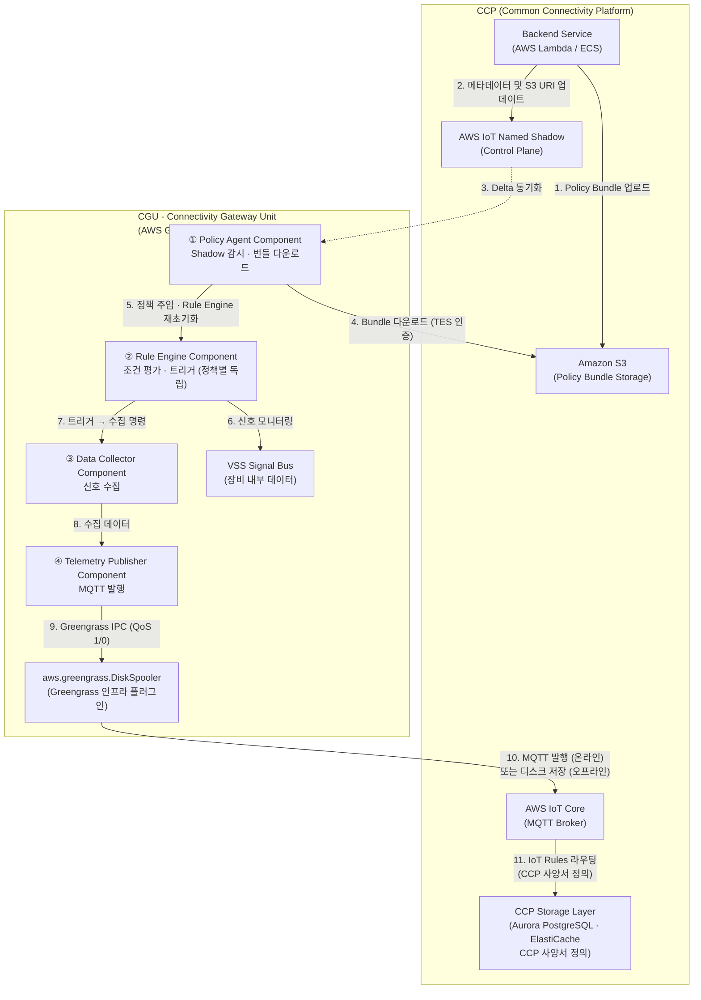

# 시스템 요구사양서: 정책 기반 텔레매트리 시스템

## 1. 개요

본 문서는 SDM(Software Defined Machine) 환경에서 **예약된 VSS Ingestion을 정책 기반으로 구현하는 텔레매트리 서비스**의 기술적 요구사양을 정의한다.

SDM의 신호 접근 계층으로 VISSv3가 사용되지만, VISSv3는 FMS 등 비즈니스 서비스의 온디맨드(On-Demand) 요청에 응답하는 서비스이다. 서비스 연결 여부와 무관하게 장비 상태를 지속·자율적으로 수집해야 하는 텔레매트리 요건은 VISSv3의 역할 범위 밖이다.

본 시스템은 VISSv3를 수정하거나 확장하지 않는다. **CGU 위에서 독립적으로 동작하는 별도의 Greengrass Component**로서, VISSv3와 동일한 VSS 신호 데이터를 소스로 활용하되, CCP에서 사전 배포된 정책에 따라 신호 수집과 CCP 전송을 자율적으로 수행한다. 두 시스템은 CGU 위에서 독립적으로 공존한다.

트리거 조건 표현에는 VISSv3 filter operation 대신 다중 신호 복합 논리식을 지원하는 **AWS IoT FleetWise 방식의 조건식(expression)**을 채택한다. 정책 배포는 **하이브리드 오프로딩(Hybrid Offloading)** 기법을 사용하여, AWS IoT Named Shadow에는 경량 메타데이터(상태, 버전, S3 URI)만 싣고 실제 정책 본문은 Amazon S3에 저장한다.

> **VSS Signal Bus 접근:** 본 시스템이 VSS 신호를 읽는 구체적 메커니즘(Kuksa Data Broker 등)은 별도의 VSS 미들웨어 사양서에서 정의한다. 본 문서에서 "VSS Signal Bus"는 CGU 내 실시간 신호 값을 제공하는 추상 인터페이스로 취급한다.

**핵심 구성 원칙:**
- **CGU (Connectivity Gateway Unit):** SDM 내부에 설치된 **AWS Greengrass Core Device**이다.
- **정책 실행 주체:** 정책 기반 텔레매트리를 실제로 구동하는 것은 CGU 위에서 동작하는 **AWS Greengrass Component**이며, VISSv3와는 독립적인 별도 컴포넌트이다.
- **CCP (Common Connectivity Platform):** AWS IoT Core를 기반으로 구성된 클라우드 연결 플랫폼으로, 정책 관리 및 텔레매트리 수신을 담당한다.

## 2. 목적

- **예약된 VSS Ingestion 구현:** 비즈니스 서비스의 실시간 구독 요청 없이도, CCP에서 사전 배포된 정책에 따라 CGU가 VSS 신호를 자율적으로 수집·전송한다.
- **표현력 있는 수집 트리거:** VISSv3 filter operation으로 표현하기 어려운 다중 신호 복합 조건식을 FleetWise 방식의 `expression`으로 정의하여, 실제 비즈니스 이벤트(예: 배터리 과열 중 고속 주행)를 정밀하게 포착한다.
- **오프라인 동기화 보장:** SDM이 통신 음영 지역에 위치하더라도 CCP에서 예약된 정책이 Shadow를 통해 안전하게 유지되며, 네트워크 복구 시 즉각 동기화되도록 보장한다.

## 3. 시스템 아키텍처



**구성요소 정의:**

1. **CCP (Common Connectivity Platform):** AWS IoT Core를 기반으로 구성된 클라우드 연결 플랫폼의 총칭이며 다음 서비스로 구성된다.
   - **Backend Service (AWS Lambda / ECS):** 정책 생성·관리, Shadow 업데이트를 수행한다.
   - **Amazon S3:** Policy Bundle 문서를 저장하는 전용 저장소이다. 텔레매트리 데이터는 저장하지 않는다.
   - **AWS IoT Named Shadow:** CGU와 CCP 간의 정책 활성화 상태, 버전, S3 URI 등 경량 메타데이터를 동기화하는 Control Plane이다.
   - **AWS IoT Core:** CGU가 발행하는 텔레매트리 MQTT 메시지를 수신하고, IoT Rules Engine을 통해 CCP 스토리지 계층으로 라우팅한다. 구체적인 라우팅 규칙 및 스토리지 구성(Aurora PostgreSQL, ElastiCache 등)은 CCP 사양서에서 정의한다.

2. **CGU (Connectivity Gateway Unit, AWS Greengrass Core Device):** SDM 내부에 설치된 AWS Greengrass Core Device로, 정책 기반 텔레매트리는 CGU 위에서 동작하는 컴포넌트들이 협력하여 수행한다.
   - **① Policy Agent Component:** Shadow를 상시 감시하고, 정책 변경 감지 시 TES(Token Exchange Service) 인증으로 S3에서 Policy Bundle을 다운로드하여 Rule Engine을 재초기화한다. Shadow의 `reported` 상태를 갱신한다.
   - **② Rule Engine Component:** 주입된 각 정책의 `expression`을 AST(Abstract Syntax Tree) 형태의 바이너리 상태 머신으로 컴파일하여 메모리에 상주시킨다. 각 정책의 상태 머신은 **독립적으로** 동작하며, VSS Signal Bus의 실시간 데이터를 대조하여 트리거 조건을 감지한다.
   - **③ Data Collector Component:** 각 정책의 트리거 조건 충족 시 해당 정책에 정의된 신호를 수집하여 Telemetry Publisher Component에 전달한다.
   - **④ Telemetry Publisher Component:** SNAPPY 압축을 적용한 후 Greengrass IPC(`PublishToIoTCore`)를 통해 정책의 `publishTopic`으로 MQTT 메시지를 발행한다. `spoolingMode`에 따라 QoS 1(디스크 보존) 또는 QoS 0(유실 허용)을 선택한다.
   - **aws.greengrass.DiskSpooler:** Greengrass Nucleus의 플러그인 컴포넌트(인프라, 커스텀 아님). QoS 1 메시지를 오프라인 시 디스크(SQLite)에 투명하게 저장하고, 연결 복구 시 FIFO 순서로 자동 재전송한다. 커스텀 컴포넌트는 이 동작을 인식할 필요 없이 IPC를 통해 평소대로 발행한다.

## 4. 기능 정의

### 4.1. Named Shadow 문서 구조 (Control Plane)

CCP에서 CGU로 배포되는 `desired` 상태와 CGU에서 응답하는 `reported` 상태를 관리한다. Shadow 페이로드는 8KB 미만을 유지하기 위해, 실제 정책 내용은 S3 Policy Bundle로 분리하고, Shadow에는 **번들 단위의 경량 메타데이터(상태, 버전, S3 URI)**만 포함한다.

Policy Bundle의 S3 접근에는 만료 기한이 있는 Pre-signed URL 대신 **S3 URI(`s3://` 형식)**를 사용한다. CGU는 Greengrass Token Exchange Service(TES)를 통해 획득한 임시 AWS 자격증명으로 S3에 직접 접근하므로, Shadow에 URL 서명 파라미터를 포함할 필요가 없다. 이로 인해 번들당 Shadow 점유 크기가 대폭 절감된다.

```json
{
  "state": {
    "desired": {
      "policyBundles": {
        "B_Standard_Operations": {
          "status": "ENABLE",
          "version": 3,
          "bundleS3Uri": "s3://telemetry-policies/bundles/B_Standard_Operations_v3.json"
        },
        "B_Diagnostic_Mode": {
          "status": "DISABLE",
          "version": 1,
          "bundleS3Uri": "s3://telemetry-policies/bundles/B_Diagnostic_Mode_v1.json"
        }
      }
    },
    "reported": {
      "policyBundles": {
        "B_Standard_Operations": {
          "status": "RUNNING",
          "version": 3,
          "activeCount": 2,
          "lastUpdated": 1711330000
        },
        "B_Diagnostic_Mode": {
          "status": "DISABLED",
          "version": 1,
          "activeCount": 0,
          "lastUpdated": 1711329000
        }
      }
    }
  }
}
```

**`desired.status` 허용 값:**

| 값 | 의미 |
|---|---|
| `ENABLE` | 번들 내 모든 정책을 활성화하도록 지시한다. |
| `DISABLE` | 번들 내 모든 정책을 비활성화하도록 지시한다. Policy Agent Component는 Rule Engine에서 해당 번들의 정책을 제거하고 `reported.status`를 `DISABLED`로 보고한다. |

**`reported.status` 허용 값 및 상태 전이:**

| 값 | 의미 |
|---|---|
| `DOWNLOADING` | S3 Policy Bundle 다운로드 진행 중 |
| `PENDING` | 다운로드 완료, Rule Engine 재초기화 대기 중 |
| `RUNNING` | 번들 내 정책이 활성 실행 중. `activeCount`는 현재 실행 중인 정책 수를 나타낸다. |
| `RUNNING_STALE` | 신규 버전 번들 적용 실패. 이전 버전 정책이 계속 실행 중. `errorCode`에 실패 원인을 첨부한다. |
| `DISABLED` | `desired.status: DISABLE` 수신 후 정책 비활성화 완료 |
| `FAILED` | 번들 적용 실패이며 실행 중인 정책 없음. `errorCode`에 원인 코드(`SCHEMA_UNSUPPORTED`, `DOWNLOAD_TIMEOUT`, `AUTH_FAILED` 등)를 첨부한다. |

```
desired.ENABLE 수신 (신규 번들)
    → reported: DOWNLOADING → PENDING → RUNNING

desired.ENABLE 수신 (버전 업데이트, 기존 번들 실행 중)
    → 성공 시: DOWNLOADING → PENDING → RUNNING
    → 실패 시: RUNNING_STALE (이전 버전 정책 유지)

desired.DISABLE 수신
    → reported: DISABLED
```

### 4.2. Policy Bundle 문서 구조 (S3 Storage)

S3에서 다운로드되는 **Policy Bundle** 문서로, 하나의 번들에 여러 정책을 포함한다. 각 정책은 **조건 기반(`conditionBasedCollectionScheme`)** 또는 **시간 기반(`timeBasedCollectionScheme`)** 수집 방식 중 하나를 사용하며, AWS IoT FleetWise의 수집 스키마(Collection Scheme) 사양을 기반으로 한다.

```json
{
  "bundleId": "B_Standard_Operations",
  "schemaVersion": "1.0",
  "policies": [
    {
      "policyId": "P_Battery_Thermal_Alert",
      "priority": 1,
      "expiryTime": "2026-12-31T00:00:00Z",
      "publishTopic": "telemetry/data/${thingName}/battery",
      "collectionScheme": {
        "conditionBasedCollectionScheme": {
          "conditionLanguageVersion": 1,
          "expression": "$variable.`Vehicle.Powertrain.TractionBattery.Temperature` > 80.0 AND $variable.`Vehicle.Speed` > 100.0",
          "minimumTriggerIntervalMs": 60000,
          "triggerMode": "RISING_EDGE"
        }
      },
      "signalsToCollect": [
        {
          "name": "Vehicle.Powertrain.TractionBattery.Temperature",
          "maxSampleCount": 10,
          "minimumSamplingIntervalMs": 100
        },
        {
          "name": "Vehicle.Speed",
          "maxSampleCount": 10,
          "minimumSamplingIntervalMs": 100
        },
        {
          "name": "Vehicle.Powertrain.TractionBattery.StateOfCharge",
          "maxSampleCount": 5,
          "minimumSamplingIntervalMs": 500
        }
      ],
      "postTriggerCollectionDuration": 5000,
      "spoolingMode": "TO_DISK",
      "compression": "SNAPPY"
    },
    {
      "policyId": "P_GPS_Periodic",
      "priority": 2,
      "expiryTime": "2026-12-31T00:00:00Z",
      "publishTopic": "telemetry/data/${thingName}/location",
      "collectionScheme": {
        "timeBasedCollectionScheme": {
          "periodMs": 5000
        }
      },
      "signalsToCollect": [
        { "name": "Vehicle.CurrentLocation.Latitude" },
        { "name": "Vehicle.CurrentLocation.Longitude" },
        { "name": "Vehicle.CurrentLocation.Altitude" }
      ],
      "spoolingMode": "TO_DISK",
      "compression": "SNAPPY"
    }
  ]
}
```

**Policy Bundle 필드 정의:**

| 필드 | 레벨 | 필수 | 설명 |
|---|---|---|---|
| `bundleId` | Bundle | 필수 | Shadow의 `policyBundles` 키와 일치해야 한다. |
| `schemaVersion` | Bundle | 필수 | 문서 스키마 버전. 미지원 버전 수신 시 `FAILED(SCHEMA_UNSUPPORTED)`를 보고한다. |
| `policies` | Bundle | 필수 | 하나 이상의 정책 객체 배열. 단일 번들 내 최대 50개. |
| `policyId` | Policy | 필수 | 번들 내 고유 식별자. |
| `priority` | Policy | 필수 | 정책 우선순위 (낮은 숫자가 높은 우선순위). Rule Engine 초기화 시 정책 로딩 순서에 영향을 준다. DiskSpooler는 단일 FIFO 큐이므로 전송 우선순위로는 사용되지 않는다. |
| `expiryTime` | Policy | 선택 | 정책 만료 시각 (ISO 8601). 만료된 정책은 Rule Engine에서 자동 제거된다. 미설정 시 번들 비활성화 전까지 유효. |
| `publishTopic` | Policy | 필수 | 수집된 텔레매트리를 발행할 MQTT 토픽 패턴. `${thingName}` 치환 변수 사용 가능. |
| `collectionScheme` | Policy | 필수 | 수집 트리거 방식. `conditionBasedCollectionScheme` 또는 `timeBasedCollectionScheme` 중 하나를 포함한다. |
| `expression` | conditionBased | 필수 | 수집 트리거 조건식. 4.3절 문법 사양을 따른다. |
| `conditionLanguageVersion` | conditionBased | 필수 | 조건식 언어 버전. 현재 `1`만 지원. |
| `minimumTriggerIntervalMs` | conditionBased | 선택 | 연속된 두 트리거 사이의 최소 쿨다운 시간(ms). 쿨다운 기간 중 발생하는 조건 전이는 무시된다. 기본값: `0`. |
| `triggerMode` | conditionBased | 선택 | `RISING_EDGE`: 조건이 `false → true`로 전이할 때만 트리거. `ALWAYS`: 조건이 참인 매 평가 주기마다 트리거. 기본값: `RISING_EDGE`. |
| `periodMs` | timeBased | 필수 | 시간 기반 수집 주기(ms). |
| `signalsToCollect` | Policy | 필수 | 트리거 발생 시 수집할 신호 목록. |
| `name` | Signal | 필수 | VSS 완전 경로(Fully Qualified Path). |
| `maxSampleCount` | Signal | 선택 | 단일 수집 이벤트당 최대 샘플 수. `postTriggerCollectionDuration`과 함께 설정 시, **둘 중 먼저 충족되는 조건**에서 해당 신호의 수집이 종료된다. 미설정 시 `postTriggerCollectionDuration` 기간 동안 `minimumSamplingIntervalMs` 주기로 계속 수집한다. |
| `minimumSamplingIntervalMs` | Signal | 선택 | 신호 샘플 간 최소 간격(ms). 미설정 시 VSS Signal Bus의 갱신 주기를 따른다. |
| `postTriggerCollectionDuration` | Policy | 선택 | 조건 기반 정책에만 적용. 트리거 이후 추가 연장 수집 시간(ms). `maxSampleCount`에 도달하지 않는 한 이 시간 동안 수집이 지속된다. |
| `spoolingMode` | Policy | 선택 | `TO_DISK`: QoS 1로 발행. 오프라인 시 `aws.greengrass.DiskSpooler`가 로컬 디스크에 투명하게 저장하고 복구 후 FIFO 재전송. `OFF`: QoS 0으로 발행. 유실 허용(기본값). |
| `compression` | Policy | 선택 | `SNAPPY`: Snappy 압축 적용. `OFF`: 미압축(기본값). |

**수집 스키마 타입 비교:**

| 타입 | 트리거 조건 | 대표 사용 시나리오 |
|---|---|---|
| `conditionBasedCollectionScheme` | `expression` 논리식이 참이 될 때 | 이벤트 기반 수집 (배터리 과열, 충돌 감지 등) |
| `timeBasedCollectionScheme` | 지정 주기(`periodMs`)마다 | 정기 상태 보고 (GPS, 주행거리, 연료량 등) |

### 4.3. 정책 조건식(`expression`) 문법 사양

`expression` 필드는 AWS IoT FleetWise의 조건식 언어(`conditionLanguageVersion: 1`)를 기반으로 하며, 아래 문법 규칙을 준수한다.

#### 4.3.1. 변수 참조

VSS 신호는 `$variable.` 접두어와 백틱(`` ` ``)으로 감싼 완전 경로(Fully Qualified Path)로 참조한다.

```
$variable.`<VSS_FULLY_QUALIFIED_PATH>`
```

- **중첩 필드 접근:** `$variable.\`Vehicle.Powertrain.TractionBattery.Temperature\``
- **배열 인덱스 접근:** `$variable.\`Vehicle.ADAS.Camera.Obstacle[0].distance\``

#### 4.3.2. 지원 연산자 및 우선순위

아래 우선순위 규칙을 따른다. 우선순위가 같을 경우 왼쪽에서 오른쪽으로 평가한다. 괄호 `( )`를 사용한 명시적 그룹화를 권장한다.

| 우선순위 | 연산자 | 설명 |
|---|---|---|
| 1 (최고) | `( )` | 괄호 그룹 |
| 2 | `NOT` | 단항 논리 부정 |
| 3 | `>`, `>=`, `<`, `<=`, `==`, `!=` | 비교 연산자 |
| 4 | `AND` | 논리 AND |
| 5 (최저) | `OR` | 논리 OR |

#### 4.3.3. 지원 리터럴 타입

| 타입 | 표기 예시 | 비고 |
|---|---|---|
| 정수 | `100`, `-5` | |
| 부동소수점 | `80.0`, `-3.14` | 소수점 포함 필수 |
| 불리언 | `true`, `false` | 소문자 강제 |
| 문자열(Enum) | `"FAULT"`, `"ACTIVE"` | 큰따옴표 사용. 열거형 신호 비교 시 사용. |

**최대 길이:** `expression` 문자열은 2048자를 초과할 수 없다.

#### 4.3.4. 신호 값 미수신 시 평가 규칙

`expression`에 참조된 신호 중 하나라도 **현재 시점의 신선한 값(fresh value)**이 없는 경우, 해당 평가 주기 전체를 건너뛴다(skip). 다음 원칙을 따른다.

- **이전 값 사용 금지:** 센서 오류, CAN 버스 타임아웃, data broker 미응답 등으로 신호가 갱신되지 않은 경우, 오래된 값으로 표현식을 평가하지 않는다. AWS IoT FleetWise와 Kuksa Data Broker 모두 신호 freshness를 전제로 평가하며, 본 시스템도 동일 원칙을 적용한다.
- **기본값 대체 금지:** 미수신 신호를 `null`, `0`, `false` 등으로 대체하여 평가하지 않는다. 이는 의도치 않은 오트리거(false positive)의 원인이 된다.
- **평가 재개:** 신호가 복구된 다음 평가 주기부터 정상 평가가 재개된다.

#### 4.3.5. `triggerMode`별 `minimumTriggerIntervalMs` 적용 규칙

`minimumTriggerIntervalMs`는 트리거 발생 직후 시작되는 **쿨다운 타이머**이다. 쿨다운 기간 중에는 트리거 조건 평가를 수행하지 않는다.

**`RISING_EDGE` + `minimumTriggerIntervalMs` 동작 예시:**

```
시각   조건값   쿨다운(60s)  동작
t=0    false    -
t=1    true     시작         ← RISING_EDGE 감지 → 트리거 발생
t=5    false    진행 중      무시 (쿨다운 중)
t=10   true     진행 중      무시 (쿨다운 중 RISING_EDGE → 무효)
t=61   true     만료         무시 (쿨다운 만료 시 이미 true 상태 → RISING_EDGE 아님)
t=62   false    -
t=63   true     시작         ← 새로운 RISING_EDGE → 트리거 발생
```

핵심 규칙: 쿨다운 만료 후 조건이 이미 `true` 상태라면 RISING_EDGE로 간주하지 않는다. 쿨다운 만료 이후 반드시 `false → true` 전이가 새로 발생해야 재트리거한다.

**`ALWAYS` + `minimumTriggerIntervalMs` 동작:**

조건이 참인 상태에서 쿨다운 만료 즉시 재트리거한다. 조건이 `false`가 될 필요 없이, 참인 상태가 지속되는 한 쿨다운 주기마다 반복 트리거한다.

#### 4.3.6. 시나리오별 표현 예시 및 VISSv3 비교

| 시나리오 | `expression` 예시 | VISSv3 filter 동등 표현 | 비고 |
|---|---|---|---|
| **단일 임계값 초과** | `$variable.\`Vehicle.Speed\` > 120.0` | `{"type":"range","parameter":{"boundary-op":"gt","boundary":"120"}}` | 동등한 표현력 |
| **다중 신호 AND 복합 조건** | `$variable.\`A\` > 80.0 AND $variable.\`B\` > 100.0` | **불가** (VISSv3 필터는 단일 신호 기준) | 이 시스템이 우세 |
| **RISING EDGE 감지** | `$variable.\`Vehicle.Fault\` == true` + `triggerMode: RISING_EDGE` | `{"type":"change","parameter":{"logic-op":"gt","diff":"0"}}` | 의미적으로 동등 |
| **범위 이탈** | `($variable.\`A\` < 0.0) OR ($variable.\`A\` > 100.0)` | `[{"boundary-op":"lt","boundary":"0","combination-op":"OR"},{"boundary-op":"gt","boundary":"100"}]` | 동등 |
| **Enum 신호 비교** | `$variable.\`Vehicle.GearMode\` == "MANUAL"` | 해당 없음 (VISSv3는 값을 항상 string으로 전달) | |
| **복합 논리식** | `($variable.\`A\` > 5.0 AND $variable.\`B\` < 10.0) OR $variable.\`C\` == true` | **불가** (다중 신호 OR 조합 미지원) | 이 시스템이 우세 |
| **주기 수집** | `timeBasedCollectionScheme.periodMs` (expression 없음) | `{"type":"timebased","parameter":{"period":"5000"}}` | 별도 스키마 타입으로 지원 |

**미지원 기능 및 대체 방안:**

| 미지원 기능 | 설명 | 대체 방안 |
|---|---|---|
| 이전 값 참조(델타 감지) | `prev($variable.A)` 유형의 변화량 비교 | 주기 수집 + CCP 후처리로 변화율 분석 |
| 시간 지속 조건 | "X 신호가 N초 동안 참인 경우" | `minimumTriggerIntervalMs` + `ALWAYS` 모드 조합으로 근사 |
| 곡선 로깅(Curve Logging) | VISSv3 `curvelog` 필터 | 미지원. `minimumSamplingIntervalMs` 조정으로 수집량 제어 |
| 이력 데이터 조회 | 과거 기간 기반 풀(Pull) 조회 | 오프라인 스풀링(`TO_DISK`) 데이터의 네트워크 복구 후 자동 전송으로 대체 |

### 4.4. 다중 정책 독립 병렬 실행

하나의 CGU에는 여러 Policy Bundle이 동시에 활성화될 수 있으며, 번들 내에도 여러 정책이 포함된다. **각 정책은 완전히 독립적으로 병렬 실행된다.** 정책 간에 트리거 상태를 공유하거나 수집 이벤트를 병합하지 않는다.

각 정책은 다음을 독립적으로 소유한다.
- Rule Engine 내 고유한 `expression` 상태 머신 인스턴스
- 고유한 수집 이벤트 버퍼
- 고유한 `publishTopic`으로의 발행 경로

#### 4.4.1. VSS Signal Bus 폴링 주기 최적화

여러 정책이 동일 VSS 신호를 구독할 때, VSS Signal Bus에 대한 폴링 요청을 중복하지 않도록 스케줄러가 신호별 단일 구독을 유지한다. 동일 신호에 대해 서로 다른 `minimumSamplingIntervalMs`를 요구하는 정책이 있을 경우, 폴링 주기를 **요구값 중 최솟값(min)**으로 설정하여 모든 정책의 요구사항을 만족한다.

> 예시: 정책 A가 100ms, 정책 B가 250ms를 요구하는 경우 → 폴링 주기 100ms 설정.

#### 4.4.2. 오프라인 스풀링 및 전송

`spoolingMode: TO_DISK` 정책의 발행은 QoS 1로 수행된다. 오프라인 시 **aws.greengrass.DiskSpooler** 플러그인이 해당 메시지를 자동으로 디스크에 저장하며, 커스텀 컴포넌트는 오프라인 여부를 별도로 감지하지 않아도 된다.

네트워크 복구 후 스풀된 메시지는 DiskSpooler에 의해 **FIFO(수집 시각) 순서**로 IoT Core에 자동 재전송된다. DiskSpooler는 시스템 전체 단일 큐이므로 정책별 전송 우선순위를 지원하지 않는다. 정책의 `priority` 필드는 Rule Engine 초기화 순서에만 영향을 준다.

### 4.5. S3 직접 접근 (Token Exchange Service)

CGU(Greengrass Core Device)는 **Greengrass Token Exchange Service(TES)**를 통해 IoT 디바이스 인증서를 임시 AWS 자격증명으로 교환할 수 있다. Policy Agent Component는 이 자격증명으로 S3에 직접 접근하므로, 만료 기한이 있는 Pre-signed URL을 Shadow에 포함할 필요가 없다.

**Policy Bundle 다운로드:**
- Shadow `desired.bundleS3Uri`에는 `s3://버킷명/경로` 형식의 영구 S3 URI를 사용한다.
- Policy Agent Component는 TES API로 임시 자격증명을 획득하고 AWS SDK의 표준 S3 GetObject 호출로 번들을 다운로드한다.
- 자격증명은 Greengrass Nucleus가 자동으로 갱신하므로, 만료 처리를 컴포넌트에서 직접 구현하지 않는다.

TES 자격증명은 Greengrass Nucleus가 자동으로 갱신하므로, 만료 처리를 Policy Agent Component에서 직접 구현하지 않는다.

### 4.6. 정책 갱신 시 Rule Engine 재초기화

CCP가 Policy Bundle의 새 버전을 배포하면, Policy Agent Component는 다음 절차로 Rule Engine을 재초기화한다.

1. **변경 감지:** Shadow `desired`에서 `version` 또는 `bundleS3Uri`가 변경된 번들을 식별한다. 초기 연결 시 수신되는 전체 `desired` 상태도 동일하게 처리한다.
2. **다운로드:** TES 자격증명으로 새 버전 Policy Bundle을 S3에서 다운로드한다. (`reported.status: DOWNLOADING`)
3. **Rule Engine 재초기화:** 다운로드 완료 후 Rule Engine Component를 재초기화한다. (`reported.status: PENDING`)
   - 해당 번들의 모든 정책 상태 머신이 즉시 중단된다.
   - 진행 중인 `postTriggerCollectionDuration` 수집은 중단되며, 이미 Collector가 수집한 데이터는 Publisher를 통해 발행하여 유실을 최소화한다.
   - 신규 번들의 정책들이 새로운 AST로 컴파일되어 활성화된다. (`reported.status: RUNNING`)
4. **실패 처리:** 신규 번들 적용 실패 시 이전 버전 정책은 계속 실행되며 `reported.status: RUNNING_STALE`을 보고한다. 자동 롤백은 지원하지 않으며, CCP에서 이전 버전 번들을 재배포해야 한다.

## 5. 제약 사항

- **Named Shadow 개수 제한:** AWS IoT Core의 제약에 따라 단일 Thing당 Named Shadow 최대 개수는 25개이다. 다수의 정책은 Policy Bundle로 논리적 그룹화하여 번들 단위로 Shadow를 관리해야 한다.
- **MQTT 페이로드 제한:** AWS IoT Core의 단일 MQTT 메시지 크기는 최대 128KB이다. 수집된 페이로드가 이를 초과하지 않도록 정책의 `signalsToCollect` 수, `maxSampleCount`, `minimumSamplingIntervalMs`를 조정해야 한다.
- **`expression` 최대 길이:** 단일 정책의 `expression` 문자열은 2048자를 초과할 수 없다.
- **Policy Bundle 내 정책 수:** 단일 Policy Bundle 내 정책 수는 최대 50개로 제한한다. 초과 시 Bundle을 논리적으로 분리하여 관리한다.

## 6. 성능 요구사항

- **실시간 평가 지연 시간:** Rule Engine Component는 밀리초 단위로 수집되는 VSS 데이터를 병목 없이 평가해야 하며, 이를 위해 수신된 `expression`을 즉시 AST 형태의 바이너리 상태 머신으로 컴파일하여 메모리에 상주시켜야 한다.
- **오프라인 스풀링:** 네트워크 단절 시 QoS 1 메시지의 디스크 저장은 **aws.greengrass.DiskSpooler**가 Greengrass Nucleus 레벨에서 투명하게 처리한다. 디스크 할당량(`maxSizeInBytes`) 및 저장 경로는 Greengrass Nucleus 구성 파일에서 관리한다.
- **압축 및 직렬화:** 데이터 전송 비용과 대역폭 최적화를 위해 페이로드 전송 시 SNAPPY 압축 알고리즘을 기본으로 적용해야 한다.

## 7. 협의사항 (고려사항)

- **Policy Bundle 무결성 검증:** S3에서 다운로드된 Bundle의 위변조 방지를 위해 SHA-256 해시 또는 AWS KMS 기반 디지털 서명을 통한 무결성 검증 절차 추가를 검토해야 한다.
- **극단적 리소스 경합 시나리오:** 다수의 활성 정책이 동시에 트리거되어 메모리 및 CPU 사용량이 정의된 임계치를 초과하는 경우의 자동 다운그레이드(정책 임시 중단) 메커니즘에 대한 추가 설계가 필요하다.
